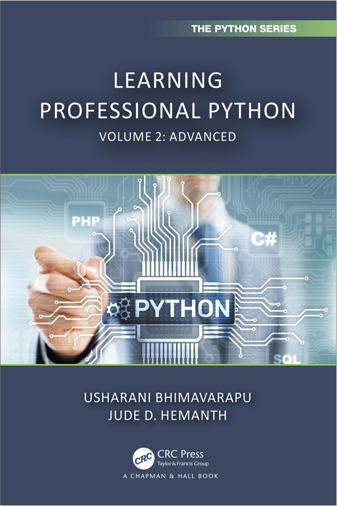

<p align="center"> 

</p>

# Learning Professional Python Volume 2 - Advanced
## Written by Usharani Bhimavarapu and Jude D. Hemanth, published by CRC Press, 2024
- [**Amazon URL**](https://www.amazon.com/Learning-Professional-Python-Advanced-Chapman/dp/1032611766)
- [**Original Books Notes**](Manning-Investing-for-Programmers-2025.txt)

## Table of Contents
- [Chapter 1: Classes and Objects](#chapter-1-classes-and-objects)
- [Chapter 2: Inheritance](#chapter-2-inheritance)
- [Chapter 3: Arrays](#chapter-3-arrays)
- [Chapter 4: Exception Handling](#chapter-4-exception-handling)
- [Chapter 5: Multi Threading](#chapter-5-multi-threading)
- [Chapter 6: Method Overloading and Operator Overloading](#chapter-6-method-overloading-and-operator-overloading)
- [Chapter 7: GUI Programming](#chapter-7-gui-programming)
- [Chapter 8: File Handling](#chapter-8-file-handling)
- [Chapter 9: Database Connectivity](#chapter-9-database-connectivity)
- [Chapter 10: Case Study](#chapter-10-case-study)


# Chapter 1: Classes and Objects
### [top](#table-of-contents)

### page 34
TABLE 1.2 Predefined Class Functions

| Function | Description |
|----------|-------------|
| `getattr(obj, name, default)` | Used to access the attribute of the object |
| `setattr(obj,name, value)` | Used to set a particular value to the specific attribute of the object |
| `delattr(obj,name)` | Used to delete a specific attribute |
| `hasattr (obj,name)` | Returns true if the object contains the specific attribute |

### page 36
TABLE 1.3 Built-In Class Attributes

| Attribute | Description |
|-----------|-------------|
| `__dict__` | Contains the class namespaces |
| `__doc__` | Class documentation |
| `__name__` | Class name |
| `__module__` | Module name in which class is defined |
| `__bases__` | Tuple containing the base classes of their occurrence |

### page 37
A parent class can have one or more inner class. There are two types of inner class in Python.
- 1. Multi-level inner class – The class comprises inner class and again this inner class comprises another inner class.
- 2. Multiple inner class – Class includes one or more inner classes.


# Chapter 2: Inheritance
### [top](#table-of-contents)

- 1. Single inheritance
  - `class childclassname({parent})`

- 2. Multiple inheritance
  - `class childclass(base1,base2, . . . . .)`

- 3. Multilevel inheritance
```
class base:
[class properties and members]

class child1(base):
[class properties and members]

class child2(child1):
[class properties and members]
```

### TABLE 2.1 Python Base Overloading Methods
| Methods | Description |
|---------|-------------|
| `__init__(self[,args . . .])` | constructor |
| `__del__(self)` | destructor |
| `__repr__(self)` | String representation |
| `__str__(self)` | print string |
| `__cmp__(self,x)` | comparison |


# Chapter 3: Arrays
### [top](#table-of-contents)
```
from array import *

a = [2, 3, 5, 7]
b = bytearray(a)
print(b)
------
bytearray(b’\x02\x03\x05\x07’)
```
```
s = ”Python is interesting.”
a = bytearray(s, ’utf-8’)
print(a)
------
bytearray(b’Python is interesting.‘)
```


# Chapter 4: Exception Handling
### [top](#table-of-contents)

### page 97
SINGLE TRY MULTIPLE EXCEPT STATEMENTS
```
try
    [suspicious erroneous code]
except excedption1:
    [run this code if an exception occurs]
except excedption2:
    [run this code if an exception occurs]
```

### page 100
SINGLE TRY SINGLE EXCEPT WITH MULTIPLE EXCEPTIONS STATEMENTS
```
try
    [suspicious erroneous code]
except (exception1, exception2 . . . exception N):
    [run this code if an any of the exception occurs]
```

TRY-EXCEPT-ELSE
```
try:
    [suspicious erroneous code]
except:
    [run this code if an exception occurs]
else:
    [run this code if no except block is executed]
```

### page 106
> Users can use the exception handling in the class constructors.


# Chapter 5: Multi Threading
### [top](#table-of-contents)
```
from multiprocessing import Process

def f():
    print(‘with out arguments’)

p = Process(target=f, args=())
p.start()
p.join()
```

### page 112: The Threading Module

| Methods                     | Description |
|-----------------------------|-------------|
| `threading.activecount()`   | Returns count of threads active threads |
| `threading.currentthread()` | Returns current thread information |
| `run()`                     | Activity of the thread |
| `start()`                   | Stars the thread |
| `join([time])`              | Until the thread that called join() was terminated, the CPU blocks the remaining threads |
| `isAlive()`                 | Checks if the thread is alive or not |
| `getName()`                 | Returns the name of the running thread |
| `setName()`                 | Sets the name of the thread |
| `threading.enumerate()`     | Returns the list of all active threads |

```
lock.acquire()
...
lock.release()
```


# Chapter 6: Method Overloading and Operator Overloading
### [top](#table-of-contents)

> Method overloading with same number of parameters but differs with the type of arguments.

### page 135
> The main advantage of using `operator overloading` is that it is much easier to read and debug.
`Operators` that already exist in the Python language can be overloaded.
`Operator overloading` **cannot** alter either the basic definition of an operator or the precedence order.


# Chapter 7: GUI Programming
```
import Tkinter
top = Tkinter.Tk()
top.mainloop()
```


# Chapter 8: File Handling

###  R/W text file and binary file examples
```
# Writing to an excel sheet using python
import xlwt
from xlwt import Workbook
```


# Chapter 9: Database Connectivity
### [top](#table-of-contents)
```
import MySQLdb
db = MySQLdb.connect('localhost', 'root', 'python', 'test')
cursor = db.cursor()
cursor,execute("SELECT VERSION()")
data = cursor.fetchone()
print(data)
db.close
```
```
import cx_Oracle
con = cx_Oracle.connect(‘system/python’)
print(con.version)
con.close()
```


# Chapter 10: Case Study
### [top](#table-of-contents)

- 10.1 PROGRAM 1: WHATS APP ANALYSER
```
import re
import regex
import pandas as pd
import numpy as np
import emoji
import plotly.express as px
from collections import Counter
import matplotlib.pyplot as plt
from os import path
```

- 10.2 PROGRAM 2: BREAST CANCER PREDICTION
```
import pandas as pd
import numpy as np
import sklearn
```
