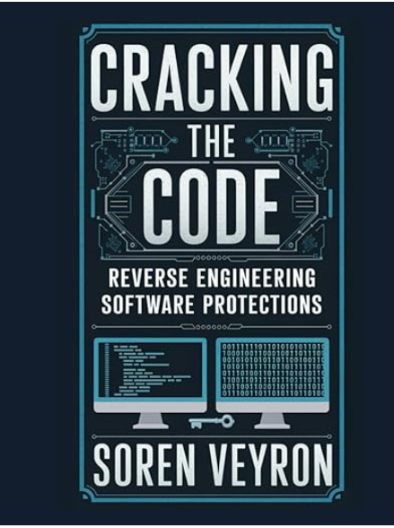

<p align="center"> 

</p>

# Cracking the Code - Reverse Engineering Software Protections (The Ultimate Reverse Engineering Guide From Beginner to Expert)
## Published in 2025 
- [**Amazon URL**](https://www.amazon.com/Cracking-Code-Engineering-Software-Protections/dp/B0F1F7HL76/)
- [**Original Book Notes**](Cracking-the-Code-Reverse-Engineering-Software-Protections_The-Ultimate-Reverse-Engineering-Guide-From-Beginner-to-Expert_2025_original_notes.txt)

## Table of Contents
- [Chapter 1: Introduction to Software Protections](#chapter-1-introduction-to-software-protections)
- [Chapter 2: Understanding Licensing and Activation Systems](#chapter-2-understanding-licensing-and-activation-systems)
- [Chapter 3: Introduction to Anti-Reverse Engineering Techniques](#chapter-3-introduction-to-anti-reverse-engineering-techniques)
- [Chapter 4: Bypassing Software Protections with Debugging](#chapter-4-bypassing-software-protections-with-debugging)
- [Chapter 5: Analyzing and Defeating Packing Techniques](#chapter-5-analyzing-and-defeating-packing-techniques)
- [Chapter 6: Cracking Serial Key and Keygen Algorithms](#chapter-6-cracking-serial-key-and-keygen-algorithms)
- [Chapter 7: Defeating Code Obfuscation and Encryption](#chapter-7-defeating-code-obfuscation-and-encryption)
- [Chapter 8: Bypassing Online Protections and Network Licensing](#chapter-8-bypassing-online-protections-and-network-licensing)

# Chapter 1: Introduction to Software Protections
### [top](#table-of-contents)

### Software protections aren’t just about keeping things safe — they’re about keeping things profitable. Here’s the breakdown:
- Money (a.k.a. "Please Pay for Our Hard Work")
- Control (a.k.a. "You Can Use It, But Not That Way")
- Fear (a.k.a. "We Know What You Did Last Summer… With Our Code")

### Common Types of Software Protections:
- License Keys & Activation Systems
- Digital Rights Management (DRM)
- Anti-Debugging & Anti-Disassembly Tricks
- Virtualization & Obfuscation
- Online-Only Protections

The Unwritten Rule of Software Protections - **No software protection is truly unbreakable**

### Tools for Bypassing Protections - IDA Pro, x64dbg, Ghidra, Frida
🔴 IDA Pro – Best for deep static analysis and detailed disassembly.

🔴 x64dbg  – Best for runtime debugging, patching, and bypassing anti-debugging tricks.

🔴 Ghidra  – Best for free, open-source static analysis and code decompilation.

🔴 Frida   – Best for dynamic analysis, code injection, and attacking mobile apps.

## Setting Up a Safe Testing Environment:
### [top](#table-of-contents)

### Step 1: Virtual Machines – Your Digital Sandbox
✅  VMware Workstation/Player – Fast, flexible, and ideal for Windows-based analysis.

✅  VirtualBox – Free and open-source with solid performance for general use.

✅  QEMU – Great for emulating various architectures (x86, ARM, etc.).

**Pro Tip:**
> Take snapshots — they’re like game save points. If you accidentally brick your VM (which you will), a snapshot lets you reset everything in seconds.
Snap early, snap often!

### Step 2: Choosing the Right Operating System
🔴 Windows 7 / 10 (64-bit)   – The most common target for commercial software protections.

🔴 Windows XP (yes, really)  – Surprisingly common in legacy software and malware research.

🔴 Linux (Ubuntu / Kali / REMnux) – Fantastic for analyzing ELF binaries, web exploits, and server-side applications.

🔴 Android Emulator (AVD / Genymotion) – Essential for testing mobile apps with Frida or other tools.

**Pro Tip:**
> Strip your VMs down to the essentials—no personal accounts, no saved passwords, and no sensitive files. Treat them like disposable lab rats.

### Step 3: Isolating Your Test Environment
✅ Set your VM’s network to Host-Only or Internal Network mode (no internet access).

✅ Use Fake DNS tools (like ApateDNS) to trap malicious traffic.

✅ Consider tools like INetSim to simulate internet services inside your VM.

**Bonus Tip:**
>Want to analyze online activations or track suspicious web requests? Use a proxy tool like Burp Suite, Fiddler , or Wireshark to intercept and inspect network traffic safely.

### Step 4: Essential Analysis Tools to Install in Your VM
🔹 IDA Pro / Ghidra – For static disassembly and analysis

🔹 x64dbg / OllyDbg / WinDbg – For dynamic debugging and runtime patching

🔹 Frida – For injecting code and bypassing runtime protections

🔹 Process Hacker – Great for monitoring system processes and memory

🔹 PE-Bear / CFF Explorer – For examining PE file structures

🔹 Detect It Easy (DIE) – For identifying packers, compilers, and obfuscation methods

🔹 Scylla / ScyllaHide – For dumping packed binaries and bypassing anti-debugging tricks

🔹 ApateDNS – For controlling and redirecting suspicious DNS traffic

🔹 Sysinternals Suite – A must-have for tracking file, registry, and process activity

**Pro Tip:**
> Create a clean baseline snapshot after installing these tools. That way, if malware makes a mess of your VM, you can roll back to a fresh state without reinstalling everything.

### Step 5: File Handling Safety
✅ NEVER double-click suspicious files. Open them in analysis tools first.

✅ Use tools like PEStudio or Exeinfo PE to inspect executables before running them.

✅ If you must execute unknown code, do it within a detonated VM snapshot you can instantly revert.

**Pro Tip:**
> Store suspicious files in .zip or .7z archives with strong passwords (e.g., infected or malware123). Many file scanners ignore encrypted archives, reducing the risk of accidental execution.

### Step 6: Tracking Your Analysis
✅ Use tools like Notion, Obsidian, or OneNote to log key observations.

✅ Record your steps, code changes, and hypotheses—you’ll thank yourself later.

✅ Screenshot key moments: entry points, license checks, decrypted strings—visual cues save time.

**Pro Tip:**
```
Adopt a consistent naming system for your files. Something like:
DATE]_[TARGET_NAME]_[STAGE]
Example: 2025-02-21_FancyApp_v3.2_LicenseCheck
```

### Step 7: Practicing Safe Reversing
✅ Keep your host OS fully patched and updated.

✅ Use a strong firewall to block unexpected outbound connections.

✅ For extra protection, analyze samples in a non-persistent VM that resets after each reboot.

**Bonus Tip:**
> Consider running your VM on a separate, isolated machine (like an old laptop) for an added layer of security. That way, even if something escapes the VM, it’s still boxed in.

### Step 8: Test, Break, Learn, Repeat
Reverse engineering isn’t just about knowing what tools to use—it’s about practicing in a safe environment. Your test lab is your training ground, so go wild:

🔹 Trigger breakpoint checks just to see how they work.

🔹 Intentionally detonate ransomware (in your isolated VM) to analyze its behavior .

🔹 Break things, fix them, then break them again—it’s all part of the process.

> Every mistake you make in your test environment is one you won’t make in the real world. So get messy, experiment often, and don’t be afraid to crash your VM a few hundred times.


# Chapter 2: Understanding Licensing and Activation Systems

### [top](#table-of-contents)

## 2.1 Common Software Licensing Methods:
### [top](#table-of-contents)

### 1. Serial Keys – The Classic “Unlock Code”
Also known as: The Old Reliable

**Common Tricks Developers Use:**

🔹 Key-length variations (short keys for basic software, long keys for pro versions)

🔹 Checksum validation to ensure keys aren’t randomly generated

🔹 Blacklist/whitelist logic to block known cracked keys

**Reverse Engineering Insight: Most serial key systems can be defeated by:**

✅ Tracing the key validation logic with a debugger

✅ Identifying the comparison function (often an strcmp() or similar routine)

✅ Bypassing the failure condition or patching the success branch

### 2. License Files – The Sneaky Digital Permission Slip
Also known as: “If lost, please panic”

**Common Tricks Developers Use:**

🔹 Embedding expiration dates directly in the license file

🔹 Tying the file’s content to your hardware profile (a.k.a. hardware locking)

🔹 Using asymmetric encryption to make license tampering difficult

**Reverse Engineering Insight: License files can often be bypassed by:**

✅ Identifying where the software attempts to load the file

✅ Modifying the file content or injecting a fake signature

✅ Overriding the license-checking routine entirely

**Pro Tip:**
> If you find a function named something like CheckLicense() or VerifyKeyFile(), you’re already halfway there.

### 3. Online Activation – The Digital Gatekeeper
Also known as: “You Shall Not Pass Without Internet!”

**Common Tricks Developers Use:**

🔹 Time-limited session keys that expire quickly

🔹 Hardware binding to tie the license to your specific PC

🔹 Frequent online check-ins to ensure continued license validity

**Reverse Engineering Insight: Cracking online activation usually involves:**

✅ Analyzing network traffic to intercept or modify activation requests

✅ Emulating the remote server locally (a technique known as “license server spoofing”)

✅ Identifying offline fallback mechanisms (some software grants temporary access if the server is unavailable)

### 4. Hardware Dongles – The Literal Key to the Kingdom
Also known as: “Oh no, I left my license at home!”

**Common Tricks Developers Use:**

🔹 Custom encryption schemes stored inside the dongle

🔹 Challenge-response protocols to verify authenticity

🔹 Periodic checks to ensure the dongle stays connected

**Reverse Engineering Insight: Dongle protections are often bypassed by:**

✅ Dumping the dongle’s memory to extract key data

✅ Emulating the dongle with software to fake its presence

✅ Patching the program to skip the dongle check entirely

**Pro Tip:**
> Dongles are often paired with driver files — these can be goldmines for extracting key-related logic.

### 5. Subscription & SaaS Models – The Eternal Payment Loop
Also known as: “Pay Up or Shut Down”

**Common Tricks Developers Use:**

🔹 Requiring constant internet access for usage

🔹 Tightly integrating the license with cloud-based services

🔹 Obfuscating API endpoints to make reverse engineering harder

**Reverse Engineering Insight: Subscription systems are challenging but not impossible. Common attack points include:**

✅ Analyzing API endpoints for token manipulation

✅ Discovering offline “grace periods” that allow continued use without internet

✅ Patching key libraries to bypass the subscription check

### 6. Freemium Models – The Digital Temptation
Also known as: “You want that feature? Fork over the cash.”

**Common Tricks Developers Use:**

🔹 Obfuscating premium features to make unlocking harder

🔹 Using feature flags that dynamically unlock functionality

🔹 Burying premium logic inside runtime checks

**Reverse Engineering Insight: Freemium cracks often involve:**

✅ Identifying feature flags and enabling them manually

✅ Bypassing premium checks or modifying the code’s logic flow

✅ Analyzing the program’s startup logic for activation routines

## 2.2 Online vs. Offline Activation
### [top](#table-of-contents)

### Online Activation – “You Shall Not Pass... Without Internet”

**How Online Activation Works:**

● User enters a product key.

● Software sends the key (and sometimes system info) to a remote server .

● Server verifies the key and responds with a success/fail message.

● If successful, the software unlocks itself or writes an activation token for future offline use.

**Common Developer Tricks:**

🔹 Encrypting network requests to prevent tampering.

🔹 Using hardware fingerprints to tie licenses to specific machines.

🔹 Requiring periodic revalidation to reduce the risk of stolen keys.

**How Reverse Engineers Break It:**

✅ Network Traffic Analysis: Tools like Wireshark, Fiddler, or Burp Suite can intercept the data exchange between software and server.
    Sometimes, developers accidentally forget to encrypt key parts of these requests (oops!).

✅ Fake License Servers: By analyzing the software's server requests, you can build a local emulator that “pretends” to be the real licensing server.
    This technique is known as server spoofing.

✅ Patching the Activation Code: Some software contains fallback logic that enables offline access if the server doesn’t respond.
    Spoofing this condition can sometimes bypass activation altogether.

### Offline Activation – “I Trust You... For Now”

**How Offline Activation Works:**

● User enters a product key.

● Software generates a hardware ID (based on CPU, motherboard, etc.).

● User submits this ID to the vendor’s website (via another device).

● The website returns an “activation code,” which unlocks the software.

**Common Developer Tricks:**

🔹 Using cryptographic algorithms (like RSA or ECC) to generate codes.

🔹 Embedding timestamps or expiry dates in the activation data.

🔹 Hiding hardware-specific logic inside complex routines to prevent tampering.

**How Reverse Engineers Break It:**

✅ Reversing the Key Algorithm: By tracing the code generation routine with a debugger (like x64dbg) or disassembler (like IDA Pro), you can often replicate the key generation logic to create valid keys.

✅ Patching the Activation Routine: Many offline systems rely on a simple success flag (if (activation == true)). Spoofing this check can often bypass the entire process.

✅ Generating Fake Hardware IDs: By identifying how the hardware ID is calculated, you can trick the software into thinking your system matches a known valid profile.

**Online vs. Offline Activation – Which One’s Tougher to Crack?**

*_Both systems have strengths and weaknesses_*

| Feature | Online Activation | Offline Activation                           |
|-------------------|-----------------|----------------------------------------------|
| security strength | stronger (relies on server-side logic) | weaker (all client-side logic)               |  
| ease of reverse engineering | harder to analyze without internet control | easier to analyze directly in code           |
| common weakness | vulnerable to spoofing or replay attacks | vulnerable to algorithm reverse engineering  |
| convinience for users | requires internet (annoying for offline users) | perfect for air-gapped system |

*_Hybrid Activation Systems – The “Best of Both Worlds” (or Worst, Depending on Your Perspective)_*

## 2.3 License Key Algorithms and Validation Mechanisms
### [top](#table-of-contents)

**Common License Key Algorithms**
### 1. Simple Pattern-Based Keys
These are the easiest to generate and the easiest to break. The software checks whether the key follows a specific format, like:

📌 Example: ABCD-1234-EFGH-5678

**Validation logic might just check:**

✅ Correct length

✅ Correct character set (letters, numbers, dashes)

✅ Presence of a few specific hardcoded values

**🔓 How Reverse Engineers Crack It:**

● Identify the key validation logic in the software.

● Modify the validation routine to always accept any input.

● Generate keys that match the expected pattern.

### 2. Checksum-Based Keys
Here, the last few characters of the key are a checksum—a value derived from the rest of the key’s content to verify integrity.

📌 Example: ABCD-1234-EFGH-1A2B (where 1A2B is a checksum)

**Validation works by:**

● Extracting the first part of the key.

● Running a checksum calculation.

● Comparing the result with the last part of the key.

**🔓 How Reverse Engineers Crack It:**

● Find and reverse-engineer the checksum algorithm (often CRC, Luhn, or custom math).

● Write a script to generate valid keys by appending the correct checksum.

● Patch the validation function to skip the checksum check.

### 3. Algorithmically Generated Keys (Crypto-Based)
These are the trickiest—keys generated using cryptographic algorithms like RSA, ECC, or HMAC. 
Instead of just checking patterns, the software uses a private key to  generate valid license keys and a public key to verify them.

📌 Example:

● The license key is signed using an RSA private key.

● The software verifies the signature using an RSA public key.

**🔓 How Reverse Engineers Crack It:**

● Extract the public key from the software and attempt to generate valid keys (difficult unless you have quantum computing).

● Patch the software to skip the RSA verification step.

● Replace the public key with one that matches a custom private key, allowing custom key generation.

Real-World Example: Adobe and Microsoft use RSA-based activation. That’s why “keygens” for them don’t brute-force keys — they manipulate activation logic instead.

### 4. Hardware-Tied License Keys
These are keys generated based on hardware characteristics like:

✅ CPU ID

✅ MAC Address

✅ Hard Drive Serial Number

The key is usually a hash of these values combined with a secret key.

**🔓 How Reverse Engineers Crack It:**

● Identify the hardware fingerprinting function and modify it to return expected values.

● Generate fake hardware signatures to match existing valid keys.

● Patch the key validation routine to bypass hardware checks.

**How License Key Validation Works**
- Step 1: User Inputs the Key
- Step 2: Pre-Validation Checks
- Step 3: Algorithm Validation

**How to bypass key validation in real software**
- 1. Debugging and Patching the Key Check
  - ● Open the executable in x64dbg or IDA Pro.
  - ● Identify where the key is validated.
  - ● Modify the logic so the software always thinks the key is valid.
- 2. Keygen Development
  - If the algorithm isn’t server-side, you can:
    - ● Reverse-engineer the key validation logic.
    - ● Implement the same logic in a separate program.
    - ● Generate new valid keys.
- 3. Network Spoofing
  - For online key validation:
    - ● Use Wireshark or Burp Suite to capture activation requests.
    - ● Modify the response to trick the software into thinking activation succeeded.

## 2.4 Detecting and Analyzing License Checks
### [top](#table-of-contents)

**Where License Checks Hide in Software：**

● During Startup – The software checks the license as soon as it runs. If the check fails, it exits or switches to trial mode.

● Before Key Features Are Used – Some programs only check licenses when you attempt to access premium functionality.

● Periodically (Timer-Based Checks) – Software might revalidate the license at regular intervals to ensure users haven’t revoked or tampered with it.

● Online Checks – Cloud-based software will often contact a server to verify license status before granting access.

**Tools for Detecting License Checks**
- 1. Debuggers (x64dbg, OllyDbg, WinDbg)
  - ● Set breakpoints on suspicious functions (like strcmp, RegQueryValueEx, or CreateFile).
  - ● Observe how the program reacts when entering a license key.
  - ● Modify instructions on the fly to bypass validation.
- 2. Disassemblers & Decompilers (IDA Pro, Ghidra, Radare2)
  - ● Search for string references like "Invalid License" or "Trial Expired".
  - ● Identify where these messages are triggered and trace back to the validation routine.
  - ● Modify or patch the disassembled code to skip these checks.
- 3. API Monitoring (Process Monitor, API Monitor, Frida)
  - ● Monitor API calls related to license files (CreateFile, ReadFile).
  - ● Look for network requests to activation servers (send, recv).
  - ● Modify or block certain API calls to bypass validation.

**Analyzing License Validation Mechanisms**
- Step 1: The Software Reads Your License Key
  - ● The key is read from a file, registry, or entered manually.
  - ● The program removes unnecessary characters (dashes, spaces) and converts it into a standard format.
- Step 2: Initial Validation (Basic Checks)
  - ● Does the key follow a specific pattern?
  - ● Is it the correct length?
  - ● Does it match a known list of valid keys?
- Step 3: Cryptographic Validation
  - If the software uses advanced licensing, it might verify the key using cryptographic techniques. This could involve:
    - ● Checking a checksum (e.g., CRC, MD5, SHA-1).
    - ● Using a public-private key system (RSA, ECC) to verify legitimacy.
    - ● Common Techniques to Detect License Checks in Code
  - 1. Searching for Error Messages
  - 2. Setting Breakpoints on Common License-Related Functions
    - ● strcmp / memcmp – Used to compare input keys against valid ones.
    - ● RegQueryValueEx – Checks for registry-stored license data.
    - ● CreateFile / ReadFile – Reads license keys from disk.
    - ● send / recv – Sends license data to an online activation server.
  - 3. Analyzing Control Flow for License Enforcement

**Bypassing License Checks (For Educational Purposes, OfCourse 😉)**
- 1. Patching the Validation Function
  - ● Locate the function that checks for a valid license.
  - ● Modify it to always return true (or 1).
  - ● Save and run the patched binary.
- 2. Hooking License-Related API Calls
  - ● Use Frida or another dynamic instrumentation tool.
  - ● Hook API calls like RegQueryValueEx and return a fake license.
  - ● Trick the software into thinking activation succeeded.
- 3. Emulating the License Server
  - ● Capture the network requests sent to the activation server .
  - ● Set up a fake server that responds with "valid" license data.
  - ● Redirect the software’s network traffic to your local emulator .

## 2.5 Cracking License Checks and Key Validation
### [top](#table-of-contents)

- Step 1: Locating the License Check in the Code
- Step 2: Patching the License Check
  - Common Patching Techniques:
    - ● NOP Out the Check – Replace the conditional check with NOP (no operation) instructions, making the program skip the validation.
    - ● Force Success – Modify the conditional jump (JNE → JE or JNZ → JZ) to always take the success path.
    - ● Change Return Values  – Modify the function return so it always indicates a valid license.
- Step 3: Reverse Engineering the Key Generation Algorithm
  - 🔬 Techniques for Analyzing Key Algorithms:
    - ● Find Key-Related Functions – Look for math-heavy functions that manipulate user input.
    - ● Analyze Constants and XOR Operations – Many keys are generated using XOR, bit shifts, or modular arithmetic.
    - ● Extract Hardcoded Keys – Some software stores valid keys inside its binary (easy target!).
- Step 4: Emulating or Bypassing Online License Checks
  - If software relies on online activation, it will send license data to a remote server . To bypass this:
    - ● Intercept and Modify Requests – Use a tool like Burp Suite or Wireshark to capture network traffic.
    - ● Patch API Calls – Modify the software to prevent it from making online requests.
    - ● Emulate the License Server – Set up a local fake server that mimics the real one.
- Step 5: Cracking Cryptographic Protections
  - Some software uses RSA or ECC signatures to validate keys. This is harder to crack, but not impossible.
  - 🔓 Methods for Breaking Crypto-Based Keys:
    - ● Dump the Private Key – If the key is stored somewhere in the binary, extract it.
    - ● Modify the Verification Function – Bypass the part that checks the cryptographic signature.
    - ● Replay Attacks – Capture valid responses from an activation server and reuse them.

**Final Thoughts: No Lock is Unbreakable**


# Chapter 3: Introduction to Anti-Reverse Engineering Techniques
### [top](#table-of-contents)

## 3.1 Anti-Debugging Tricks and Detection Mechanisms

**Most anti-debugging techniques fall into two categories:**

● Passive Detection – The software simply checks for signs of a debugger (e.g. looking for debugger-related processes, checking system flags, or calling Windows APIs).

● Active Detection – The program actively tries to interfere with the debugger , using tricks like self-modifying code, timing checks, or even crashing itself to frustrate the reverse engineer.

**The most common anti-debugging techniques:**
- 1. Checking for Debugger Presence
  - 🔍 API-Based Checks (Windows-Specific)
    - ● IsDebuggerPresent() – A direct API that returns true if the process is running inside a debugger.
    - ● CheckRemoteDebuggerPresent() – Checks if another process is debugging this one.
    - ● NtQueryInformationProcess() – Retrieves process information, including debugging status.
  - 🛠 Bypassing API Checks:
    - ● Patch the Function Call – Modify the binary to always return false.
    - ● Intercept API Calls – Use tools like Frida or API Monitor to hook these functions and override their return values.
    - ● Modify Process Flags – Some debuggers allow modifying process flags to trick these checks.
- 2. Anti-Attach Techniques (Preventing Debuggers from Attaching)
  - 🛡 Common Techniques:
    - ● Using NtSetInformationThread() to set ThreadHideFromDebugger, which makes the process invisible to debuggers.
    - ● Spawning a Child Process and immediately terminating the parent if debugging is detected.
    - ● Anti-attach Mutexes – Creating specific mutex objects that debuggers rely on, causing them to fail when they try to attach.
  - 🛠 Defeating Anti-Attach:
    - ● Patch NtSetInformationThread() Calls – Modify the binary to skip these calls.
    - ● Use a Custom Debugger – Some specialized debuggers, like ScyllaHide, can evade these techniques.
    - ● Debug the Child Process Instead – If the main process dies, follow the child process instead.
- 3. Debugger Interference Techniques
  - ⏳ Timing Attacks
    - Some programs measure how long operations take (e.g., QueryPerformanceCounter()). If they take too long (because a debugger paused execution), the program knows it's being
debugged.
  - 🛠 Bypassing Timing Attacks:
    - ● Patch out the timing checks or modify return values.
    - ● Speed up debugger execution using tools like Cheat Engine's speedhack.
  - 🚨 Hardware Breakpoint Detection
    - The software writes to debug registers (DR0–DR7) and then checks if they were modified. If so, a debugger is present.
    - 🛠 Bypassing Hardware Breakpoint Detection:
      - ● Use Software Breakpoints (INT3) Instead – These don’t rely on debug registers.
      - ● Modify NtGetContextThread() to Always Return Zeroed Registers.
- 4. Code Obfuscation and Debugger Evasion
  - Some programs go a step further and use techniques that make it harder to follow their execution.
  - 👀 Anti-Disassembly Techniques
    - ● Opaque Predicates – Conditional branches that always resolve the same way but trick disassemblers.
    - ● Junk Code Insertion – Filling the binary with useless instructions to confuse analysis.
  - 🛠 Bypassing Anti-Disassembly:
    - Use dynamic analysis (run the program) instead of relying on static disassembly.
  - 🎭 Self-Modifying Code
    - Some programs modify their own instructions at runtime, making static analysis nearly impossible.
    - 🛠 Defeating Self-Modifying Code:
      - Use a debugger to dump memory after the code has been unpacked.
- 5. Handling Anti-Debugging in Virtual Machines
  - If you’re analyzing malware or highly protected software, it might refuse to run inside a VM (Virtual Machine).
  - 🖥 Common VM Detection Techniques:
    - ● Checking for VM-specific processes (VBoxService.exe, vmtoolsd.exe).
    - ● Checking for MAC addresses associated with virtual network adapters.
    - ● Executing CPUID instructions to detect virtualization.
  - 🛠 How to Trick VM Detection:
    - ● Rename Processes – Change VM-related process names.
    - ● Modify Registry Keys – Hide signs of virtualization.
    - ● Patch Out CPUID Checks – Modify the binary to skip virtualization checks.

**Final Thoughts: The Cat-and-Mouse Game of Debugging**


## 3.2 Anti-Disassembly Techniques (Opaque Predicates, Junk Code)
### [top](#table-of-contents)

Disassemblers like IDA Pro, Ghidra, and Radare2 are powerful tools, but they rely on predictable patterns in assembly code.
Software protections take advantage of this by introducing irregularities that break automatic analysis. The goal? To make disassembly either:

● Incorrect – By misleading  the disassembler  into  interpreting code incorrectly.

● Unreadable – By bloating the binary with garbage instructions and fake control flows.

● Excessively Complicated – By making the real  logic nearly impossible to follow without manual intervention.

**Two of the most common techniques used to achieve this: opaque predicates and junk code insertion**
- 1. Opaque Predicates – The Ultimate Misdirection
  - An opaque predicate is a conditional statement (like an if or while check) that always evaluates the same way at runtime but looks unpredictable to a disassembler.
  - This tricks the analysis tool into thinking both paths of execution are valid when, in reality, only one is ever taken.
```
🕵 Example:
cmp eax, eax   ; Compare register to itself (always true)
je some_label  ; This jump will always be taken
```
  > To a human, it’s obvious that cmp eax, eax will always be true, making the je instruction useless.
  > But a disassembler doesn’t inherently know that—it sees a conditional jump and assumes both paths might be relevant.
  > This causes the disassembler to generate misleading control flow graphs, making analysis harder.

  - 🚀 Advanced Opaque Predicates

Some protections take it a step further with math-based opaque predicates:
```
mov eax, 123456
imul eax, eax   ; Square the value
sub eax, 15241383936  ; eax - (123456^2) == 0
jnz fake_path   ; This jump will never happen
```
> Again, a human can figure out that eax will always be zero after the subtraction, but a disassembler sees a jnz and assumes both execution paths are possible.
> Multiply this kind of trick across hundreds of code blocks, and the real logic gets buried under false control flows.

  - 🛠 Defeating Opaque Predicates
    - ● Identify Constant Conditions – If a conditional statement must always be true or false, it’s a fake branch.
    - ● Manually Clean Up Control Flow – Remove misleading branches in IDA Pro or Ghidra to simplify the graph.
    - ● Run the Code Dynamically – Debugging tools like x64dbg or Frida can reveal the real execution path by skipping dead code.

- 2. Junk Code Insertion – Making a Mess on Purpose
  - Junk code is exactly what it sounds like — completely unnecessary instructions thrown into a binary to slow down analysis.
  - It doesn’t change program execution, but it clutters up disassembly, making it harder to read.
```
🗑 Example of Junk Code:
push eax
pop eax       ; Does nothing
xor ebx, ebx
add ebx, 5
sub ebx, 5    ; Still does nothing
nop
nop
jmp real_code ; Finally, the real execution continues
```
This kind of nonsense serves no purpose other than wasting your time. In some cases, it’s generated in large amounts to artificially bloat the function, making it difficult to see where the real logic starts.

  - 🔄 Polymorphic Junk Code
> More advanced junk code generators will mix things up so that no two executions of the program look the same.
> Instead of static no sleds, they’ll use randomized variations like:
```
xor ecx, ecx
mov cl, 0
add cl, 1
sub cl, 1
```
To a disassembler, this might look like important logic, but in reality, it’s just a fancy way of doing nothing.

  - 🛠 Defeating Junk Code
    - ● Look for Repeated Patterns – If you see instructions that don’t contribute to calculations or jumps, they’re likely junk.
    - ● Cross-Reference with Runtime Execution – Use a debugger to see which instructions actually matter.
    - ● Use Automated Deobfuscation Tools – Scripts like de-junkers in IDA Pro or symbolic execution in tools like Angr can help clean things up.

**Final Thoughts: Outsmarting the Tricks**


## 3.3 Anti-Virtual Machine and Sandboxing Detection
### [top](#table-of-contents)

Normal users don’t typically run everyday applications inside virtual machines and sandboxes, while reverse engineers, malware analysts, and cybersecurity professionals do.

To counteract this, software will:

● Detect VM-specific artifacts – Looking  for  telltale signs of VMware, VirtualBox, QEMU, or Hyper-V.

● Check hardware inconsistencies – Identifying CPU, RAM, and system specs that scream “I’m fake!”.

● Monitor timing and performance – Slower execution times inside a virtualized environment can give away the presence of a hypervisor.

● Inspect running processes and services – If security tools like Sandboxie, Cuckoo Sandbox, or malware analysis tools are running, the software might refuse to launch.

The goal? Stay hidden and make analysis a pain in the ass for reverse engineers.


**Common Virtual Machine Detection Techniques**
- 1. Checking System Hardware for Virtualization Clues
  - Most virtual machines have distinctive fingerprints that betray their presence. Protected software can use system API calls to check for VM-specific traits, such as:
    - ● CPU Brand Strings – Some VMs don’t report real CPU manufacturers (GenuineIntel or AuthenticAMD), instead using identifiers like Microsoft Hv (Hyper-V) or VBoxVBoxVBox (VirtualBox).
    - ● BIOS and Motherboard Strings – Many VMs use generic BIOS identifiers like VBOX, QEMU, or VMware.
    - ● MAC Addresses – Virtual network adapters often have predictable MAC address prefixes (00:05:69 for VMware, 08:00:27 for VirtualBox).
```
🕵 Code Example: Detecting VMware via CPUID
mov eax, 1
cpuid
cmp ecx, 'VMXh'   ; VMware uses 'VMXh' as a hypervisor signature
je vm_detected
```
    - If ecx contains VMXh, congrats — you’re inside a VMware environment, and the software can react accordingly (usually by shutting down or throwing an error).
- 2. Checking for Virtual Machine Services and Drivers
  - Many VM solutions install system drivers and background services that can be easily detected. Some common ones include:
    - ● VBoxService.exe (VirtualBox)
    - ● vmtoolsd.exe (VMware Tools)
    - ● vmmouse.sys, vmhgfs.sys, VBoxGuest.sys  (Various VM guest additions)

  - If a program sees these running, it might exit immediately, crash, or even modify its behavior to act innocent.
```
🕵 Code Example: Detecting VirtualBox Services in Windows
#include <windows.h>
int detectVBox() {
return (FindWindow("VBoxTrayToolWndClass", NULL) != NULL);
}
```
If this function returns true, the software knows it’s inside VirtualBox and can respond accordingly.

- 3. Timing Attacks – Measuring Execution Speed
  - VMs introduce performance overhead, meaning operations inside them tend to run slower than on a physical machine.
  - Cleverly protected software can measure execution time for key operations and compare them to expected values.
```
🕵 Code Example: Timing-Based VM Detection
#include <time.h>
double measure_time() {
    clock_t start = clock();
    for (int i = 0; i < 1000000; i++) { asm("nop"); }
    return (double)(clock() - start) / CLOCKS_PER_SEC;
}

if (measure_time() > 0.01) {
    printf("Hmm... seems slow. Running in a VM?\n");
}
```
A real machine will complete the loop much faster than a VM, so if execution time is longer than expected, the software may refuse to run.


**Defeating Anti-VM and Sandboxing Tricks**
- 1. Hiding Virtual Machine Artifacts
  - Many anti-VM checks rely on looking for default VM settings (like MAC addresses, BIOS strings, or specific drivers). Modifying these settings can help evade detection:
    - ● Change BIOS identifiers (VBox, QEMU, VMware) using VM configuration settings.
    - ● Spoof MAC addresses to avoid detection based on known prefixes.
    - ● Disable VM guest additions  (e.g., VirtualBox Guest Additions, VMware Tools) since they expose services that can be detected.
- 2. Patching Detection Code
  - If a program checks for VMs via CPUID or system calls, you can patch out these detections using a debugger (x64dbg) or a hex editor.
```
Example: Patching out CPUID-based Detection
Find the cpuid instruction in the binary and replace it with NOPs (0x90 in hex) so the detection logic never triggers.
```
- 3. Hooking System Calls to Return Fake Values
  - Using tools like Frida or API hooking, you can intercept system calls and return fake data.
  - For example, if the program checks for VBoxService.exe, you can hook FindWindow to always return NULL.
```
import frida
script = """
Interceptor.attach(Module.findExportByName(null, "FindWindowA"),
{
    onEnter: function (args) {
        if (Memory.readUtf8String(args[0]).indexOf("VBox") !== -1) {
            console.log("Spoofing FindWindowA result!");
            this.context.eax = 0;
        }
    }
});
"""

session = frida.attach("target_process.exe")
session.create_script(script).load()
```
**Final Thoughts: Outsmarting the Watchers**


## 3.4 Code Obfuscation Methods
### [top](#table-of-contents)

Developers use obfuscation techniques for several reasons, including:

● Preventing Reverse Engineering – Makes it harder for attackers to understand and modify the code.

● Protecting Intellectual Property – Stops competitors from stealing proprietary algorithms.

● Hindering Cracks and Patches – Confuses hackers trying to remove DRM, license checks, or security features.

● Evading Malware Detection – (In  the case of bad actors) Helps malicious software avoid antivirus analysis.

The goal isn’t to make cracking impossible (because that’s a fantasy), but rather  to make it annoying and time-consuming enough that most attackers give up or move on to an easier target.


**Common Code Obfuscation Techniques**
- 1. Control Flow Obfuscation
  - Control flow obfuscation makes the program’s logic look random, disorganized, and unnecessarily complex by:
    - ● Inserting fake conditional branches
    - ● Using goto statements everywhere (yes, even when it makes zero sense)
    - ● Replacing if-else conditions with arithmetic tricks
  - How to Defeat It?
    - ● Flatten the control flow by simplifying the logic.
    - ● Use debugging tools like x64dbg to trace execution instead of analyzing code statically.
    - ● Decompile and reformat the logic to restore readability.

- 2. String Encryption and Obfuscation
  - ● Encrypt important strings and decrypt them at runtime.
  - ● Store strings as a sequence of manipulated bytes instead of readable text.
  - ● Use XOR, Base64, or custom encoding schemes to scramble messages.

  - How to Defeat It?
    - ● Set breakpoints at string-handling functions (printf, MessageBoxA, etc.).
    - ● Dump decrypted strings from memory during execution.
    - ● Use static analysis tools to detect XOR or Base64 encoding patterns.

- 3. Junk Code Insertion
  - Another way to confuse reverse engineers is by inserting completely useless instructions into the code. These extra operations:
    - ● Make decompiled output unreadable
    - ● Bloat the program size unnecessarily
    - ● Waste a reverser’s time trying to analyze nothing
```
Example: Normal Code (Straightforward)
int x = a + b;

Example: Obfuscated Code (Pointless Junk Instructions)
int x = a + b; 
x ^= 0;  // XOR with zero does nothing 
x = x << 2 >> 2;  // Shift left, then shift right (still does nothing) 
if (x == 9999999) { x = 42; }  // This will never execute 
```
The logic is still the same, but good luck reading through all that junk!

  - How to Defeat It?
    - ● Identify no-op instructions and remove them.
    - ● Simplify redundant calculations using decompilers like Ghidra or IDA Pro.
    - ● Look for patterns where operations cancel each other out.

- 4. Function Inlining and Dead Code Injection
  - Instead of calling functions normally, obfuscated software sometimes inlines them—meaning all function logic is dumped directly into the main code, making it harder to identify useful functions.
  - Developers might also add dead code, which:
    - ● Never executes but bloats the program
    - ● Tries to mislead reverse engineers
    - ● Wastes CPU cycles to slow down analysis
```
Example: Dead Code That Does Nothing
int a = 5; 
if (a > 1000) { 
    selfDestruct();  // This will NEVER execute
}
```
  - How to Defeat It?
    - ● Identify and remove dead code using control flow analysis.
    - ● Reconstruct function calls manually if inlining is detected.
    - ● Use pattern recognition tools to filter real code from garbage.

**Final Thoughts: Cutting Through the Confusion**

If you ever get lost in a mess of obfuscated code, remember:

💡 Follow execution instead of static code. Debuggers don’t care if the logic looks weird—they just execute it.

💡 Look for patterns. Most obfuscators follow predictable techniques that can be reversed.

💡 Be patient. Obfuscation is designed to waste your time, so take breaks before your brain melts.


## 3.5 Identifying and Defeating Anti-Reversing Mechanisms
### [top](#table-of-contents)

**What Are Anti-Reversing Mechanisms?**

Anti-reversing mechanisms are techniques used to detect and prevent:

✅ Debugging – Stopping tools like x64dbg or OllyDbg from attaching.

✅ Disassembly – Making it difficult for IDA Pro or Ghidra to produce readable code.

✅ Sandbox Evasion – Preventing analysis in virtual machines.

✅ Tampering Detection – Detecting and blocking code modifications.

Software developers and malware authors alike use these tricks to slow down and frustrate reverse engineers. 


**Common Anti-Reversing Mechanisms & How to Defeat Them**
- 1. Anti-Debugging Techniques
  - The first and most obvious trick in the book: detect if someone is debugging the software, then either crash, freeze, or behave differently to throw them off.
  - How They Do It:
    - ● Checking for debugger presence using API calls like IsDebuggerPresent().
    - ● Using hardware breakpoints to detect debugging tools.
    - ● Timing checks to measure execution speed (debuggers slow things down).

  - How to Defeat It:
    - ● Patch or bypass IsDebuggerPresent() calls using x64dbg or Frida.
    - ● Modify return values of debugging detection functions.
    - ● Use hardware breakpoint protection bypass techniques (like hiding debug registers).

  - 💡 Pro Tip: Some software will even self-debug to block external debuggers. If you see strange behavior, check if the software is launching itself in debug mode!

- 2. Anti-Disassembly Tricks
  - Static analysis tools like IDA Pro and Ghidra are a reverse engineer’s best friend, but developers try to confuse them by:
  - How They Do It:
    - ● Adding junk bytes that make disassemblers misinterpret instructions.
    - ● Using opaque predicates (always-true conditions) to insert dead-end branches.
    - ● Self-modifying code that changes during runtime, making static analysis useless.

  - How to Defeat It:
    - ● Run the program in a debugger to analyze real execution instead of static code.
    - ● Manually clean up junk instructions and restore readable logic.
    - ● Dump thememory at runtime to capture the deobfuscated code.

  - 💡 Pro Tip: Self-modifying code is annoying, but if you dump the process memory after execution, you can capture the real code before it morphs again.

- 3. Anti-Virtual Machine (VM) & Sandboxing Detection
  - Developers don’t want their software being analyzed in a virtual machine (VM) or a sandbox — because that’s exactly how malware researchers and reverse engineers study them.
  - How They Do It:
    - ● Checking for VM-specific hardware or drivers (e.g., VirtualBox, VMware).
    - ● Looking at MAC addresses or system serial numbers to identify virtual environments.
    - ● Running CPU instruction tests that behave differently in VMs.

  - How to Defeat It:
    - ● Modify VM identifiers (change MAC addresses, CPU info, and registry values).
    - ● Use anti-anti-VM tools (like HardenedVM or VBoxHardenedLoader).
    - ● Manually patch software checks to ignore VM detection routines.

  - 💡 Pro Tip: Some software will even look at mouse movement patterns to determine if a real user is present. If you see weird behavior, try randomly moving your mouse to fool it.

- 4. Tamper Detection & Integrity Checks
  - Developers don’t just try to prevent analysis — they also want to prevent modification. If you change even one byte in a protected program, it might detect the change and refuse to run.
  - How They Do It:
    - ● Checksum verification (e.g., MD5 or SHA-1 hashes to check file integrity).
    - ● Code signing enforcement (verifying digital signatures).
    - ● Self-checking mechanisms (the software scans itself for unauthorized changes).

  - How to Defeat It:
    - ● Find where the checksum is calculated and modify the verification routine.
    - ● Patch the hash comparison function to always return "valid."
    - ● Use dynamic instrumentation (like Frida) to modify behavior on the fly.

  - 💡 Pro Tip: If the software is checking its own hash, you can sometimes modify the hash stored in memory instead of trying to bypass the entire check.

- 5. Anti-Hooking & API Redirection
  - Some reverse engineering tools, like Frida or DLL injection frameworks, work by hooking system APIs. Developers don’t like this and try to block it.
  - How They Do It:
    - ● Detecting modified API calls by checking function addresses.
    - ● Using inline hooks to break common reverse engineering tools.
    - ● Employing Direct System Calls to bypass hooked APIs.

  - How to Defeat It:
    - ● Use stealth hooking methods to avoid detection.
    - ● Patch inline hooks to restore original functionality.
    - ● Manually trace system calls instead of relying on common hooks.

  - 💡 Pro Tip: If your hooks are getting detected, try writing your own indirect hooking mechanism to avoid detection!

**Final Thoughts: Outsmarting the Guards**


# Chapter 4: Bypassing Software Protections with Debugging
### [top](#table-of-contents)

## 4.1 Setting Up Debugging Tools (x64dbg, OllyDbg, WinDbg)

**Choosing the Right Debugger for the JobDebuggers come in all shapes and sizes. We’ll focus on these three:**
- ● x64dbg – The modern, user-friendly debugger designed for 32-bit and 64-bit Windows applications.
- ● OllyDbg – The old-school classic for 32-bit applications, beloved for its simplicity.
- ● WinDbg – Microsoft’s official debugger , powerful but with a steep learning curve.

| Debugger | Best For | Pros                                                                                             | Cons                                     |
|----------|----------|--------------------------------------------------------------------------------------------------|------------------------------------------|
| x64dbg | general purose debugging | easy-to-use UI, active development, scripting support                                            | slightly heavier than OllyDbg            |
| OllyDbg | older 32-bit applications | simple and lightweight                                                                           | no native 64-bit support, outdated UI    |
| WinDbg | system-level debugging, crash analysis | powerful, can debug drivers and kernel-mode code | steep learning curve, less intuitive UI |

**Configure x64dbg:**
- ● Go to Options → Preferences.
- ● Enable "Ignore first chance exceptions" to avoid constant pop-ups.
- ● Set up symbol paths (optional) to get better debugging info.
- ● Customize keyboard shortcuts to match your workflow.

**Configure OllyDbg plugins:**
- To install plugins, just drop the .dll files into OllyDbg’s plugins folder.
  - ● StrongOD – Helps bypass anti-debugging tricks.
  - ● OllyDump – Useful for unpacking protected executables.
  - ● Hide Debugger – Prevents detection by anti-debugging mechanisms.

**Set Up WinDbg Symbol Paths:**
- ● Open WinDbg.
- ● Go to File → Symbol File Path.
- ● Enter the following path, and symbols will be downloaded to C:\symbols\ folder:
> SRV*c:\symbols*http://msdl.microsoft.com/download/symbols
- ● Click OK, then restart WinDbg.
- ● Basic Debugging Workflow

**Final Thoughts: Debuggers Are Your Best Friend**


## 4.2 Identifying and Bypassing Breakpoint Detection
### [top](#table-of-contents)

**Types of Breakpoints and How They Get Detected**

### 1. Software Breakpoints (INT 3 / 0xCC Breakpoints)
This is the most common breakpoint.

**How Software Detects It:**
- ● Memory Checks: The program scans its own code for unexpected 0xCC bytes.
- ● Exception Handling Abuse: It places intentional INT 3 instructions in the code and checks if an exception occurs (which should normally happen unless a debugger is present).

### 2. Hardware Breakpoints (DR0-DR3 Registers)
Hardware breakpoints use the processor’s debugging registers (DR0-DR3) instead of modifying code. Since they don’t alter the executable, they’re much harder to detect.

**How Software Detects It:**
- ● Checking Debug Registers: The program reads DR0-DR3 to see if they are set (which only happens when a debugger is active).
- ● Clearing Debug Registers: Some protection systems will wipe these registers before critical operations, nullifying our breakpoints.

### 3. Memory Breakpoints (Page Guard / VirtualProtect)
Instead of setting a breakpoint on an instruction, memory breakpoints trigger when a specific memory region is accessed or modified.

These are used heavily when debugging  self-modifying code or unpacking malware.

**How Software Detects It:**
- ● Checking Page Permissions: Some programs use VirtualQuery() or VirtualProtect() to inspect memory permissions and detect hidden breakpoints.
- ● Triggering Fake Reads/Writes: Some protection systems will intentionally access protected memory to see if an unexpected breakpoint gets triggered.

### 4. Exception-Based Breakpoints (Vectored Exception Handling)
Some sneaky breakpoints don’t modify code or registers but instead exploit Windows' exception handling to catch when a certain condition is met.

**How Software Detects It:**
- ● Manipulating Exception Handlers: Programs install custom SEH (Structured Exception Handlers) and check if their execution flow gets interrupted.
- ● Triggering Known Exceptions: If a debugger is present, the program may trigger divide-by-zero or access violations and check how the debugger responds.

### Bypassing Breakpoint Detection: Outsmarting the Watchdogs

#### 1. Bypassing Software Breakpoint Detection

**Method 1: Patch Out the Memory Check**

Many programs scan for 0xCC breakpoints using functions like memcmp(), ReadProcessMemory(), or VirtualProtect().

If we find these checks, we can patch them out by modifying the assembly code.
- ● Load the target program in x64dbg.
- ● Search for calls to ReadProcessMemory or VirtualProtect.
- ● NOP out or modify the comparison logic to always return “no breakpoints found.”

**Method 2: Use a Different Debugger**

Some debuggers, like `TitanHide` or `ScyllaHide`, can prevent a program from detecting `0xCC` breakpoints by hooking Windows API functions.

#### 2. Bypassing Hardware Breakpoint Detection

**Method 1: Manually Clear Debug Registers**

If a program checks `DR0-DR3`, we can zero them out right before the check:
- ● Open x64dbg and attach to the process.
- ● Find where the program checks debug registers (mov eax, dr0).
- ● Set a breakpoint right before that check.
- ● Modify `DR0-DR3` in the CPU register window to 0x00000000.

**Method 2: Use Hardware Breakpoint Hiding Tools**

Some tools, like TitanHide, can prevent software from accessing debug registers, making it think no breakpoints exist.

#### 3. Bypassing Memory Breakpoint Detection

**Method 1: Disable Page Guard Protections**

If a program uses VirtualProtect() to set page guards, we can override it:
- ● Use a debugger to break when VirtualProtect is called.
- ● Modify the parameters so the page remains writable.

**Method 2: Modify Page Permissions Manually**

We can use tools like `Cheat Engine` or manually patch `VirtualAlloc()` to override page protections.

#### 4. Bypassing Exception-Based Breakpoint Detection

**Method 1: Hook Exception Handlers**

Since some programs manipulate SEH (Structured Exception Handling) to detect debuggers, we can:
- ● Modify the SEH chain to remove suspicious handlers.
- ● Patch exception handling routines to always return normal execution.

**Method 2: Prevent Debugger Detection Using Hide Tools**

Tools like `ScyllaHide` and `TitanHide` can hook Windows APIs and block common anti-debugging tricks.

**Final Thoughts: Be Smarter Than the Software**


## 4.3 Patching Software in Memory at Runtime
### [top](#table-of-contents)

### Why Patch in Memory Instead of on Disk?
- ● Anti-tamper mechanisms: Some software verifies  its  integrity and will refuse to run if modified.
- ● On-the-fly tweaks: Runtime patching lets us experiment without permanently altering a file.
- ● Less risk: No need to worry about corrupting the executable — we can just restart if something goes wrong.
- ● Bypassing protections: Some protections rely on code obfuscation or packing, making static patching a nightmare.

### How Runtime Patching Works

#### 1. Modifying Code Instructions in Memory
This involves finding a specific instruction and replacing it with something else. For example:
- ● Changing a `JNZ` (jump if not zero) to a `JMP` (unconditional jump) to bypass a license check.
- ● Replacing a function call with `NOP` (no operation) to disable an unwanted feature.

#### 2. Editing Variables and Memory Values
Sometimes, instead of changing instructions, we modify the program’s variables. For example:
- ● Changing a trial countdown timer to 9999 days remaining.
- ● Modifying an in-game currency value for "unlimited credits".

#### 3. Hooking and Redirecting Function Calls
Instead of modifying instructions, sometimes we redirect execution elsewhere. This is useful when:
- ● You want to replace a function (e.g., bypassing a serial key check).
- ● You need to log and analyze function calls in real-time.

**Typical Tools for Runtime Patching**
- ● `x64dbg` – Great for real-time instruction patching.
- ● `Cheat Engine` – Perfect for modifying variables and memory values.
- ● `Frida` – Best for hooking and modifying function calls dynamically.
- ● `Process Hacker` – Useful for exploring processes and memory regions.

**Final Thoughts: The Power of Runtime Patching**

Software is never truly in control—we are. Once you learn to manipulate it at runtime, the possibilities are endless.


## 4.4 Modifying Control Flow with Debugging
### [top](#table-of-contents)

### What is Control Flow and Why Modify It?

Control flow refers to the logical sequence in which a program executes instructions.

Think of it as a roadmap the program follows to get from start to finish. This roadmap includes:
- ● Conditional statements (if, else, switch)
- ● Loops (for , while, do-while)
- ● Function calls and returns
- ● Jumps and branches

Developers use these to control program behavior, but so do software protections.

Many anti-reverse engineering techniques rely on clever control flow tricks to prevent cracking.

That’s why modifying control flow is one of the most powerful skills a reverse engineer can have.

**We modify control flow to:**
- ✅ Bypass license checks and restrictions (turn a trial into a full version)
- ✅ Skip password verification (because who needs a login screen, right?)
- ✅ Disable annoying protections (anti-debugging tricks, software shutdowns)
- ✅ Force execution into hidden or locked features (because Easter eggs are fun!)

### Techniques for Modifying Control Flow

#### 1. Changing Conditional Jumps (`JMP`, `JNZ`, `JE`, etc.)
**How to Bypass It in x64dbg**
- ● Attach x64dbg to the running process.
- ● Find the conditional jump (JNZ in this case).
- ● Modify it! Right-click → Assemble → Change JNZ (75 0A) to JMP (EB 0A).
- ● Run the program and enjoy the full version.

Boom! Now the software always thinks our license is valid. Who knew changing two bytes could be so satisfying?

#### 2. Skipping Unwanted Code Blocks
Sometimes, software protections don’t just rely on simple jumps. Instead, they use longer sections of code that we need to completely skip over.

**How to Skip a Function Call**
- ● Locate the function call in x64dbg.
- ● Right-click → Assemble → Replace the call with NOPs (90 90 90 90).
- ● Execute the program and watch it skip the check entirely.

Now, instead of verifying our license, the program just assumes everything is fine and lets us in. Ignorance is bliss, even for software.

#### 3. Redirecting Execution to Our Own Code
Sometimes, instead of skipping a function, we want to redirect execution somewhere else — maybe a custom routine or a known-good location.

**How to Redirect a Function Call**
- ● Find the function call in x64dbg.
- ● Replace the call with a jump (JMP) to another location.
- ● Write a small patch at that location to return a valid response (MOV EAX, 1; RET).

Now, when the program tries to verify the key online, it gets tricked into thinking everything is valid — no internet check required.

Congratulations, you just hacked offline mode!

#### 4. Modifying Loops and Execution Timers
Some programs make you wait 30 seconds before retrying after a failed login attempt. Annoying, right?

Most delays in software are implemented using loops, like:
```
MOV ECX, 1E        ; Set loop counter (30 in decimal)
DELAY_LOOP:
DEC ECX            ; Decrease counter
JNZ DELAY_LOOP     ; Keep looping until ECX = 0
```
Instead of waiting, we can eliminate the delay by modifying ECX

**How to Remove a Delay Loop**
- ● Find the loop in the debugger .
- ● Modify ECX (loop counter) to 0 before it starts.
- ● Watch as the delay magically disappears.

**Common Pitfalls (and How to Avoid Them)**
- 🔴 Software crashes after a modification.
- 🟢 Make sure you’re not jumping into invalid memory or skipping essential setup functions.
- 🔴 Integrity checks detect our changes.
- 🟢 Many programs use checksums or anti-tamper measures—these may need to be bypassed first.
- 🔴 The software resets changes after restarting.
- 🟢 Runtime modifications don’t persist—consider patching the disk file if needed.


## 4.5 Understanding Exception Handling Tricks in Protected Software
### [top](#table-of-contents)

### How Exception Handling Works (for Normal People)
In programming, exceptions are unexpected situations—like dividing by zero, accessing invalid memory, or trying to run software without a valid license (oops).

To prevent the entire program from crashing, developers use structured exception handling (SEH) to catch and deal with errors.
```
try {
    int x = 10 / 0;  // Oops, division by zero!
} catch (std::exception &e) {
    std::cout << "Caught an exception: " << e.what() << std::endl;
}
```
### How Protected Software Abuses Exception Handling
#### 1. Deliberate Crashes to Detect Debuggers
Some programs intentionally crash and then check if the exception was handled. Why?

Because a normal user running the software shouldn’t have a debugger attached. But if an exception occurs and someone catches it... Busted! You’re debugging the program!

Example:
```
MOV EAX, 0
DIV EAX  ; Division by zero - intentional crash!
```
If you’re debugging the program, you’ll catch the exception before the OS does. The software then checks whether an exception handler was triggered:
```
PUSH DWORD PTR FS:[0]   ; Get the exception handler
CMP DWORD PTR FS:[0], 0 ; Is there one?
JNE Debugger_Detected   ; Uh-oh, someone is debugging!
```
**How to Bypass This Trick**
- ✅ Use a debugger that hides from exception checks (e.g. ScyllaHide for x64dbg).
- ✅ Patch out the crash so it never happens.
- ✅ Modify the exception handler registration to always return a clean state.

#### 2. Hardware Breakpoints vs. Software Breakpoints
Another way software detects reverse engineers is by triggering breakpoint exceptions (INT3, 0xCC) and checking if they were actually hit.

If an exception occurs at a specific  instruction, but the debugger doesn’t pause, the software knows it’s being manipulated.

Example of a sneaky check:
```
INT3  ; Breakpoint Exception (0xCC)
MOV EAX, 1234
CMP EAX, 1234
JNZ Debugger_Detected  ; If we don't hit the INT3, something is fishy
```
If you bypass the `INT3`, but `EAX` doesn’t equal `1234`, the program knows you’re cheating.

**How to Bypass This Trick**
- ✅ Use hardware breakpoints instead of software breakpoints.
- ✅ Modify the exception handler to ignore the INT3 and continue execution.
- ✅ Patch out the check so it never happens.

#### 3. Anti-Debugging Through Invalid Memory Access
Another trick involves intentionally accessing invalid memory and checking if an exception handler saves the day.

Example:
```
MOV EAX, [0xDEADBEEF]  ; Access an invalid address
```
Normally, this would crash the program. But if an attached debugger catches and handles the exception, the software knows it’s being watched.

**How to Bypass This Trick**
- ✅ Manually handle the exception before the software detects it.
- ✅ Patch out the invalid memory access so it doesn’t happen.
- ✅ Modify the return values to always return valid memory addresses.

#### 4. Fake Exception Handling to Confuse Debuggers
Some programs set up fake exception handlers that look legitimate but actually contain junk code, infinite loops, or misleading execution paths.

The goal? Waste your time and make debugging a nightmare.

Example:
```
PUSH Handler
MOV FS:[0], ESP   ; Set a fake exception handler
```
When the program  "crashes," the handler takes over and redirects execution to a garbage function that does nothing useful.

**How to Bypass This Trick**
- ✅ Analyze the SEH chain using WinDbg or x64dbg to identify fake handlers.
- ✅ Follow execution flow manually instead of letting the software trick you.
- ✅ Modify the SEH handler to redirect execution to the real code.

#### 5. Obfuscating Execution Flow with Exceptions
Some protections use exception handling to completely replace normal execution flow.

Instead of using traditional jumps and calls, the software throws an exception on purpose and uses the exception handler to execute different code paths.

Example:
```
MOV EAX, 0
DIV EAX    ; Crash on purpose
; The real code execution happens inside the exception handler
```
This makes it hard to follow the actual execution flow because every important function runs through an exception handler instead of being called directly.

**How to Bypass This Trick**
- ✅ Trace exception handling routines to find where real execution continues.
- ✅ Manually force execution past the artificial exception.
- ✅ Rewrite the code flow to remove reliance on exception handling.

**Conclusion: Outsmarting Exception Shenanigans**


# Chapter 5: Analyzing and Defeating Packing Techniques
### [top](#table-of-contents)

> A packer is a type of software that compresses, encrypts, or obfuscates an executable file to make reverse engineering harder.
Think of it like a zip file, but for executables. Unlike a normal archive, a packed program unpacks itself in memory when executed.
This means:
- ● The original code is hidden inside the packed file.
- ● The unpacked version only exists in RAM during execution.
- ● Debuggers, disassemblers, and static analysis tools see nothing but noise until the code unpacks.

## 5.1 Introduction
### Why Do Developers Use Packers?
Packers aren’t inherently evil. In fact, they serve several legitimate purposes:
- 1. Protecting Intellectual Property
- 2. Preventing Tampering & Cracking
- 3. Reducing File Size
- 4. Hiding Malware from Antivirus Programs

### How Do Packers Work?
- 1. The Executable’s Code is Encrypted or Compressed
- 2. A Stub Loader Handles the Unpacking
- 3. The Original Code is Executed from Memory

### Common Types of Packers
#### 1. UPX (Ultimate Packer for Executables)
- ● One of the most well-known and widely used packers.
- ● Open-source, commonly used for compression rather than security.
- ● Can be easily unpacked with the upx -d command (unless modified).

#### 2. Themida
- ● Used to protect commercial software against cracking.
- ● Uses virtualization and obfuscation to make reverse engineering painful.
- ● Features anti-debugging and anti-VM techniques to detect analysis tools.

#### 3. VMProtect
- ● Virtualizes important parts of the code, making it incredibly difficult to analyze.
- ● Used in DRM systems and high-security applications.
- ● Turns regular assembly instructions into custom virtual machine opcodes.

#### 4. ASProtect
- ● Designed for protecting software from piracy and reverse engineering.
- ● Uses encryption, compression, and anti-debugging measures.

#### 5. Custom Packers (Homemade Protections)
- ● Some developers create their own packers to avoid detection.
- ● These can be harder to unpack since there are no pre-made tools for them.

**Why Reverse Engineers Hate Packers**
- ● Static analysis tools (like IDA Pro) show garbage instead of useful disassembly.
- ● Debuggers (like x64dbg) hit obfuscated code and weird execution tricks.
- ● Memory analysis is required to extract the original code.
- ● In short, packers turn software into a puzzle, and it’s our job to solve it.

**How Do You Defeat Packers? Here’s a general strategy:**
- ● Identify the Packer – Use tools like PEiD, DIE (Detect It Easy), or Exeinfo PE to determine what packer is used.
- ● Look for Known Unpackers – Some packers (like UPX) have public unpacking tools.
- ● Set Breakpoints on Unpacking Code – Debug the application and find where it extracts itself in memory.
- ● the Unpacked Code – Once the original code is in RAM, use a memory dumper to extract it.
- ● Fix Import Table & Rebuild the Executable – Since packers modify imports, you’ll need to repair them using tools like Scylla or Import Reconstructor.

**Final Thoughts: Breaking the Magic Trick**


## 5.2 Common Packers (UPX, Themida, VMProtect, ASProtect)
### [top](#table-of-contents)

### 1. UPX (Ultimate Packer for Executables)
> UPX is like the Toyota Corolla of packers — simple, reliable, and everywhere.
It’s open-source, widely used, and (spoiler alert) ridiculously easy to unpack unless someone customizes it.

**What UPX Does:**
- ● Primarily used for compression rather than hardcore protection.
- ● Reduces the size of executables by compressing them.
- ● Includes a small decompression stub that restores the program in memory.

**How to Detect It:**
- ● Use tools like PEiD, Detect It Easy (DIE), or Exeinfo PE — they’ll scream “UPX” almost instantly.
- ● Manually check the PE headers — UPX leaves distinct footprints.

**How to Unpack It:**
- ● The easy way: Just run upx -d <filename.exe>, and boom — original executable restored.
- ● The hard way (if modified): Use a debugger, trace the unpacking process, and dump the memory.

**💡 Reality Check: If you’re dealing with UPX, you’re not in real trouble yet.**
> It’s often used by malware authors to evade basic antivirus detection, but in terms of actual protection? It’s about as strong as a wet paper bag.

### 2. Themida - The Paranoid Bodyguard
> Themida is not your average packer — it’s a full-blown software fortress.
If UPX is a hoodie disguise, Themida is a bulletproof suit with biometric locks and self-destruct buttons.

**What Themida Does:**
- ● Uses virtualization and obfuscation to protect code.
- ● Implements anti-debugging, anti-disassembly, and anti-VM tricks.
- ● Encrypts sections of the executable to prevent static analysis.

**How to Detect It:**
- ● Tools like PEiDmight recognize it, but Themida often fools basic scanners.
- ● Running the program in a debugger? Expect crashes, fake errors, and system calls designed to make your life miserable.

**How to Unpack It:**
- ● Manual unpacking required—break on memory decryption routines, dump the memory, and reconstruct the executable.
- ● Dynamic analysis with x64dbg — trace execution and identify unpacking points.
- ● Use scripts and plugins — there are specialized tools to bypass some Themida protections, but you’ll need patience.

**💡 Reality Check: Themida isn’t just about making reverse engineering difficult — it’s about making you question your career choices.**
> Expect a long battle with anti-debugging tricks and self-modifying code.

### 3. VMProtect - The Virtual Maze of Doom
> VMProtect doesn’t just pack an executable — it transforms it into an unrecognizable, nightmarish mess of custom virtual machine instructions.
Instead of running normal assembly, the protected code executes inside a custom interpreter, making it nearly impossible to analyze in a traditional disassembler.

**What VMProtect Does:**
- ● Converts normal assembly instructions into custom bytecode, which runs inside a built-in VM.
- ● Uses multiple encryption layers to protect the executable.
- ● Includes anti-debugging, anti-disassembly, and anti-VM detection.

**How to Detect It:**
- ● Static analysis tools will show gibberish instead of normal assembly.
- ● Running in a debugger? You’ll notice random crashes, weird behavior, and invisible code execution.

**How to Unpack It:**
- ● There’s no “one-size-fits-all” solution—VMProtect fundamentally alters the execution flow.
- ● Dynamic analysis is key—hooking API calls, logging execution, and dumping memory during runtime are your best bets.
- ● Manual devirtualization requires deep understanding of how VMProtect’s opcode system works (which is NOT fun).

**💡 Reality Check: If you’re dealing with VMProtect, you’re in for a rutal challenge.**
> Even experienced reverse engineers struggle with this one, so be prepared for a long, painful journey.

### 4. ASProtect - The Old-School Lockbox
> ASProtect is an older but still effective packer often used to protect commercial software from cracking.
It doesn’t have the crazy virtualization of VMProtect, but it does use heavy encryption, anti-debugging tricks, and code obfuscation.

**What ASProtect Does:**
- ● Encrypts and compresses executables.
- ● Uses anti-debugging and anti-disassembly techniques.
- ● Can protect software license checks from tampering.

**How to Detect It:**
- ● PE scanners like `Exeinfo PE` or `DIE` will often recognize it.
- ● Checking the import table? You’ll see missing or obfuscated imports — a common sign of packing.

**How to Unpack It:**
- ● Use dynamic analysis to break at the unpacking stage.
- ● Dump memory once the executable is decrypted.
- ● Tools like Scylla or Import Reconstructor help rebuild the IAT (Import Address Table).

**💡 Reality Check: ASProtect is tough, but nowhere near as painful as Themida or VMProtect.**
> With the right debugging and memory dumping techniques, you’ll break through eventually.

**Final Thoughts: Choose Your Battles Wisely**
> Not all packers are created equal. Some are simple annoyances (UPX), while others are designed to make reverse engineers cry (Themida, VMProtect).
The key is to identify the packer first, choose the right strategy, and be patient — because some of these protections exist solely to waste your time and test your sanity.


## 5.3 Identifying and Detecting Packed Binaries
### [top](#table-of-contents)

#### 1. Why Identify a Packed Binary?
- ● Anti-Reverse Engineering – Developers use packers to protect intellectual property from prying eyes (a.k.a. people like us).
- ● Malware Analysis – Malware authors use packers to evade detection by antivirus software.
- ● Security Research – If you’re analyzing a potential threat, you need to know what’s real code and what’s just a protective shell.

#### 2. Common Signs of a Packed Binary
- 🛑 Suspiciously Small Import Table
  - ● Normally, an executable relies on dozens or even hundreds of system libraries (like kernel32.dll, user32.dll).
  - ● Packed executables strip out most imports, leaving only a couple of generic ones, like LoadLibrary or GetProcAddress.
  - ● Use PE-browsing tools (like PEiD, Detect It Easy, or CFF Explorer) to check the Import Address Table (IAT). If it looks too small, it’s likely packed.
- 🛑 Unusual Entry Point (OEP) and Code Sections
  - ● The Original Entry Point (OEP) of a program usually lands in the .text section (where executable code is stored).
  - ● If the OEP points somewhere weird, like a section labeled .UPX, .protect, or .vmp, congratulations—you’ve got a packed binary!
  - ● You can check this with PEview, PE Explorer , or IDA Pro.
- 🛑 High Entropy in Sections (Looks Like Encrypted Junk)
  - ● Unpacked executables contain a mix of readable strings, assembly instructions, and structured code.
  - ● Packed binaries have sections filled with random, high-entropy garbage, which means the real code is encrypted or compressed.
  - ● Tools like Entropy Scanner (DIE), PE Bear, and Binwalk can help visualize entropy.
- 🛑 Missing or Obfuscated Strings
  - ● In normal executables, strings like error messages, file paths, and API calls are visible in plain text.
  - ● If you open a binary in strings.exe, FLOSS, or IDA’s string viewer and see nothing but gibberish or very few readable words, it’s likely packed.
- 🛑 Strange Behavior in Debuggers
  - ● Some packed executables crash instantly when loaded into a debugger (x64dbg, OllyDbg).
  - ● Others run, but randomly restart or throw fake errors.
  - ● Many packers include anti-debugging tricks to frustrate reverse engineers.

#### 3. Tools for Detecting Packed Binaries
- 🔍 Detect It Easy (DIE) – The Swiss Army Knife
  - ● Quickly scans a binary and detects common packers (UPX, Themida, VMProtect, etc.).
  - ● Shows entropy levels, giving a visual clue if sections are packed.
  - ● Portable and lightweight—great for quick scans.
- 🔍 PEiD – Classic Packer Detector
  - ● One of the oldest but still reliable packer detectors.
  - ● Identifies signatures of hundreds of common packers.
  - ● Can be customized with user-defined signatures for better accuracy.
- 🔍 Exeinfo PE – A More Detailed Alternative
  - ● Similar to PEiD but provides more info about the executable’s structure.
  - ● Can show the actual packer name and hints about unpacking methods.
- 🔍 CFF Explorer – Deep PE Analysis
  - ● Allows you to manually inspect PE headers, imports, and sections.
  - ● Great for verifying OEP, checking IAT, and finding suspicious sections.
- 🔍 Strings & FLOSS – Hidden String Finder
  - ● Searches for encoded or obfuscated strings in packed binaries.
  - ● FLOSS (by FireEye) can automatically decode basic obfuscation techniques.
- 🔍 x64dbg & OllyDbg – Dynamic Detection
  - ● If the binary tries to unpack itself at runtime, use a debugger to break on execution and catch it in the act.
  - ● If you set a breakpoint and suddenly see real code appear — congratulations, you’ve found the unpacking stub!

#### 4. What’s Next? Dealing with Packed Binaries
- Step 1: Find Out the Packer Type
  - ● Use PEiD, DIE, or Exeinfo PE to see if it’s UPX, Themida, etc.
- Step 2: Try Automated Unpacking
  - ● For simple packers like UPX, just use upx -d <filename>.
  - ● Some tools (like UnpackMe or Quick Unpack) can auto-extract packed binaries.
- Step 3: Manual Unpacking (For Tough Cases)
  - ● Load  the binary in x64dbg or OllyDbg, set breakpoints, and dump memory once the unpacked code is revealed.
  - ● Rebuild the Import Table using tools like Scylla or Import Reconstructor.
- Step 4: Static Analysis on the Unpacked Binary
  - ● Once unpacked, open it in IDA Pro, Ghidra, or Binary Ninja to analyze the real code.

**Final Thoughts: Crack the Shell, Get the Treasure!**


## 5.4 Manual and Automated Unpacking Techniques
### [top](#table-of-contents)

#### 1. Automated Unpacking: The Fast and (Sometimes) Easy Way

**UPX (Ultimate Packer for Executables)**

If the binary is packed with UPX, congratulations! Just run:

`upx -d packed.exe -o unpacked.exe`

UPX is an open-source packer, so unpacking it is trivial.

**UnpacMe**
- ● A cloud-based service that can automatically detect and unpack various common packers.
- ● Good for quickly analyzing whether automated unpacking will work before spending time manually reversing.

**QuickUnpack**

A general-purpose unpacking tool that attempts to dump the real binary after the unpacking stub executes.

**PE Tools & PE Explorer**

These tools can help reconstruct the import table after unpacking, making it easier to analyze the real code.

**Scylla & ImpRec (Import Reconstructor)**
- ● Once a binary is unpacked, the import table is usually broken.
- ● These tools help rebuild imports, allowing the binary to be loaded correctly into disassemblers like IDA or Ghidra.

**🚨 Pro Tip: Automated unpackers only work on known packers like `UPX`, `ASPack`, or `FSG`.
Advanced packers like `Themida`, `VMProtect`, and `Enigma Protector` require manual unpacking.**

#### 2. Manual Unpacking: When Automation Fails (and they often do)

**Manual unpacking is all about:**
- ● Finding the unpacking stub
- ● Breaking at the right moment (when the real code is revealed)
- ● Dumping the unpacked binary
- ● Rebuilding the import table

**🛠 Tools for Manual Unpacking**
- ● `x64dbg` / `OllyDbg` – Debuggers to step through execution and catch unpacking in real time.
- ● `Scylla` / `Import Reconstructor` – To fix import tables after dumping.
- ● `LordPE` / `PE Tools` – For inspecting and modifying the dumped binary.
- ● `IDA Pro` / `Ghidra` – To analyze the final unpacked executable.

#### 3. Step-by-Step Manual Unpacking

##### Step 1: Load the Binary in x64dbg or OllyDbg
- ● Open the packed executable in a debugger .
- ● Look at the entry point (OEP).
- ● If the OEP is somewhere unusual (e.g., in `.UPX` or `.vmp` instead of `.text`), the binary is packed.

##### Step 2: Set Breakpoints on Key Functions
> Common packers first decompress/decrypt the code before jumping to the real entry point.

**Set breakpoints on:**
- ● `VirtualAlloc`, `VirtualProtect` – Used for unpacking code in memory.
- ● `WriteProcessMemory`, `NtUnmapViewOfSection` – Often used in advanced packers.
- ● `LoadLibrary`, `GetProcAddress` – For rebuilding import tables dynamically.

**🚨 Pro Tip: If you hit a breakpoint and suddenly see real, readable code in the debugger, you’ve found the unpacked version!**

##### Step 3: Locate the Real Entry Point (OEP)
- ● Once you hit a breakpoint inside real code, check the call stack.
- ● Look for the final jump that leads into actual unpacked execution.
- ● Mark this as the new OEP.

##### Step 4: Dump the Unpacked Binary
- ● Use Scylla, OllyDump, or LordPE to dump the process memory.
- ● Save it as a new executable file.

##### Step 5: Rebuild the Import Table
- ● Since packers strip imports, the dumped file will likely crash when run.
- ● Use Scylla or Import Reconstructor to rebuild the Import Address Table (IAT).
- ● Save the fixed binary, and now you have a fully functional unpacked executable!

##### 4. Advanced Tricks for Tough Packers
> Some packers don’t give up easily. They use extra tricks like anti-debugging, self-modifying code, or encrypted sections.

**Here’s how to fight back:**
- ⛏ Defeating Self-Modifying Code
  - ● Some packers keep rewriting themselves to frustrate analysis.
  - ● Solution: Set a breakpoint on VirtualProtect or WriteProcessMemory and monitor what changes.
- 🕵 Bypassing Anti-Debugging
  - ● Many packers detect if they’re running in a debugger and refuse to execute properly.
  - ● Solution: Patch anti-debugging checks (e.g., IsDebuggerPresent, CheckRemoteDebuggerPresent).
- 💾 Handling Virtualized Code (VMProtect, Themida)
  - ● Some packers convert code into a custom bytecode that runs in a virtual machine.
  - ● Solution: This is much harder to unpack — often requiring static analysis, emulation, or even writing a custom devirtualizer.

##### 5. What’s Next? Dissecting the Unpacked Binary
- ● Analyze it in IDA Pro, Ghidra, or Binary Ninja.
- ● Patch protections, crack licenses, or extract valuable code.
- ● Study malware behavior (if it’s a malicious binary).

**Final Thoughts: Patience, Persistence, and a Bit of Luck**


## 5.5 Rebuilding and Analyzing the Unpacked Binary
### [top](#table-of-contents)

### 1. Why Does a Dumped Binary Need Rebuilding?
- ● The Original Entry Point (OEP) Needs Fixing – The packed file had a fake entry point, and now we need to find and restore the real one.
- ● The Import Table is Broken – Packers remove import information to make reverse engineering harder.
>    After unpacking, the binary doesn’t know how to find system functions.
- ● Sections Might Be Misaligned or Corrupted – Some packers mess with section headers or hide data inside unusual memory regions.
- ● Anti-Tamper Checks Could Still Be Active – The binary might still be looking for signs of modification and refuse to run.

### 2. Fixing the Original Entry Point (OEP)
- Check Where the Unpacking Stub Jumps
  - ● Most packers execute their own code first, then jump to the real OEP.
  - ● If you followed manual unpacking steps, you likely saw a JMP instruction at the end of the unpacking stub—that’s your real OEP.

- Look for Code in the .text Section
  - ● The packed binary might have started execution in an unusual section (.UPX, .vmp, etc.), but the real code should be in .text.
  - ● Look for the first meaningful instructions (not garbage opcodes) in .text and set that as your OEP.

- Use Debugging Tools
  - ● Load the dumped binary in x64dbg or OllyDbg, step through execution, and see where the unpacked code really starts.

**How to Patch the OEP?**

Once you’ve found the correct OEP, use LordPE or CFF Explorer to manually edit the PE header and update the Entry Point field.

### 3. Rebuilding the Import Table
- Scylla or Import Reconstructor (ImpRec)
  - ● These tools help rebuild the import table by scanning the running process for API calls.
  - ● Steps:
      - ● Attach Scylla or ImpRec to the running unpacked process.
      - ● Click “IAT Autosearch” to detect the missing imports.
      - ● Click “Fix Dump” to patch the executable with the correct imports.

- Manually Rebuilding Imports (Advanced Method)
  - ● If automated tools fail, you may need to manually track API calls in a debugger and add them back one by one.
  - ● This is time-consuming but sometimes necessary for heavily obfuscated binaries.

### 4. Fixing Corrupted Sections and Alignments
Sometimes, when a binary is dumped from memory, section headers get misaligned, or data gets corrupted.

**How to Fix Section Headers?**
- ● Use PE Tools or CFF Explorer to check the section table.
- ● Look for sections with incorrect virtual sizes or misaligned offsets.
-- ● If needed, manually adjust section sizes based on expected values.

> If the binary is still crashing, you may need to debug it in x64dbg to find out if any missing or corrupted data is causing issues.

### 5. Final Touches: Patching Anti-Tamper Checks
Even after unpacking, some software includes integrity checks to detect tampering. These can include:
- ● Self-checking hashes (e.g., CRC checks that verify the binary hasn't been modified)
- ● Anti-debugging tricks that are still active
- ● Hidden encryption layers that trigger if modifications are detected

**How to Bypass These?**
- NOP Out Integrity Checks
  - If the binary calculates a hash of itself, find where the check happens and NOP (0x90) out the comparison.
- Patch Out Debugger Detection
  - If IsDebuggerPresent is still active, patch it to always return 0.
- Decrypt Remaining Obfuscated Data
  - Some software keeps parts of its code encrypted. Use memory dumping techniques to extract and reconstruct the real data.

### 6. Verifying and Analyzing the Final Unpacked Binary
Once you’ve fixed the OEP, rebuilt imports, corrected sections, and patched out any remaining checks, it’s time to test the final binary.

**How to Verify the Unpacked Binary?**
- ✅ Load it in IDA Pro or Ghidra – If it disassembles properly without showing junk instructions, you’re good.
- ✅ Run it in x64dbg – If it executes without crashing, you’ve fixed the major issues.
- ✅ Compare it to the original packed binary – Check what was changed and ensure no essential code was lost.

Once verified, you now have a fully unpacked, functional binary that’s ready for deeper reverse engineering!

**Final Thoughts: Like Fixing a Broken Puzzle**


# Chapter 6: Cracking Serial Key and Keygen Algorithms
### [top](#table-of-contents)

## 6.1 Understanding Key Validation Mechanisms

### 1. The Basics of Key Validation

At its core, a license key system does two things:
- ● Generates a unique key when a user purchases a license.
- ● Validates the key when the software runs, ensuring it’s legitimate.

### 2. Types of License Key Validation Systems
#### A. Simple Key Validation (Checksum-Based Keys)
- ● A key is generated based on predefined formula (e.g., combining user information and a checksum).
- ● The software applies the same formula when the user enters the key to check if it’s valid.

#### 🛠 Example:
##### A. A license key might be `ABCD-1234-EFGH-5678`, where the last set of digits is a checksum of the previous characters.

**Weakness:**

Once reverse engineers figure out the checksum algorithm, they can generate unlimited valid keys.

##### B. Algorithmic Key Validation (Mathematical Formulas)
Instead of a simple checksum, some software uses more complex mathematical formulas to generate valid keys.

**🛠 Example:**
- ● The key is generated based on modular arithmetic, encryption, or a secret polynomial function.
- ● The software runs the key through the same function at runtime to verify it.

**Weakness:**

If the algorithm is embedded in the software and not properly obfuscated, reverse engineers can reverse-engineer the math and write a key generator (keygen).

##### C. Public-Key Cryptography (RSA/ECDSA-Based Keys)
Many modern software products use public-key cryptography (RSA, ECDSA) for license validation.

**🛠 How It Works:**
- ● The software vendor has a private key used to generate licenses.
- ● The software itself has a corresponding public key to verify those licenses.
- ● When a user enters a key, the software checks if it was signed by the private key.

**Weakness:**

While extremely secure, if attackers extract the private key (e.g., from a careless implementation), they can generate unlimited valid keys.

##### D. Online Activation (Server-Side Validation)
Some software avoids local validation altogether by requiring an internet connection to verify the key against an online server.

**🛠 How It Works:**
- ● The user enters their key.
- ● The software sends it to a remote server .
- ● The server checks its database and returns a "valid" or "invalid" response.

**Weakness:**
- ● If the validation server is shut down, legitimate users lose access.
- ● Attackers can intercept and modify the server’s response (e.g., with tools like Burp Suite or MITM attacks).

##### E. Hardware-Based Keys (HWID Licensing)
Some software links licenses to a user’s hardware ID (HWID), such as their CPU, motherboard, or disk serial number.

**🛠 How It Works:**
- ● When a user installs the software, it generates a unique HWID fingerprint.
- ● The license key is locked to this fingerprint.
- ● If the user changes hardware, the key becomes invalid.

**Weakness:**
- ● Users who upgrade their hardware might lose access to their software.
- ● Reverse engineers can patch out HWID checks or spoof hardware identifiers.

### 3. Common Weaknesses in License Key Validation
- A. Storing Key Validation Logic in the Executable
- B. Weak Cryptographic Keys
- C. Poorly Implemented Online Validation
- D. Hardcoding License Keys in the Binary

### 4. How Reverse Engineers Analyze Key Validation Systems
- 1️⃣  Find the License Check Function – Load the executable in IDA Pro or Ghidra and look for key validation functions (e.g. ValidateKey, CheckLicense).
2- ️⃣  Analyze the Algorithm – Determine whether the validation uses a checksum, math formula, cryptographic signature, or online request.
- 3️⃣  Patch or Emulate the Validation – Depending on the system, an attacker might:
  - ✔ Modify the binary to skip validation.
  - ✔ Write a keygen to generate valid serials.
  - ✔ Redirect online validation requests to a fake server .

**Final Thoughts: The Cat-and-Mouse Game**


## 6.2 Extracting Serial Key Algorithms from Executables
### [top](#table-of-contents)

### 1. Where Do Programs Store Serial Key Logic?
- ● Inside the main binary (EXE or ELF files) – Most common, especially for offline software.
- ● In external DLLs – Some software loads license validation functions from dynamic libraries.
- ● As an online validation request – If the software checks a server, we might need to intercept network traffic instead.

### 2. Finding the License Check Function
#### Identify the Input Handling Routine
- String References (STRREFs): Look for common validation messages like:
  - ● "Invalid serial key",
  - ● "Registration successful!",
  - ● "License verification failed."
- Function Calls: Many programs use standard string comparison functions like:
  - ● strcmp(), strncmp(), memcmp() → Used to compare user input with a stored serial.
  - ● sprintf(), printf(), puts() → Used to display success or failure messages.
  - ● GetDlgItemText(), scanf(), cin → Used to collect input from the user.

### 3. Reverse-Engineering the Serial Check
#### Common Key Validation Techniques
- ● Hardcoded Serial Keys
- ● Checksum-Based Validation
- ● Mathematical Transformations
- ● Cryptographic Serial Keys (RSA, ECDSA)

### 4. Extracting the Key Algorithm Using Tools
- A. Using IDA Pro / Ghidra
  - ● Load the binary in IDA Pro or Ghidra.
  - ● Find the license check function using string references or function analysis.
  - ● Convert assembly to decompiled C-like code (if possible).
  - ● Extract the algorithm and rewrite it in a key generator.
- B. Using Debuggers (x64dbg, OllyDbg)
  - ● Set a breakpoint on strcmp() or memcmp() when entering a serial key.
  - ● Step through the execution to see how the key is validated.
  - ● Modify values in memory to force acceptance of any key.
- C. Using Dynamic Analysis (Frida, API Hooking)
  - ● Hook the license check function using Frida.
  - ● Dump the valid key or force a success response.
- 5. Bypassing or Replicating the Algorithm
  - Once we extract the algorithm, we can do one of three things:
    - ● Patch the executable to bypass the check entirely.
    - ● Modify memory at runtime to trick the program into thinking any key is valid.
    - ● Write a keygen that generates valid serials.

**Final Thoughts: The Art of Serial Extraction**


## 6.3 Reverse Engineering Cryptographic Hashes and Checksums
### [top](#table-of-contents)

Software developers love using hashes and checksums to verify integrity, authenticity, and validity.

### 1. Understanding Hashes vs. Checksums
#### Hash Functions:
- ● MD5 (128-bit)
- ● SHA-1 (160-bit)
- ● SHA-256 (256-bit)

#### Hashes are:
- ✔ Deterministic (same input always produces the same output)
- ✔ One-way (can’t easily be reversed)
- ✔ Collision-resistant  (ideally, two different inputs won’t produce the same hash)

#### Checksums:
- ● CRC32 (Cyclic Redundancy Check)
- ● Adler-32
- ● Simple XOR-based checksums

Unlike hashes, checksums are not cryptographically secure, which makes them easier to break or manipulate.

### 2. How Software Uses Hashes and Checksums
- 🔹 License Key Validation
    - Some software doesn’t store serial keys in plaintext. Instead, it hashes the key and compares it to a stored hash.
- 🔹 File Integrity Checks
    - Software installers often use hashes to verify that files haven’t been tampered with.
- 🔹 Anti-Tamper and DRM Mechanisms
    - Some software uses hashing to detect if a binary has been modified.
    - In this case, we either:
      - ✔ Patch the binary so the check is never called
      - ✔ Modify the comparison to always return true
      - ✔ Recalculate and replace the expected hash

### 3. Reverse Engineering Hash Checks
#### Step 1: Identify the Hashing Algorithm
To reverse-engineer a hash check, we first need to find out which algorithm is being used. Here’s how:
- 🔍 String Search for Hashing Libraries
  - Open the binary in IDA Pro, Ghidra, or a hex editor and search for:
    - ● MD5, SHA1, SHA256 (if dynamically linked)
    - ● Function calls like md5(), SHA1_Update(), SHA256_Final()
    - ● API calls like CryptHashData() (Windows CryptoAPI)
    - If these exist in the binary, bingo! You’ve found the hashing function.

- 🔍 Looking for Hashing Loops 
  - If the function is statically implemented, look for loops that:
    - ● Process the input in chunks (like 64 bytes at a time for SHA-256).
    - ● Perform bitwise operations (XOR, ROL, ROR).
    - Once found, you can compare the implementation to known algorithms and figure out which one is being used.

#### Step 2: Cracking or Bypassing the Hash Check Once we know the hashing function, what’s next?
- 🛠 Option 1: Patch the Hash Comparison
  - If the hash is used for validation, we can modify the binary to skip the check.
  - ● Replace jne (jump if not equal) with jmp (unconditional jump).
  - ● Modify the return value of the hash function so it always matches the expected hash.

- 🛠 Option 2: Generate a Matching Hash (If Reversible)
  - If the algorithm is weak (like CRC32 or an XOR checksum), we can generate our own key that produces the expected hash.
  - Example:
    - If a program checks for a CRC32 checksum, we can:
      - ● Extract the target CRC32 value.
      - ● Write a script to brute-force an input that produces the same CRC32.

- 🛠 Option 3: Exploit Weak Hashing Algorithms
  - Older hashing algorithms like MD5 and SHA-1 are vulnerable to collision attacks, meaning two different inputs can generate the same hash.
  - ● If the program stores an MD5 hash of a serial key, we can generate a collision to make a different key produce the same hash.
  - ● For SHA-1, precomputed rainbow tables might help us find a matching input faster.
  - Tools for this:
    - ● `John the Ripper` (Brute-force attacks on hashes)
    - ● `hashcat` (GPU-accelerated hash cracking)
    - ● `Collide+Power` (SHA-1 collision generator)

#### Step 3: Bypassing File Integrity Checks
- Some software refuses to run if it detects file modifications. Here’s how to get around that:
  - 🔹 Patch the Comparison Check
- If the binary checks if (hash(file) == stored_hash), we change the check to always return true.
  - 🔹 Recalculate and Inject a New Hash
- If the program compares the hash to a stored value, we modify the binary to replace the stored hash with our modified file’s hash.

**Final Thoughts: When Hashes Aren’t So Secure**
> At the end of the day, hashing and checksums are like fancy locks on a door—they only work if no one knows how to pick them.


## 6.4 Writing Key Generators (Keygens) for Bypassing Protection
### [top](#table-of-contents)

### 1. How Software Validates Serial Keys
- 🔹 Simple Pattern-Based Keys
  - ● Key must be in XXXX-YYYY-ZZZZ format.
  - ● First few characters represent a product code.
  - ● Last character might be a checksum.
  - ✔ How to Bypass?
    - Once we identify the pattern, we can write a simple script to generate keys in the same format.

- 🔹 Hash-Based Serial Keys (MD5, SHA-1, CRC32)
  - ✔ How to Bypass?
    - ● Find the hash function.
    - ● Reverse the hash or brute-force a matching input.
    - ● Generate new keys that match the required hash.

- 🔹 Mathematical Algorithms (Modulus, XOR, Custom Math)
  - Some software uses custom math operations like XOR, multiplication, or modulus to validate keys.
  - ✔ How to Bypass?
    - ● Reverse the math equation.
    - ● Write a function that generates valid numbers.

### 2. Extracting Serial Key Algorithms from Executables
- 🔹 Method 1: Static Analysis (Looking for the Logic in IDA/Ghidra)
  - ● Open the binary in IDA Pro or Ghidra.
  - ● Search for strings like "Invalid Key", "Wrong Serial", or "License Expired".
  - ● Trace backward to find the validation function.

- 🔹 Method 2: Dynamic Analysis (Watching the Validation in Action)
  - ● Use a debugger like x64dbg to set breakpoints at strcmp(), memcmp(), or hashing functions.
  - ● Enter a test serial key and observe how the program processes it.
  - ● Extract the logic and recreate it in our own code.

### 3. Writing Our Own Key Generator

### 4. Advanced Keygen Techniques
- 🔹 Cracking Cryptographic Key Validation
  - If the software uses MD5, SHA-1, or CRC32 to validate keys, we need to find a way to generate a key with the correct hash.
  - 1. Use Rainbow Tables: If it’s an MD5 or SHA-1 hash, tools like hashcat can be used to find a matching input.
  - 2. Modify the Validation Function: If the hash check is too strong, we can patch the binary to always return true.

- 🔹 Reverse Engineering RSA-Protected Keys
  - Some modern software uses RSA encryption for license keys. This means the serial key is digitally signed, making it nearly impossible to forge a valid one.
  - ✔ The workaround?
    - Instead of generating a key, we patch the software to skip RSA verification altogether.

**Final Thoughts: A Keygen is Just a Fancy Calculator**


## 6.5 Case Study: Cracking a Real-World Software License

Page 144
**Example software:** `SecureNote Pro`


# Chapter 7: Defeating Code Obfuscation and Encryption
### [top](#table-of-contents)

## 7.1 Common Code Obfuscation Techniques

### 1. Renaming Everything into Gibberish
- 🔹 How to Defeat It: Most decompilers  like IDA Pro, Ghidra, and dnSpy allow us to rename variables and functions manually.
  - Once we start assigning logical names based on what the code does, things become clear again.

### 2. Junk Code Insertion (The Digital Equivalent of Noise)
Example of normal, readable assembly:
```
MOV EAX, 1
RET
```
the obfuscated version:
```
MOV EAX, 5
ADD EAX, 10
SUB EAX, 14
MOV EAX, 1
NOP
NOP
RET
```
- 🔹 How to Defeat It:
  - ● Pattern recognition – If instructions don’t contribute to the logic flow, they can be ignored.
  - ● Deobfuscation scripts – Tools like Ghidra scripts or dynamic analysis (actually running the program in a debugger) help clean things up.

### 3. Control Flow Flattening (The Code Rollercoaster)
Before obfuscation:
```
if (user_is_valid) {
    grant_access();
} else {
    deny_access();
}
```
After obfuscation:
```
switch (state) {
    case 1: check_user(); break;
    case 2: validate(); break;
    case 3: grant_access(); break;
    case 4: deny_access(); break;
}
```
- 🔹 How to Defeat It:
  - ● Identify the original structure by analyzing conditions and logical jumps.
  - ● Graph analysis in tools like IDA Pro’s control flow graph helps visualize execution paths.

### 4. String Encryption (Hiding Important Text in Plain Sight)
Example of normal strings in a program:
```
printf("Invalid License Key");
```
Obfuscated version:
```
char encoded_str[] = { 0x7F, 0x4A, 0x5D, 0x6B, 0x00 };
decode(encoded_str);
printf(encoded_str);
```
- 🔹 How to Defeat It:
  - ● Find the decode function – If the program needs to use a string, it must decode it at some point.
-- ● Dump memory at runtime – If you debug the program while it’s running, you can capture the real strings before they’re obfuscated.

### 5. API Redirection (Hiding Calls to Important Functions)
Normal API call:
```
CreateFileA("license.dat", ...);
```
Obfuscated API call:
```
call CustomFileOpener();
```
Where `CustomFileOpener()` internally calls `CreateFileA()`.

- 🔹 How to Defeat It:
  - ● Trace execution with a debugger (like `x64dbg`).
  - ● Set breakpoints on suspicious function calls to see what happens.

### 6. Virtualization-Based Obfuscation (`VMProtect` & `Themida`)
The final boss of obfuscation techniques: Virtualized Code Execution.

Instead of running normal x86 instructions, some protectors (like `VMProtect` and `Themida`) translate code into custom virtual machine opcodes that only their internal engine understands.

- 🔹 How to Defeat It:
  - ● Hook the virtual machine engine to capture decoded instructions.
  - ● Analyze execution traces to reconstruct the original logic.
  - ● Use devirtualization tools (there are some scripts available for popular packers).

**Final Thoughts: Dealing with Obfuscation Like a Pro**

Obfuscation is annoying but not impossible to bypass.


## 7.2 Identifying and Reversing String and Function Obfuscation
### [top](#table-of-contents)

### 1. Why Obfuscate Strings and Functions?
- ● Hiding Important Data – License keys, API tokens, and error messages often give away too much.
- ● Making Reverse Engineering Harder – If you can't read function names, debugging becomes a nightmare.
- ● Confusing Static Analysis Tools – Disassemblers like IDA Pro struggle with junk code and encrypted strings.
- ● Preventing Signature-Based Detection – Malware authors love obfuscation because it makes their code harder to detect.

### 2. Identifying Obfuscated Strings
- 🔹 Error messages like "Invalid license key" tell us where validation happens.
- 🔹 API calls like "CreateFileA" reveal how files are being accessed.
- 🔹 URLs and IPs expose where data is being sent.

**How to Find Hidden Strings**
- 🔹 Look for Encoding or Encryption Functions
    - ● Common techniques include XOR encryption, Base64 encoding, and custom ciphers.
    - ● Search for functions that take random-looking data and return a string.
- 🔹 Dump Strings at Runtime
  - ● If a string is hidden, run the program and use a debugger (`x64dbg`, `Ghidra`, or `Frida`) to grab it after decryption.
  - ● Tools like `Procmon` and `Strings.exe` can extract strings from memory.
- 🔹 Set Breakpoints on Common API Calls
  - ● Windows APIs like `LoadLibrary`, `GetProcAddress`, and `MessageBoxA` often reference strings.
  - ● Hook into these calls and log what strings are being passed.

### 3. Identifying Function Obfuscation
- Common Function Obfuscation Techniques
  - ● Function Inlining – Instead of calling a function, the code inserts its logic everywhere.
  - ● Control Flow Flattening – Normal if and while loops are replaced with a confusing state machine.
  - ● Opaque Predicates – Fake  if statements make it seem like code has extra conditions when it really doesn’t.
  - ● Junk Code Insertion – Unused, misleading  instructions are added to throw off disassemblers.

- How to Reverse Obfuscated Functions
  - 🔹 Rebuild Function Names in IDA Pro / Ghidra
    - ● If a function accesses file paths, name it something like FileAccessHandler().
    - ● If it deals with cryptography, rename it DecryptFunction().
  - 🔹 Use Control Flow Graphs
    - ● IDA Pro’s graph view helps visualize obfuscated function flow.
    - ● If a function jumps around like crazy, it's probably obfuscated.
  - 🔹 Analyze Function Calls at Runtime
    - ● Debug the program and step into functions to see what they really do.

### 4. Decrypting Obfuscated Strings
- 🔹 XOR Encoding
  - ✅  How to Decrypt It: XOR is reversible, so just XOR it again!
- 🔹 Base64 Encoding
  - ✅  How to Decrypt It: Use any Base64 decoder (or just run echo "U29mdHdhcmUgUHJvdGVjdGlvbiBFbmFibGVk" | base64 -d).
- 🔹 Custom Ciphers
  - ✅ How to Decrypt It:
- ● Identify the encryption function and reverse it.
- ● If needed, dump the decrypted data at runtime.

### 5. Extracting and Renaming Obfuscated Functions

### 6. Automating Deobfuscation
**Best Tools for Automating Deobfuscation**
- ✅ `Ghidra` Decompiler – Auto-reconstructs function logic.
- ✅ `Frida` Hooks – Extracts strings from live processes.
- ✅ `x64dbg` Python Scripts – Automates breakpoint setting and logging.
- ✅  `Radare2` – Can patch and rename functions in bulk.

**Final Thoughts: Beating Obfuscation Like a Pro**


## 7.3 Analyzing Encrypted Code and Data Sections
### [top](#table-of-contents)

### 1. Why Encrypt Code and Data?
- ● Protecting Intellectual Property – Software companies don’t want competitors or pirates snooping around.
- ● Hiding Sensitive Data – API keys, cryptographic secrets, or DRM mechanisms are often encrypted.
- ● Preventing Reverse Engineering – If you can’t read the code, you can’t modify it (or so they hope).
- ● Evading Antivirus Detection – Malware encrypts payloads to prevent signature-based detection.

### 2. Identifying Encrypted Code and Data Sections
- 🔹 Checking for Suspicious Memory Regions
  - ● Look for unreadable strings – If you run strings.exe and find nothing but gibberish, you might be dealing with encrypted data.
  - ● Check memory permissions – Code sections should be EXECUTE and data should be READ/WRITE.
      - If a section suddenly switches from READ to EXECUTE, it might be self-decrypting code.
- 🔹 Looking at the Executable Sections
  - Use PE tools (like PE-Bear, CFF Explorer, or Detect It Easy) to examine the .text, .data, and .rdata sections.
    - ● If the .text section looks too small, the real code is probably encrypted and will be unpacked later.
    - ● If the .data section is full of high-entropy (random-looking) data, that’s a sign of encryption.
- 🔹 Detecting Encryption with Entropy Analysis
  - Encryption makes data look random. By checking entropy, we can identify encrypted sections.
  - 🛠 Use Binwalk or DieEntropy to check entropy scores:
    - ● Low entropy (below 5.0) → Normal, unencrypted data.
    - ● High entropy (above 7.5) → Encrypted or compressed data.
  - Once we’ve found the encrypted section, it’s time to break in.

### 3. Extracting and Decrypting Encrypted Code
- 🔹 Dumping Decrypted Memory at Runtime
  - ● Run the program in a debugger (x64dbg, OllyDbg, or Ghidra).
  - ● Set breakpoints on common decryption functions:
  - ● VirtualAlloc (allocates memory for decrypted data)
  - ● VirtualProtect (changes memory protections)
  - ● memcpy (copies decrypted data)
  - ● Dump the decrypted memory once it’s in a readable state.

- 🔹 Reversing the Decryption Algorithm
  - Common encryption methods used in software protections:
    - ● XOR encryption – Easy to break, just XOR the data again.
    - ● AES / DES / RC4 – Used in advanced DRM protections.
    - ● Custom Ciphers – Proprietary encryption routines.
  - 🔍 How to find the decryption function:
    - ● Look for large buffers of unreadable data.
    - ● Trace where they’re used in the code.
    - ● Identify any mathematical operations (XOR, ROL, AES decrypt).

### 4. Reconstructing Encrypted Executables
- Dump the Decrypted Code from Memory
  - Use x64dbg or Scylla to extract the real code.
- Fix Import Tables
  - Packed binaries usually mess up the import table. Use Scylla or Import REConstructor to fix it.
- Patch Jump Instructions
  - Some encrypted programs contain anti-dumping checks. Patch out any jumps that break debugging.
- Rebuild the Executable
  - Save the modified binary using LordPE or PE Tools.

### 5. Case Study: Breaking an Encrypted Malware Payload

### 6. Automating the Process
- ✅ `Frida` – Hook decryption functions and extract data in real-time.
- ✅ `x64dbg` Scripts – Automate breakpoint setting and memory dumps.
- ✅ `Scylla` – Automatic memory dumping and import fixing.
- ✅ `Radare2` – Can decrypt memory regions on the fly.


### 7.4 Extracting Hidden or Encrypted Data from Memory
### [top](#table-of-contents)

#### 1. Why Data Hides in Memory
**Software hides data in memory for many reasons:**
- ● DRM & Licensing Systems – Serial keys and activation tokens are often stored in RAM.
- ● Malware Tricks – Many viruses decrypt themselves only when executed.
- ● Protected Software – Some applications store user data encrypted to prevent tampering.
- ● Game Cheat Prevention – Developers use memory encryption to stop hackers from modifying in-game stats.

#### 2. Finding Hidden Data in Memory
- 🔹 Searching for Strings
  - ✅ Tools:
    - ● `x64dbg` / `OllyDbg` – Look at memory regions for interesting text.
    - ● `strings.exe` (Sysinternals) – Extract human-readable text from a running process.

- 🔹 Dumping Memory Regions
  - ✅ Steps to locate encrypted memory sections:
    - ● Open the program in x64dbg or WinDbg.
    - ● Look for heap allocations (VirtualAlloc, HeapAlloc).
    - ● Dump memory sections to a file and analyze them offline.
  - 🛠 Tool Spotlight: Process Hacker
    - ● A great GUI-based tool for inspecting memory allocations in real-time.

- 🔹 Checking for High-Entropy Data
  - Encrypted data looks random — if a memory section is full of gibberish, chances are it’s encrypted.
  - 🛠 Use `Binwalk`, `DieEntropy`, or `PE-sieve` to check entropy scores:
    - ● Low entropy (0-5): Probably plaintext data.
    - ● High entropy (7-8): Likely encrypted or compressed.
    - ● Once we’ve found the encrypted data, it’s time to extract and decrypt it.

#### 3. Extracting Encrypted Data at Runtime
- 🔹 Method 1: Memory Dumping
  - ✅ How to do it:
    - ● Run the target program in a debugger .
    - ● Set breakpoints on decryption functions (VirtualAlloc, ReadProcessMemory, memcpy).
    - ● Dump memory once the decrypted data is available.
  - 🛠 Tools:
    - ● `Scylla` – Dumps process memory and rebuilds import tables.
    - ● `Process Dump` – Extracts decrypted binaries from running processes.
    - ● `Volatility` – A powerful tool for memory forensics.

- 🔹 Method 2: Hooking Decryption Functions
  - ✅ How to do it:
    - ● Use Frida to hook functions like AES_decrypt or CryptDecrypt.
    - ● Intercept the function before it returns the decrypted data.
    - ● Log or extract the decrypted output.

- 🔹 Method 3: Reversing the Encryption Algorithm
  - ✅ Steps:
    - ● Locate the encryption function (AES_encrypt, RC4, XOR).
    - ● Reverse its logic using IDA Pro or Ghidra.
    - ● Write a decryption script to manually decrypt the data.

#### 4. Case Study: Extracting a Hidden API Key from Memory
Let’s say we’re analyzing a program that communicates with a remote server, but all the API keys are encrypted. How do we find them?
- ✅ Solution:
  - ● Run the program and monitor network requests.
  - ● Set a breakpoint on send or HttpSendRequestA in a debugger .
  - ● Dump the decrypted API key from memory before the request is sent.

- 🔍 Alternative Approach:
  - ● Hook the API call using Frida and grab the API key dynamically.
  - ● This technique works for password managers, DRM systems, and even malware that hide their command-and-control (C2) domains.

#### 5. Automating the Process
- 🛠 Best Tools for Automating Memory Extraction:
  - ● `Frida` – Hooks and extracts decrypted data in real time.
  - ● `Volatility` – Analyzes memory dumps for hidden secrets.
  - ● `Rekall` – Another powerful memory forensics framework.
  - ● `Cheat Engine` – Great for scanning live memory in real time.

**Final Thoughts: Data Always Leaves a Trail**


## 7.5 Reconstructing Decompiled Code for Analysis
### [top](#table-of-contents)

### 1. Why Decompiled Code is a Mess
- ● Compiler Optimizations – Original variable names and structures are lost.
- ● Obfuscation & Junk Code – Deliberate efforts to confuse analysis.
- ● Control Flow Flattening – Code jumps all over the place, making it unreadable.
- ● Inline & Opaque Predicates – Logic gets rewritten in confusing ways.

### 2. Choosing the Right Decompiler
- 🔹 IDA Pro
  - ✅ Pros:
    - ● Industry-standard static analysis tool
    - ● Powerful graph view for control flow
    - ● Plugins available for automation
  - ❌ Cons:
    - ● Expensive (like, sell-a-kidney expensive)
    - ● GUI feels like it’s from 1999
- 🔹 Ghidra
  - ✅ Pros:
    - ● Free and open-source (thanks, NSA!)
    - ● Excellent decompiler with function analysis
    - ● Supports scripting for automation
  - ❌ Cons:
    - ● Can be slow on large binaries
    - ● Java-based (which means... Java)
- 🔹 RetDec
  - ✅ Pros:
    - ● Open-source and works well for x86/x64
    - ● Can be used for automated decompilation
  - ❌ Cons:
    - ● Struggles with obfuscated binaries

### 3. Cleaning Up Decompiled Code
- 🔹 Step 1: Rename Variables and Functions
  - ✅ How to rename:
    - ● In IDA Pro: Right-click a variable > Rename
    - ● In Ghidra: Right-click a function > Rename

- 🔹 Step 2: Fix Control Flow
  - ✅ How to fix it:
    - ● Use graph view in IDA/Ghidra to follow logic.
    - ● Identify loops and if-statements and rewrite them cleanly.
    - ● Remove unnecessary jumps that just confuse the code.

- 🔹 Step 3: Identify Important Functions
  - ✅ Functions that deal with:
    - ● User Input (keyboard/mouse interactions)
    - ● File I/O (reading/writing to disk)
    - ● Network Communication (sending/receiving data)
    - ● Encryption & Hashing (security mechanisms)
  - 👀 Quick Trick: Search for function calls like `strcmp()`, `memcpy()`, or `fopen()`. These often reveal interesting behavior in the code.

- 🔹 Step 4: Handle Obfuscation & Junk Code
  - ✅ Fix: Identify useless logic and remove it.

### 4. Rewriting Decompiled Code to Make Sense

### 5. Case Study: Reverse Engineering a Login Function

### 6. Automating Decompiled Code Cleanup
- ✅ Useful Automation Tools:
  - ● `IDA` Python / `Ghidra` Scripting – Rename functions and clean up code automatically.
  - ● Decompiler Output Parsers – Extract useful functions from raw output.
  - ● `Binary Ninja` – Another great decompiler with built-in automation tools.


# Chapter 8: Bypassing Online Protections and Network Licensing
### [top](#table-of-contents)

## 8.1 How Online Activations Work

### 1. Why Online Activation Exists
Online activation is introduced to prevent:
- ● Key Sharing – No more one-key-for-everyone loophole.
- ● Piracy – Makes it harder (but not impossible) to use cracked versions.
- ● Multiple Installations – Enforces per-device licensing.
- ● Unauthorized Reselling – Prevents people selling stolen or duplicate keys.

### 2. The Online Activation Process
- 🔹 Step 1: User Enters a License Key
- 🔹 Step 2: The Software Contacts the License Server
  - The request typically includes:
    - ✅ Your License Key – The key you entered.
    - ✅ Hardware ID (HWID) – A unique fingerprint of your system.
    - ✅ User Data – Sometimes tied to your account.
    - ✅ Timestamp – To check if the key is expired.
- 🔹 Step 3: Server Validation
  - The activation server checks if the license key is:
    - ✅ Valid – Matches a real, purchased key.
    - ✅ Unused or Within Allowed Limits – Not already activated on too many devices.
    - ✅ Not Blacklisted – Some keys get banned due to abuse or piracy.
- 🔹 Step 4: Activation Response

### 3. Different Types of Online Activation Systems
- 🔹 One-Time Activation
  - Once activated, you’re good to go — no internet required afterward. 
  - Example: `Microsoft Office 2016`
- 🔹 Periodic Online Checks
  - The software phones home every few days or weeks to verify the license.
  - Example: `Adobe Creative Cloud`
- 🔹 Subscription-Based Activation
  - You pay a monthly fee, and the software remains active as long as you keep paying.
  - Example: `Netflix`, `Microsoft 365`
- 🔹 Cloud-Based Licensing
  - No local activation. All licensing is handled through a cloud server.
  - Example: SaaS applications like `Autodesk` or `MATLAB`

### 4. How Online Activation Can Be Bypassed (For Research Purposes, Of Course 😉)
Some common techniques:
- 🔹 Network Interception

Using tools like `Wireshark` or `Burp Suite`, researchers can capture the activation request to see what data is being sent.

This can help in analyzing how the activation process works.
- 🔹 API Call Tampering

Some reverse engineers use tools like Frida to intercept and modify the response from the server, tricking the software into thinking the activation was successful.
- 🔹 Local License Token Patching

If the activation token is stored locally, modifying or copying it can bypass checks. This is why modern protections use encrypted tokens.
- 🔹 Emulating the License Server

By running a fake activation server on a local machine, the software can be tricked into verifying a bogus license key.

This is called server-side license spoofing.

### 5. The Cat-and-Mouse Game Between Hackers and Developers
Companies try to fight back with:
- ✅ Hardware-Based Licensing (Dongles, TPM Chips) – Harder to bypass.
- ✅ Frequent Online Verification – Prevents offline key tampering.
- ✅ Encrypted License Keys & Tokens – Makes reverse engineering tougher.
- ✅ AI-Based Fraud Detection – Identifies suspicious activation patterns.


## 8.2 Analyzing Network Requests for Authentication
### [top](#table-of-contents)

### 1. How Authentication Requests Work
- ● User enters a license key into the software.
- ● Software generates an authentication request with system details.
- ● Request is sent to the server over the internet.
- ● Server verifies the request and responds with either a success or failure message.
- ● Software either activates successfully or denies access.

### 2. Tools for Capturing Network Traffic
-🔹 Wireshark (The Swiss Army Knife of Network Sniffing)
-🔹 Burp Suite (For Web-Based Licenses & API Calls)
-🔹 Fiddler (Man-in-the-Middle Debugging)
-🔹 Frida (Dynamic Hooking for Advanced Analysis)
-🔹 MitMproxy (Intercept and Modify on the Fly)

### 3. Capturing and Analyzing Authentication Traffic
-🔹 Step 1: Identify the Target Software
-🔹 Step 2: Set Up Your Sniffing Environment
  - ● Install Wireshark or Burp Suite and configure them to capture network traffic.
  - ● Set up SSL interception (if necessary) to decrypt HTTPS traffic.
  - ● Use a virtual machine if you want to test without affecting your main system.
- 🔹 Step 3: Capture the Activation Request
  - ● Start your sniffer (Wireshark, Burp, etc.).
  - ● Enter the license key in the software.
  - ● Capture the outgoing request the software makes.
  - ● Look for patterns like POST requests to an activation server .
-🔹 Step 4: Analyze the Response
-🔹 Step 5: Replay and Modify Requests

### 4. Bypassing Authentication Mechanisms (Ethical Research Only 😉)
- 🔹 Method 1: Modifying License Requests
  - By changing request parameters (e.g. replacing invalid_key with valid_key), some poorly protected software might grant access.
- 🔹 Method 2: Local License Token Forgery
  - If the activation token is stored locally, attackers can replace it with a valid token from another system.
- 🔹 Method 3: Fake Activation Servers
  - By redirecting the software’s request to a custom server, an attacker can send back an "activation successful" response.
- 🔹 Method 4: Man-in-the-Middle Attack
  - Intercepting and modifying activation responses in real time using Burp Suite or mitmproxy.
- 🔹 Method 5: API Abuse
  - Some software has debug endpoints that can be exploited for unauthorized activation.

## 8.3 Intercepting and Modifying API Calls
### [top](#table-of-contents)

### 1. What Are API Calls and Why Do They Matter?

### 2. Tools for Intercepting API Calls
- 🔹 Burp Suite (The Web API Interceptor)
  - ● Perfect for capturing HTTP/S-based API requests.
  - ● Allows modifying requests in real time.
  - ● Can replay, automate, and brute-force API requests.
- 🔹 mitmproxy (Man-in-the-Middle Proxy)
  - ● Works similarly to Burp Suite but is command-line-based.
  - ● Excellent for modifying API responses dynamically.
  - ● Can be used for SSL/TLS decryption.
- 🔹 Frida (The Dynamic Code Hooker)
  - ● Hooks into applications at runtime.
  - ● Can intercept and modify API calls before they even reach the server .
  - ● Works on desktop, mobile, and embedded devices.
- 🔹 Wireshark (The Network Sniffer)
  - ● Great for analyzing API traffic but not modifying it.
  - ● Useful for spotting unsecured data transmissions.

### 3. Capturing API Requests in Action
- 🔹 Step 1: Set Up Burp Suite as a Proxy
  - ● Install Burp Suite and configure it to intercept traffic.
  - ● Set your browser or software’s proxy to localhost:8080.
  - ● Enable SSL/TLS interception to capture encrypted traffic.
- 🔹 Step 2: Capture the License Validation Request
  - ● Start the target software.
  - ● Enter a test license key and hit Activate.
  - ● Burp Suite will capture the outgoing request before it reaches the server .
- 🔹 Step 3: Modify the API Request or Response

### 4. API Hooking with Frida: A More Advanced Approach
- 🔹 Hooking an API Call in Frida
Example internal API in a mobile app:
```
bool checkPremiumAccess() {
    return callServerForActivation();
}
```
Example Frida script:
```
Interceptor .attach(Module.findExportByName(null, "checkPremiumAccess"), {
    onEnter: function(args) {
        console.log("Intercepted API Call!");
    },
    onLeave: function(retval) {
        retval.replace(1);  // Forces the function to return "true"
    }
});
```

## 8.4 Patching Online Checks and Redirecting Traffic
### [top](#table-of-contents)

### 1. How Online Checks Work
- ● Software starts → Sends a request to the license server.
- ● Server responds → Confirms whether the license is valid or expired.
- ● Software acts accordingly → Grants full access if valid, limits functionality if invalid.

### 2. Methods for Bypassing Online License Checks
There are three primary ways to defeat online license verification:
- ● Patching the software to remove the call to the license server .
- ● Redirecting traffic so that the software talks to a fake local server instead of the real one.
- ● Modifying network responses to return “valid” even when they aren’t.

### 3. Patching Online Checks in the Executable
- 🔹 Identifying the License Check Function
- 🔹 NOPing Out the Call
  - ● Replace it with NOP (no operation) instructions.
  - ● Redirect it to a function that always returns “success.”

### 4. Redirecting Traffic to a Local Server
- 🔹 Editing the Hosts File (Quick and Dirty)
  - ● Windows: C:\Windows\System32\drivers\etc\hosts
  - ● Linux/Mac: /etc/hosts
  - Add an entry like this:
`127.0.0.1  license-check.example.com`

- 🔹 Running a Fake Local Server
  - Example Python script (using Flask):
```
from flask import Flask, jsonify

app = Flask(__name__)

@app.route('/api/validate_license', method
def validate_license():
    return jsonify({
        "status": "valid",
        "expires": "2099-12-31"
    })

if __name__ == '__main__':
    app.run(host='127.0.0.1', port=80)
```
### 5. Modifying Network Responses with Burp Suite or mitmproxy
- ● Open Burp Suite and enable Intercept Mode.
- ● Capture the license validation request.

**Conclusion: Online Checks Are Not Bulletproof**


## 8.5 Reverse Engineering Web-Based Licensing Systems
### [top](#table-of-contents)

### 1. How Web-Based Licensing Works
- ● Online Authentication on Launch - The software checks the license server every time it starts. 
- ● Periodic License Validation - The software calls home every few days or weeks to verify its license.
- ● Token-Based  Licensing - The software retrieves a temporary access token from the server, which expires after a certain time.
- ● Cloud-Based Accounts - The software requires a user login, and the license is tied to that account rather than a traditional key.

### 2. Intercepting and Analyzing License Requests
- 🔹 Using Burp Suite or mitmproxy
  - ● These tools allow us to intercept HTTPS requests, modify them, and observe the responses.
  - ● By setting up a man-in-the-middle (MITM) proxy, we can analyze every request and response between the software and the licensing server.
- 🔹 Examining the Software’s API Calls
  - ● Some applications use cleartext API calls that are easy to read.
  - ● Others may encrypt or obfuscate their communication — we’ll cover how to analyze those later.

### 3. Modifying Server Responses
Once we intercept a request, we can tamper with the response before it reaches the software.

### 4. Bypassing Cloud-Based Licensing Systems
- 🔹 Analyzing Authentication Requests
  - ● First, capture the login request in Burp Suite or mitmproxy.
  - ● Look for authentication tokens, which are often JWTs (JSON Web Tokens) or encrypted cookies.
  - ● Modify or replace these tokens to mimic a premium account.

### 5. Defeating Server-Side Encryption and Obfuscation
- 🔹 Finding the Encryption Algorithm
  - ● Use dynamic analysis tools (like x64dbg or Frida) to find where the software encrypts and decrypts the data.
  - ● Look for common encryption algorithms like AES, RSA, or Base64.
- 🔹 Hooking the Encryption Functions
  - With Frida, we can hook encryption functions and capture decrypted data in real-time.

