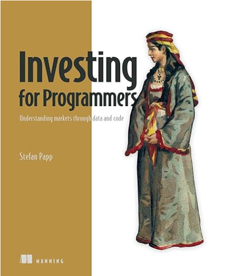

<p align="center"> 

</p>

# Investing for Programmers: Understanding markets through data and code
## Written by Stefan Papp, published by Manning, 2025
- [**Amazon URL**](https://www.amazon.com/Investing-Programmers-Stefan-Papp/dp/1633435806/)
- [**Original Books Notes**](Manning-Investing-for-Programmers-2025.txt)

| Chapter |Brief Notes |
|---------|------------|
| Chapter 1 | introduces you to the investment domain and how programmers can excel. |
| Chapter 2 | teaches financial basics and introduces you to key metrics for exploration. |
| Chapter 3 | demonstrates collecting financial data using Python libraries, including Yahoo Finance and alternative libraries. |
| Chapter 4 | teaches you how to create an investment thesis to look for growth portfolios. |
| Chapter 5 | explains how to look for portfolios to create passive income. |
| Chapter 6 | demonstrates how to collect data from brokers and exchanges, centralize all holdings in one place, and facilitate their analysis. |
| Chapter 7 | explains how to investigate risks and learn ways to hedge them. We look at Sharpe ratios and other methods. |
| Chapter 8 | introduces AI for investment analysis. We introduce machine learning use cases and explore the application of generative AI in investment research. |
| Chapter 9 | demonstrates how to use AI agents for more advanced use cases, enabling data exploration and the integration of additional data sources. |
| Chapter 10 | shows how to display charts and technical analysis. You learn how to create charts using Bollinger Bands and other frameworks. |
| Chapter 11 | explores algorithmic trading and the application of nonfinancial data in financial analysis. |
| Chapter 12 | explores private equity as a form of ownership in startups and how to make informed investment decisions. |
| Chapter 13 | summarizes what you learned and provides some final thoughts for the path ahead. |

## Table of Contents
- [Chapter 1: The analytical investor](#chapter-1-the-analytical-investor)
- [Chapter 2: Investment essentials](#chapter-2-investment-essentials)
- [Chapter 3: Collecting data](#chapter-3-collecting-data)
- [Chapter 4: Growth portfolios](#chapter-4-growth-portfolios)
- [Chapter 5: Income portfolios](#chapter-5-income-portfolios)
- [Chapter 6: Building an asset monitor](#chapter-6-building-an-asset-monitor)
- [Chapter 7: Risk management](#chapter-7-risk-management)
- [Chapter 8: AI for financial research](#chapter-8-ai-for-financial-research)
- [Chapter 9: AI agents](#chapter-9-ai-agents)
- [Chapter 10: Charts and technical analysis](#chapter-10-charts-and-technical-analysis)
- [Chapter 11: Algorithmic trading](#chapter-11-algorithmic-trading)
- [Chapter 12: Private equity: Investing in start-ups](#chapter-12-private-equity-investing-in-start-ups)
- [Chapter 13: The road goes ever on and on](#chapter-13-the-road-goes-ever-on-and-on)
- [Appendix A](#appendix-a)

**liveBook discussion forum**        https://livebook.manning.com/book/investing-for-programmers/discussion


# Chapter 1: The analytical investor
### [top](#table-of-contents)

An **asset** is something we can purchase to monetize.

The term **securities** refers to a group of assets in the financial domain, such as stocks and bonds. 

In general, assets are monetized in two ways:
- Capital appreciation—For example, buy low and sell high.
- Passive income—For example, getting regular payments (interest payments on savings accounts or receiving rent from a tenant).

Stock represents ownership, also known as equity. When you buy stocks, you acquire a small part of a company.

Through a brokerage account, investors buy shares (referring to a countable amount) of the company’s stock (representing the total assets of a company.

A **portfolio** is a collection of securities (stocks, bonds, options, etc.) that you own.

If a position in your portfolio is higher than its purchase price, you have an unrealized gain until you sell it to realize the gain.

The same logic applies to `unrealized` and `realized` losses.

Some stocks offer income to investors through a small payment per share, known as a **dividend**.

Most ETFs are passively managed, meaning they track a market index automatically, such as the S&P 500.

Algorithms are used to rebalance the fund’s holdings, keeping it aligned with its index.

In actively managed ETFs, a portfolio manager selects specific investments to buy.

- Mutual funds—These funds are similar to ETFs in that they provide diversification and are highly regulated. The primary operational difference is that mutual funds only trade once a day at a price determined after the market closes, known as the net asset value (NAV).
- Hedge funds—These funds are typically less regulated, require a substantial minimum investment, and are generally accessible only to wealthy investors.

### Derivatives
- A put option gives the buyer the right, but not the obligation, to sell an asset at a set price (the strike price). It’s a type of insurance.
- A call option gives the buyer the right, but not the obligation, to buy an asset at a specified strike price. It’s a way to bet on a price increase with limited risk.

Investing involves acquiring assets and monetizing them, either through  capital gains or passive income.

An asset is considered non-fungible if it’s unique and can’t be easily replaced by another identical item.

In contrast, fungible assets are interchangeable, which makes them a good starting point for new investors.

This interchangeability allows them to be traded easily and efficiently.

**Candlestick charts** help us evaluate stock performance over multiple days.
- `Black` (or `red`) shows that a stock’s price decreased, while `white` (or `green`) shows that it increased during the day.

We can classify investment styles into three main categories: value, growth, and income investing. These categories sometimes overlap.

One approach is called Growth at a Reasonable Price (**GARP**), which combines value and growth investing.

### page 38
**Table 1.1 Comparing growth, value, and income investing**

| Attribute | Growth investing | Value investing | Income investing |
|-----------|------------------|-----------------|------------------|
| Primary goal | Capital appreciation | Capital appreciation | Regular income |
| Investor focus | Future potential, innovation | Undervalued “bargains” | Consistent cash payouts |
| Typical company | Young, innovative, rapidly expanding | Mature, stable, temporarily unpopular | Established, predictable, high cash flow |
| Dividends | Low or none (profits are reinvested) | Often pays dividends | High and stable dividends key |
| Key metrics | High revenue growth, High P/E | Low P/E, Low P/B* | High dividend yield, stable cash flow |
| Risk profile | High | Low to moderate | Low |
| Time horizon | Long-term | Medium to long term | Any, but often for immediate needs |

**P/E = price-to-earnings; P/B = price-to-booking.**


# Chapter 2: Investment essentials
### [top](#table-of-contents)

-  Income statement — How much revenue a business makes and how much it spends
-  Balance sheet — What assets a business owns and what it owes
-  Cashflow statement — How much cash the business generates


**Investopedia**        https://www.investopedia.com/

The main components of an income statement are as follows:
-  Revenue — Total income from sales or services
-  Expenses — Costs incurred to generate revenues
-  Net income — Revenue minus expenses, indicating profit or loss


》 Just by looking at the increased R&D expenses without any further details, we can take a guess at what’s going on here to come up with theories and create a bullish
(optimistic) and a bearish (pessimistic) hypothesis.

### Revenue to Expenses Distribution Example:
- revenue 100%
  - R&D      5%
  - expenses 80%
    - services 60%
    - other expenses 20%
  - surplus 15%


**Simple Balance sheet**
> Assets = Liabilities + Shareholders’ equity

> Assets are what a company owns, liabilities are what it owes, and shareholder equity is the amount shareholders would get paid 
>> if all assets were liquidated and the debts were paid. A company may be in serious trouble when its liabilities exceed its assets.

> Liquidity is a metric that tells how easily an asset can be converted to cash.

> Free cash flow = Operating cash flow – Capital expenditures


### page 51
Why cash flow matters
- categorization of sectors according to the Global Industry Classification Standard (GICS) of S&P
  - https://www.spglobal.com/spdji/en/landing/topic/gics/
  - a standard used to categorize companies based on their business models.

### page 53
Table 2.1 GICS sectors and their influences

| Sector | What it does | Influenced by |
|--------|--------------|---------------|
| Utilities | Companies that provide essential services such as electricity,</br>water, and natural gas | Interest rates, energy prices, regulation, and bond yields |
|Consumer Staples | Companies that produce essential products such as food, beverages,</br>and household items | Interest rates, inflation, consumer confidence, and raw material costs |
| Consumer Discretionary | Companies that produce nonessential goods and services, including</br>automobiles, apparel, and leisure | Consumer spending, unemployment rates, and disposable income |
| Communication Services | Companies that provide communication services, including telecom</br>and media | Government regulation, intense competition, technology changes, general</br>economic conditions, consumer and business confidence, spending, and</br>changes in consumer and business preferences |
| Real Estate | Companies involved in the development, management, and operation of</br>real properties | Demographic changes, interest rates, economic cycle, government policies,</br>housing demand, and economic growth | 
| Information Technology | Companies that produce software, hardware, or semiconductor equipment,</br>and companies that provide internet or related services | Innovation, cybersecurity threats, and regulatory changes |
| Energy | Companies that play a role in extracting, refining, or supplying</br>consumable fuels | Oil prices, geopolitical stability, and renewable energy trends |
| Health Care | Companies that provide medical services, manufacture medical</br>equipment, or develop pharmaceuticals | Pandemics, regulation, drug pricing, and demographic changes |
| Financials | Companies that provide financial services, including banking,</br>insurance, and investment | Interest rates, economic cycles, and regulatory changes |
| Industrials | Companies that produce goods used in construction and manufacturing,</br>including machinery and equipment | Manufacturing output, trade policies, and commodity prices |
| Materials | Companies that provide raw materials used in the manufacturing</br>process, including metals and chemicals | Commodity prices, supply chain stability, and environmental regulations |

**Warren Buffett** recommends investing **only** in businesses that you understand.

> Some companies are highly cyclical, with their success directly tied to the health of the economy.
In contrast, others are noncyclical or defensive, remaining stable during economic downturns.


We can group companies as follows (with some slight variations in different markets):
-  Mega-cap—Market :  value of `$200 billion` or more
-  Large-cap—Market:  value between `$10 billion` and `$200 billion`
-  Mid-cap—Market  :  value between `$2 billion` and `$10 billion`
-  Small-cap—Market:  value between `$250 million` and `$2 billion`
-  Micro-cap—Market:  value of less than `$250 million`

Web pages such as the Terms page from `FullRatio` https://fullratio.com/terms give more context to what each ratio could mean for an industry.


### page 58
**Liquidity**

In the simplest terms, `liquidity` measures a company’s ability to pay bills.

The current ratio measures a company’s ability to pay its short-term liabilities with its assets.
This is calculated by dividing the current assets by the current liabilities. We can collect both values from the balance sheet.

The quick ratio is more stringent. It only considers assets, such as cash, marketable securities, and receivables, that the company
 can use to pay short-term debts today and omits assets such as inventory.

`current ratio` > `quick ratio`

Technology companies tend to have higher liquidity ratios, which can also be explained by their business models.


> In a financial sense, debt is all liabilities with interest-bearing obligations.
The `debt-to-equity` (D/E) ratio is calculated by dividing a company’s total liabilities by its total shareholders’ equity.
This ratio is a key indicator of a company’s financial leverage, showing the proportion of debt used to finance its assets compared to equity.
A higher ratio indicates a greater reliance on debt financing, which can increase financial risk.


- earnings per share (EPS) = (Profit – Preferred dividends) ÷ Shares outstanding
- Free cash flow (FCF) = Operating cash flow – CapEx
- Free cash flow per share = Free cash flow (FCF) ÷ Shares outstanding


### page 63
Table 2.8 Earnings ratios for NVIDIA (tech), Apple (tech), Sempra (utility), Walmart (supermarket chain), and Coca-Cola (beverages)

Data taken from Seeking Alpha on June 8, 2025 https://seekingalpha.com

| Company | Forward P/E | Trailing P/E | PEG ratio | Price-to-sales | Price-to-book | Beta |
|---------|-------------|--------------|-----------|----------------|---------------|------|
| NVIDIA (NVDA) | 34.40 | 45.72 | 1.76 | 23.27 | 41.22 | 2.122 |
| Apple (AAPL) | 24.54 | 31.76 | 1.85 | 7.61 | 45.10 | 1.211 |
| Sempra (SRE) | 14.95 | 16.89 | 2.03 | 3.76 | 1.63 | 0.656 |
| Walmart (WMT) | 35.83 | 41.65 | 3.72 | 1.14 | 9.32 | 0.693 |
| Coca-Cola (KO) | 24.02 | 28.65 | 4.41 | 6.55 | 11.72 | 0.46 |


- profitability = earnings - expenses
- Return on assets (ROA) = net income ÷ total assets
  - It reflects how effectively the company uses its assets to generate revenue.
- Return on equity (ROE) = net income ÷ shareholder equity
  - It indicates how effectively a company compensates its shareholders for their investment.


### page 67
Table 2.10 Looking at a dividend scorecard from data collected via Python

| Company | Sector | Industry | Dividend yield | Payout ratio |
|---------|--------|----------|----------------|--------------|
| Microsoft (MSFT) | Technology | Software - Infrastructure | 0.71 | 0.2442 |
| Walmart (WMT) | Consumer Defensive | Discount Stores | 0.96 | 0.3665 |
| NVIDIA (NVDA) | Technology | Semiconductors | 0.03 | 0.0129 |
| Sempra (SRE) | Utilities | Utilities - Diversified | 3.36 | 0.4404 |
| Apple (AAPL) | Technology | Consumer Electronics | 0.51 | 0.1558 |
| Altria (MO) | Consumer Defensive | Tobacco | 6.89 | 0.6779 |
| VICI Properties (VICI) | Real Estate | REIT - Diversified | 5.50 | 0.650 |
| International (RBI.VI) | Financial Services | Banks - Regional | 4.06 | 0.4297 |


A public company can alter its share value by changing the number of outstanding shares:
-  Issuing new shares—When a company issues additional stock, it increases the total supply, thereby diluting the ownership stake of existing shareholders.
-  Repurchasing shares (buybacks)—Conversely, when a company repurchases its stock, it reduces the number of outstanding shares, thereby concentrating ownership and potentially increasing the value of the remaining shares.


**the investment platform Seeking Alpha**               https://seekingalpha.com/

-  SA Analyst Rating
  - An aggregation of crowdsourced ratings by platform users
-  Wall Street Rating
  - An aggregation of ratings by professional Wall Street analysts
-  Quant Rating
  - A rating calculated by a Seeking Alpha algorithm

For the **latest numbers**, go to https://seekingalpha.com/

### page 71
Table 2.13 Company ratings based on the Seeking Alpha platform

| Company | SA analyst rating | Wall Street rating | Quant rating |
|---------|-------------------|------|--------------|
| NVIDIA (NVDA) | 3.83 | 4.56 | 3.38 |
| Pfizer (PFE) | 3.18 | 3.56 | 3.40 |
| Aeva Technologies (AEVA) | 2.50 | 4.40 | 4.99 |
| Innoviz (INVZ) | — | 4.25 | 3.35 |
| Ouster (OUST) | 3.33 | 5.00 | 4.50 |
| Luminar Technologies (LAZR) | 3.25 | 2.75 | 2.63 |

**Treating `statements of experts` as `opinions`, not as `predictions`.**


# Chapter 3: Collecting data
### [top](#table-of-contents)

To analyze financial assets, we can divide the data into three categories:
-  Fundamental data — Fundamental data doesn’t change regularly within short time frames.
  - e.g. regularly published quarterly financial documents, such as income statements, balance sheets, or cash flow statements. They are updated in intervals, such as with quarterly reports.
-  Technical data — As a prominent example of technical data, share prices of company stocks change continuously during the open hours of stock exchanges.
  - Many traders try to predict trends from these price movements, especially for those day traders.
-  Nonfinancial data — information that can be mined to find hidden insights.

Fundamental, technical, and nonfinancial data differ fundamentally (no pun intended).
> While fundamental analysis is primarily based on comparing financial data between companies within an industry to identify good investment opportunities,
technical analysis is used to make quick trading decisions that benefit from bullish or bearish market trends.
The next step is to look at the origins of the data.


### Financial analysis platforms
A stock screener is a tool that allows investors to filter listed stocks based on customizable criteria and displays relevant information onscreen to support informed decision-making.

In this book, we demonstrate how to create a preselection using the `Finviz` platform https://finviz.com


### page 80
Table 3.1 Categorization of financial platforms for developers 

| Platform category | Examples | Summary                                                                                                                                                                                                                                                                                                                                               |
|-------------------|----------|-------------------------------------------------------------------------------------------------------------------------------------------------------------------------------------------------------------------------------------------------------------------------------------------------------------------------------------------------------|
|Finance pages of a search</br>engine provider | Yahoo Finance, Google Finance, or MSN Money | They provide financial data and insights without asking users to pay for a subscription (except for Yahoo Finance, which offers a premium subscription).</br>In many cases, open source developers create libraries to scrape data from the platforms to provide that  data to programmers. The yfinance library is a good example of such a library. |
| Financial advisory platform for</br>private investors | Seeking Alpha, The Motley Fool, Morningstar,</br>Ziggma, Zacks, Koyfin, Stock Rover, Empower,</br>Simply Wall St, TipRanks | They provide insights about financial assets on a tiered subscription model.</br>from $10 to $350 for standard plans, you gain access to more in-depth insights.</br>Only a few advisory platforms provide an API to programmers.                                                                                                                     |
| Financial data providers for fintech start-ups | EODHD, Alpha Vantage, OpenBB | They provide financial data through APIs. Most of them also offer a freemium version, providing limited access to economic data.</br>Prices for commercial packages, which include more data, more requests, and faster access, vary but are often in the range of $240 to $1,200 per year.                                                           |
| Commercial products for large investment firms | Bloomberg Terminal, Refinitiv, MSCI | These products normally exceed the budget of individual investors.</br>They provide an immense amount of data and insights for analysts and fund managers.                                                                                                                                                                                            |

```
import yfinance as yf
microsoft = yf.Ticker('MSFT')
microsoft.income_stmt
microsoft.balance_sheet
microsoft.cash_flow

microsoft.income_stmt["2024-06-30"]["EBITDA"]
microsoft.quarterly_income_stmt
microsoft.quarterly_balance_sheet
microsoft.quarterly_cash_flow

import pandas as pd
info = pd.Series(microsoft.info)
print(', '.join(info.keys()))
```

We define a small helper function to collect the company’s ratios.
```
import pandas as pd
import yfinance as yf

def collect_ratios(tickers: list, ratios: list):
    rows = []
    
    for ticker in tickers:
        info = yf.Ticker(ticker).info
        row = [ticker] + [info.get(ratio, None) for ratio in ratios]
        rows.append(row)

    return pd.DataFrame(rows, columns=["Ticker"] + ratios)
```

### page 85
Table 3.3 How to collect specific ratios using the collected object and helper functions

| Ratio | Code |
|-------|------|
| Return on assets | `company.income_stmt[col_latest_inc_stmt]["Net Income"]/company.balance_sheet[col_latest_bs]["Total Assets"] * 100` |
| Return on equity | `company.income_stmt[col_latest_inc_stmt]["Net Income"]/company.balance_sheet[col_latest_bs]["Stockholders Equity"] * 100` |
| Profit margin | `company.income_stmt[col_latest_inc_stmt]["Net Income"]/company.income_stmt[col_latest_inc_stmt]["Total Revenue"] * 100` |
| Asset turnover ratio | `company.income_stmt[col_latest_inc_stmt]["Total Revenue"]/company.balance_sheet[col_latest_bs]["Total Assets"]` |
| Debt-to-equity | `company.balance_sheet[col_latest_bs]['Total Debt']/company.balance_sheet[col_latest_bs] ['Stockholders Equity']` |

```
# load Microsoft’s historical stock data into a DataFrame for one year's interval
import yfinance as yf

historical_data = yf.Ticker("MSFT").history(start="2024-05-08", end="2025-05-08")
historical_data


# load loadMicrosoft’s historical stock data into a DataFrame for exact one year

import yfinance as yf

hd_msft_2023 = yf.Ticker("MSFT").history(start="2023-01-01", end="2023-12-31")
hd_msft_2023
```
```
def plot_closing_prices(data):
    import matplotlib.pyplot as plt
    close_prices = data["Close"]
    price_change_in_percentage = (close_prices / close_prices.iloc[0] * 100)
    price_change_in_percentage.plot(figsize = (12,8), fontsize = 12)
    plt.ylabel("Percentage")
    plt.title(f"Price Chart", fontsize = 15)
    plt.show()


import yfinance as yf
hd_nvda_smr_aapl_1yr = yf.Tickers(["AAPL", "SMR", "KO"]).history(start= "2023-11-22", end= "2024-11-22")
plot_closing_prices(hd_nvda_smr_aapl_1yr)
```
```
simple_returns = hist_prices_24 ["Close"].pct_change(fill_method=None).dropna()
simple_returns

# logarithmic returns
import numpy as np
log_rets = hist_prices_24["Close"].apply(lambda x: np.log(x / x.shift())).dropna()
log_rets
```
```
log_rets_2023 = hist_prices_2023["Close"].apply(lambda x: np.log(x / x.shift())).dropna()
log_rets_2023.hist(bins=35, figsize=(10, 6))
```
```
# mean, standard deviation, and variance
summary = log_rets_2023.agg(["mean", "std", "var"]).T
summary.columns = ["Mean", "Std", "Var"]
summary
```

Table 3.5 Statistics for Apple, Coca-Cola, and NuScale

| Company | mean | std | var       |
|---------|------|-----|-----------|
| Coca-Cola | -0.035349 | 0.134959 | 0.018214  |
| Apple | 0.442217 | 0.199222 | 0.039690 |
| NuScale | -1.149094 | 0.799615 | 0.639385 |

> The mean is the average stock price over the given period, representing the “central” value of the dataset.
Variance measures how far each price deviates from the mean in squared units.
The standard deviation is the square root of the variance, bringing the measure back to the same units as the prices.


**Limitations of `yfinance`**

> Digging into the source code of the yfinance code on GitHub, we see that it uses web scraping frameworks, such as Beautiful Soup.
On the landing page, the author introduces this library as a wrapper for Yahoo’s internal API, highlighting that Yahoo doesn’t maintain the yfinance library.


**Commercial libraries**

> Yahoo Finance statistics (https://mng.bz/z2Dg) confirm that Yahoo Finance uses
data providers such as Refinitiv, Edgar Online, and Morningstar to collect information.
The provider EODHD (https://eodhd.com/) claims in its FAQ that it collects data through
direct contracts with various exchanges. They also collect fundamental data from finan-
cial news providers, corporate websites, and annual reports, with direct extraction from
https://www.sec.gov for the US and www.sedarplus.ca/landingpage/ for Canada.


### page 93
Table 3.6 **APIs and their packages**

| Platform | Packages |
|----------|----------|
| Finviz | Elite subscription costs $24.96 per month. |
| EODHD | Packages range from $0 to $199.00 per month. |
| Alpha Vantage | Packages range from $0 to $249.99 per month. |
| OpenBB | Pricing isn’t disclosed. |


> `Finviz` is a popular financial platform best known for its feature-rich stock screener on the platform’s webpage.
The major downside of this platform is that it only provides data for companies listed on US exchanges.
Because `Finviz` is popular among investors and often featured in finance training videos, it still makes sense to
 introduce the API to users who plan to invest only in the United States and appreciate the stock screener’s richness.
```
import requests
URL = f"https://elite.finviz.com/export.ashx?[allYourFilters]&auth={token}"
response = requests.get(URL)
open("export.csv", "wb").write(response.content)
```
sample URL:
`https://elite.finviz.com/portfolio_export.ashx?pid={pid}&o=price&auth={token}`


**Python Package Index** (`PyPI`) lists alternative and free libraries that scrape `Finviz` data without using `Finviz`’s paid service.
These libraries follow the same strategy as yfinance: They scrape data from the web and return data in `Pandas` DataFrames.

`EODHD`, in contrast, is a platform where data provision is the primary business model.
```
from eodhd import APIClient
client = APIClient(api_key)
client.get_exchanges()

resp = client.get_eod_historical_stock_market_data(symbol = 'RR.LSE', period='d', from_date = '2024-06-01', to_date = '2024-06-17', order='a')
df = pd.DataFrame(resp)
df
```

Like `EODHD`, `Alpha Vantage`’s primary business model is to provide financial data via an API.
The provider offers a free package and advanced services through a paid subscription.
```
from alpha_vantage.timeseries import TimeSeries
import pandas as pd

symbol = 'AAPL'
ts = TimeSeries(key)
data, meta_data = ts.get_daily(symbol=symbol)
df = pd.DataFrame(data)
df
```

`OpenBB` integrates various asset classes beyond stocks.
```
from openbb import obb
obb.equity.price.historical("NVDA").to_df().head()
obb.equity.price.historical("NVDA", provider="yfinance").to_df().head()

obb.currency.price.historical("USDGBP").to_df().head()
obb.fixedincome.government.treasury_rates(start_date="2024-01-02").to_df().dropna()
obb.crypto.price.historical("SOLUSD").to_df().tail()
```

### Other libraries

**The Awesome Quant GitHub page**           https://github.com/wilsonfreitas/awesome-quant

> provides a comprehensive list of alternatives for collecting financial data.
However, rewriting the code can be time-consuming if we choose libraries and later find out that they don’t meet our expectations.


# Chapter 4: Growth portfolios
### [top](#table-of-contents)

-  Luminar Technologies (LAZR)
-  Innoviz Technologies (INVZ)
-  Ouster (OUST)
-  Aeva Technologies (AEVA)

```
import yfinance as yf
import pandas as pd

def collect_ratios(tickers: list, ratios: list):
    rows = []
    
    for ticker in tickers:
        info = yf.Ticker(ticker).info
        row = [ticker] + [info.get(ratio, None) for ratio in ratios]
        rows.append(row)
    return pd.DataFrame(rows, columns=["Ticker"] + ratios)

objects = [“AEVA”, “LAZR”, “INVZ”, “OUST”]
for o in objects:
    ticker = yf.Ticker(o)
    print(f"ticker {o}: {ticker.info['marketCap']}")

collect_ratios(objects, [“sector”, “industry”, “debtToEquity”])
```

### Trend Analysis
```
from pytrends.request import TrendReq
import pandas as pd

pytrend = TrendReq(hl='en-US', tz=360)
keywords = [“Luminar Technologies”, “Ouster Inc”, “AEVA Technologies”, “Innoviz Technologies”]
pytrend.build_payload(keywords, cat=0, timeframe='today 12-m', geo='', gprop='')
interest_over_time_df = pytrend.interest_over_time()
print(interest_over_time_df.head())
interest_over_time_df.to_csv('google_trends_data.csv')
```

# Chapter 5: Income portfolios
### [top](#table-of-contents)

A dividend is a portion of a company’s profit that is paid to its shareholders.

### dividend metrics and ratios
-  Annual payout — The total amount paid out per share per year.
-  Dividend payout frequency — How often dividends are paid out per year, which is usually monthly, quarterly, semi-annually, annually, or irregularly.</br>In most cases, yearly payouts are distributed equally. For example, a `$1` annual payout per share results in `$0.25` per quarter if paid quarterly.
-  Dividend yield — Calculated by dividing the annual payout per share by the share price. A high dividend yield isn’t always a positive indicator; it can also signal a falling share price, which increases the risk of a reduced annual payout.
-  Dividend growth — This metric tracks how many years a company has consistently increased its dividends. Companies with long histories of raising dividends, such as Coca-Cola with 62 years of increases, are considered reliable long-term income stocks.
-  Dividend growth rate — The rate at which a company grows its dividends. Some companies grow their dividends faster than others, but larger companies may take a slower approach to increases.
-  Payout ratio — The fraction of a company’s net income paid to shareholders. A smaller payout ratio suggests more room for growth and reinvestment.
-  Residence of the company — Your residency can affect taxation. For example, non-US investors may face additional taxes when investing in US-based companies compared to those headquartered elsewhere.


### page 133
Listing 5.1 Calculating dividend growth
```
def calc_div_growth_rate (stock):
    try:
        dividends = stock.dividends

        if dividends.empty:
            return None, None

        dividends_by_year = dividends.resample('YE').sum()      # Gets the dividend sum by years

        if len(dividends_by_year) > 1:                          # Calculate growth rate (CAGR)
            first_year = dividends_by_year.index[0].year  
            last_year = dividends_by_year.index[-1].year  
            first_dividend = dividends_by_year.iloc[0]    
            last_dividend = dividends_by_year.iloc[-1]    
            num_years = last_year - first_year            
            cagr = ((last_dividend / first_dividend) ** (1 / num_years)) - 1                   
        else:
            cagr = None

        payouts_per_year = dividends.resample('YE').count().mean()  # Determines payout frequency
        if payouts_per_year > 3.5:
            payout_frequency = "Quarterly"
        elif payouts_per_year > 1.5:
            payout_frequency = "Semi-Annual"
        elif payouts_per_year > 0.5:
            payout_frequency = "Annual"
        else:
            payout_frequency = "Irregular"
        return cagr, payout_frequency
    except Exception as e:
        print(f"Error processing {stock}: {e}")
        return None, None
```
In this method, we collect ticker data through the tickers and filter by dividend-paying companies and those whose market cap exceeds a minimum threshold. This threshold is passed to the function as a parameter.
```
import requests
import pandas as pd
import yfinance as yf
from io import StringIO

def get_sp500_tickers():
    # Collects all tickers from S&P 500 companies
    url = "https://en.wikipedia.org/wiki/List_of_S%26P_500_companies"              
    response = requests.get(url)                   
    tables = pd.read_html(StringIO(response.text)) 
    sp500_table = tables[0]                        
    return sp500_table["Symbol"].tolist()          

def get_stocks_with_dividends_and_high_market_cap(tickers, market_cap_threshold):
    data = []
    for ticker in tickers:                          # Collects company data from all tickers
        try:
            stock = yf.Ticker(ticker)
            info = stock.info
            if info.get("dividendYield") and 
                   info.get("marketCap") >= market_cap_threshold:
                cagr, payout_frequency = (calc_div_growth_rate(stock))
                
                # Gets dividend data
                data.append({
                    "Ticker": ticker,                     
                    "Name": info.get("longName", "N/A"),
                    "Market Cap": info.get("marketCap"),
                    "Dividend Yield": info.get("dividendYield"),
                    "Sector": info.get("sector", "N/A"),
                    "payoutRatio": info.get("payoutRatio", "N/A"),
                    "dividendRate": info.get("dividendRate", "N/A"),
                    "cagr": cagr,
                    "payout_frequency": payout_frequency,
                })
        except Exception as e:
            print(f"Error processing {ticker}: {e}")

    return pd.DataFrame(data)
```

Many attributes define a bond’s details, also called the indenture:
-  Borrower — it refers to the party who receives the money. You can lend money, for instance, to the federal government, municipalities, or companies.
-  Maturation date — This parameter defines the day the borrower must repay the principal (the total amount of borrowed money) to the lender. The time to maturity of a bond at its emission can vary from months to decades.
-  Coupon payments — Eventually, a coupon rate is an investor’s annual payment while holding a particular bond. Rates can also be floating or fixed, meaning coupon rates may change over time for some bonds. 
-  Risk rating — A bond’s interest rate depends strongly on the borrower’s default risk. The higher the risk, the higher the rate. Therefore, a third party needs to evaluate the default risk. Figure 5.4 outlines the rating structure of Moody’s and Standard & Poor (S&P), two rating agencies in the United States.
-  Payment modalities — For cash flow planning, investors must also know when they get their payments. The payment modalities define, among other things, how often and when the lender receives money. In many cases, coupon payments are made quarterly.


### page 137
Table 5.1 **Rating of bonds**

| Rating tier | Moody’s | S&P | Fitch | Meaning |
|-------------|---------|-----|-------|---------|
|Investment Grade||||
|Highest quality | Aaa | AAA | AAA | Prime credit quality, lowest risk |
|High quality | Aa1, Aa2, Aa3 | AA+, AA, AA- | AA+, AA, AA- | Very high credit quality |
|Upper medium grade | A1, A2, A3 | A+, A, A- | A+, A, A- | Strong capacity to meet financial commitments |
|Lower medium grade | Baa1, Baa2, Baa3 | BBB+, BBB, BBB- | BBB+, BBB, BBB- | Adequate capacity, some susceptibility to conditions|
|Speculative grade||||
|Upper speculative | Ba, Ba, Ba3 | BB+, BB, BB- | BB+, BB, BB- | Higher risk of default, but financial commitment met |
|Highly speculative | B1, B2, B3 | B+, B, B- | B+, B, B- | Material default risk, but financial obligations still met |
|Substantial risk | Caa1, Caa2, Caa3 | CCC+, CCC, CCC- | CCC+, CCC, CCC- | Very high risk, substantial vulnerability to default |
|Near default | Ca | CC, C | CC, C | Highly vulnerable to default |
|Default | C | D | RD, D | In default |


The following code demonstrates how to collect bond interest rates using the EODHD platform:
```
import requests
def fetch(country_code):
    url = f’https://eodhd.com/api/eod/{country_code}.GBOND?api_token={eod_api_key}&fmt=json’
    return requests.get(url).json()

import pandas as pd
us = pd.DataFrame(data=fetch("US10Y"))
```
```
# plot the results and explore the outcome
import matplotlib.pyplot as plt
p = us[["date", "adjusted_close"]]
p.set_index("date", inplace=True)

p.plot(figsize = (12,8), fontsize = 12)
plt.ylabel("Price (USD)")
plt.title("yield Price Chart", fontsize = 15)
plt.show()
```

> Alternatively, we can analyze high-risk bonds, often referred to as `junk bonds`, and use data to determine if some are undervalued relative to their ratings.
Unfortunately, the free EODHD version is limited and doesn’t provide corporate data.
The following code uses an alternative open platform to load data from an International Securities Identification Number (ISIN), a bond identifier.
```
import requests
headers = {
    “Content-Type”: “application/json”,
    “X-OPENFIGI-APIKEY”: OPEN_FIGI_KEY
}
isin = "US36166NAJ28"  # Example ISIN
data = [{"idType": "ID_ISIN", "idValue": isin}]
response = requests.post("https://api.openfigi.com/v3/mapping", headers=headers, json=data)
print(response.json())
```

### page 141
5.3 Crypto staking


# Chapter 6: Building an asset monitor
### [top](#table-of-contents)

 Collecting portfolio data from online and offline sources
```
create table main.offline_asset
(
    ticker        TEXT constraint InterestTable_pk  primary key,
    yield         REAL,
    avg_price     REAL,
    exchange      TEXT,
    amount        REAL,
    asset_type    TEXT
);
```

Related concepts:
-  Ticker — The stock symbol that serves as a unique identifier.
-  Number of shares — The total number of shares currently held.
-  Average price — The average purchase price aggregated for all transactions.
-  Exchange — The exchange on which the asset is traded.
-  Broker — A constant value to identify the data source. In our case, this will be either INTERACTIVE_BROKER or ALPACA.

> Alpaca markets itself as a **developer-first** broker, offering modern APIs designed for seamless integration into your workflows.
To use the Alpaca platform, you’ll need an account, and you must generate **access keys** on this account.
These keys enable programmatic access to your account for tasks such as retrieving balances or executing trades.


### page 152
Ensure the .env file contains your keys in this format:
```
ALPACA_API_KEY=your_api_key_here
ALPACA_SECRET_KEY=your_secret_key_here
```

Listing 6.1 Extracting data from Alpaca
```
# Collects the secrets from a local .env file
from alpaca.trading.client import TradingClient
ALPACA_KEY = os.getenv("ALPACA_API_KEY")
ALPACA_SECRET = os.getenv("ALPACA_SECRET_KEY")

trading_client = TradingClient(ALPACA_KEY, ALPACA_SECRET, paper=False)

# Collects data through the method get_all_positions()
positions_data = [
    [position.symbol, position.qty,
     position.avg_entry_price,
     position.exchange.value, 'ALPACA']
    for position in trading_client.get_all_positions()
]

alpaca_balances = pd.DataFrame(
    positions_data,
    columns=[COL_TICKER, COL_AMOUNT, COL_PRICE_INIT,
             COL_EXCHANGE, COL_BROKER])
```
**NOTE** - `Alpaca` only supports US dollars as currency.


Listing 6.2 Extracting data from Interactive Brokers
```
# Connects to the local TraderWorkstation
from ib_insync import *
util.startLoop()
ib =  IB()
ib.connect()

# Collects data through ib.positions()
ibr = util.df(ib.positions())
ibr[COL_TICKER] = (ibr.contract.apply
                   (lambda x: x.symbol))
ibr["exchange"] = (ibr.contract.apply
                   (lambda x: x.exchange))
ibr["broker"] = "INTERACTIVE_BROKER"

IB_balances = (ibr[[COL_TICKER, 'position', 'avgCost',
                    COL_EXCHANGE, COL_BROKER]].rename(
                        columns={'position': COL_AMOUNT, 'avgCost': COL_PRICE_INIT}))
```

### Enriching data
We now have data in two DataFrames containing information from two brokers arranged in the same data structures. Additionally, we have a DataFrame that includes
offline assets. We can merge them as
```
all_positions_raw = pd.concat([alpaca_balances, IB_balances, offline_assets])
```

-  Ticker — The broker’s unique identifier for a stock
-  Asset type — The type of asset (here, stocks; different types of assets will be collected later)
-  Portfolio — The portfolio the asset belongs to
-  Yahoo — The ticker name on Yahoo Finance
-  Google — The ticker name on Google Finance

```
create table main.asset_lookup
(
    ticker      TEXT not null constraint base_security_pk primary key,
    asset_type  TEXT not null,
    portfolio   TEXT,
    yahoo       TEXT,
    google      TEXT
);
```

### page 155
Listing 6.3 Loading metadata
```
# Loads data from SQLite
from sqlalchemy import create_engine
engine = create_engine('sqlite:///portfolio.sqlite')
asset_lookup = pd.read_sql('asset_lookup', engine, index_col=COL_TICKER)

all_positions = all_positions_raw.merge(asset_lookup, on=COL_TICKER)

# Fills NULL values with ticker data
all_positions[COL_YAHOO] = (all_positions[COL_YAHOO].fillna(all_positions[COL_TICKER]))                               
all_positions[COL_GOOGLE] = (all_positions[COL_GOOGLE].fillna(all_positions[COL_TICKER]))                               


def collect_fin_data(tickers):
    return {ticker: yf.Ticker(ticker).info for ticker in tickers}
```

### 6.5 Processing assets
```
# stocks
shares = all_positions[all_positions[COL_ASSET_TYPE].isin(["STOCK"])]
unique_stock_tickers = shares[COL_YAHOO].unique().tolist()
yfin_data_stocks = collect_fin_info(unique_stock_tickers)
```

Listing 6.4 Merging Yahoo Finance data into DataFrames
```
def merge_fin_data (df_orig, ticker_data, metrics):
    df = df_orig.copy(deep=True)
    for m in metrics:
        df[m] = None

    # Gets the symbol from the DataFrame
    for ind in df.index:
        ticker_symbol = df.loc[ind, "yahoo"]           
        company = ticker_data.get(ticker_symbol, {})

        # Adds desired metrics to the DataFrame
        for m in metrics:
            df.loc[ind, m] = company.get(m, None)

    return df

ratios = ["currentPrice", "targetMeanPrice", "dividendRate"]
stocks = merge_fin_data(shares, yfin_data_stocks, ratios)
```

Listing 6.5 Converting currency
```
from currency_converter import CurrencyConverter

# Sets up the mapping
def get_conversion(target_currency = "USD"):
    c = CurrencyConverter()
    mapping_exchange_currency = {
        'ARCA': c.convert(1, 'USD', target_currency),
        'NASDAQ': c.convert(1, 'USD', target_currency),
        'NYSE': c.convert(1, 'USD', target_currency),
        'BATS': c.convert(1, 'USD', target_currency),
        'PINK': c.convert(1, 'USD', target_currency),
        'IBIS': c.convert(1, 'EUR', target_currency),
        'AEB': c.convert(1, 'EUR', target_currency),
        'VSE': c.convert(1, 'EUR', target_currency),
        'AMEX': c.convert(1, 'USD', target_currency),
        'BVME': c.convert(1, 'EUR', target_currency),
        'SBF': c.convert(1, 'EUR', target_currency),
        'EBS': c.convert(1, 'CHF', target_currency),
        'CPH': c.convert(1, 'DKK', target_currency),
        'PRA': c.convert(1, 'CZK', target_currency)
    }

    return mapping_exchange_currency

# Specifies USD as the target currency
conversion = get_conversion()
```

Listing 6.6 Executing conversion
```
def convert(row, column_name):
    return (row[column_name] * conversion[row[COL_EXCHANGE]])


# Maps the conversion to the exchange column
df[COL_PRICE_INIT_USD] = df.apply(convert, column_name=COL_PRICE_INIT, axis=1)

# Gets a single currency from a field
df[COL_PRICE_USD] = df.apply(convert, column_name=col_price, axis=1)                    
df[COL_YIELD_USD] = df.apply(convert, column_name=col_yield, axis=1)
```

Listing 6.7 Aggregating values
```
df[COL_TOT_INIT_VALUE] = (df[COL_AMOUNT] * df[COL_PRICE_INIT_USD]).round(2)
df[COL_TOT_VALUE] = (df[COL_AMOUNT] * df[COL_PRICE_USD]).round(2)
df[COL_TOT_YIELD] = df[COL_AMOUNT] * df[COL_YIELD_USD]
df[COL_PAST_GAIN] = df[COL_TOT_VALUE] - df[COL_TOT_INIT_VALUE]
df[COL_PROJ_GAIN] = ((df[COL_TARGET_PRICE] - df[COL_PRICE_USD]) * df[COL_AMOUNT])
```

Listing 6.8 Adding live data
```
# Gets column positions
col_amount_character = (get_char_by_col_pos(pos_col_amount))
col_tot_val_character = (get_char_by_col_pos(pos_col_tot_val))
col_live_character = (get_char_by_col_pos(pos_col_live))
col_update_character = (get_char_by_col_pos(pos_col_live+1))

# Assembles cell function for export
update_cols = []
counter = 0
for ticker in tickers:
    update_cols.append(f'=GOOGLEFINANCE("{ticker}")*{col_amount_character}{counter+2}')
    counter += 1

# Updates worksheets
worksheet.update([update_cols],
                  col_live_character + "2",
                  raw=False,
                  major_dimension = "COLUMNS" )
```

Let’s collect and export all ETFs to a new worksheet in the spreadsheet.
```
all_etfs_held = all_ positions[all_positions['asset_type'].isin(["ETF"])]
full_etf_data = all_etf["yahoo"].unique().tolist()
essential_etf_data = merge_values_into_df(all_etfs_held, 
                                          full_etf_data, 
                                          ["navPrice", "yield"])

# Listing 6.9 Exporting ETFs
all_etfs_held = all_positions[all_positions['asset_type'].isin(["ETF"])]
yfin_data_etf = collect_fin_data(all_etfs_held[COL_YAHOO].unique().tolist())

etf_info = merge_fin_data(all_etfs_held, yfin_data_etf, ["navPrice", "yield"])
etf_info = calculating_price_data(etf_info, "navPrice", "yield")

export_etf_columns = [COL_TICKER, COL_PORTFOLIO, 
                      COL_TOT_VALUE, COL_TOT_YIELD, 
                      COL_AMOUNT, COL_TOT_INIT_VALUE]

export_df_to_sheet(COL_WORKSHEET_ETF, etf_info[export_etf_columns])

add_live_data(COL_WORKSHEET_ETF, 
              etf_info[COL_GOOGLE].tolist(), 
              export_etf_columns)
```

### page 162
6.5.4 Cryptocurrencies


# Chapter 7: Risk management
### [top](#table-of-contents)

###  Classifying risks

#### page 173
Figure 7.3 How to map risk in a matrix based on severity and likelihood

| Likelihood  | Harm severity: Minor | Marginal | Critical | Catastrophic |
|-------------|----------------------|----------|----------|--------------|
| Certain     | High                 | High | Very High | Very High |
| Likely      | Medium               | High | High | Very High |
| Possible    | Low                  | Medium | High | Very High |
| Unlikely    | Low                  | Medium | Medium | High |
| Rare        | Low                  | Low | Medium | Medium |
| Eliminated  | Eliminated           | Eliminated | Eliminated |

Assessing risks also means understanding beta, a measure of an asset’s sensitivity to market fluctuations:
-  `Beta = 1` — Moves with the market
-  `Beta > 1` — More volatile than the market
-  `Beta < 1` — More stable than the market

-  Market risk — Stock prices are significantly affected by overall market trends.
-  Sector risk — Investing in stocks concentrated in a specific sector (e.g., technology, energy) exposes investors to risks that may affect that entire sector
-  Asset-specific risk — Individual stocks carry the risk of poor performance due to company-specific issues such as mismanagement, declining sales, product failures, or scandals. This is also known as unsystematic risk.

###  Mitigating risks 
**Value at risk** (`VaR`) is a tool for measuring the potential loss of an investment or portfolio over a specified period,
under normal market conditions, at a given confidence level.

-  You monitor a portfolio (a collection of assets).
-  You need a time frame (e.g., days, months) and a confidence level.
-  These can be used to determine risk, such as the following: “We’re 95% confident that the portfolio won’t lose more than $30,000 in one day.”


To calculate `VaR`, we simulate the potential future risks based on historical data. There are two common approaches:
-  Variance - coeffect method—This approach assumes that returns follow a normal distribution. It’s similar to predicting load times using standard deviation.
-  Monte Carlo simulation — This method simulates numerous potential outcomes, like stress-testing code under various edge cases.

> A `Monte Carlo simulation` is a computational technique for modeling the probability of different outcomes in a process with inherent uncertainty.
It relies on repeated random sampling to obtain numerical results, making it useful for scenarios where traditional analytical methods are infeasible.

#### page 175
Listing 7.1 Monte Carlo simulation for VaR on Apple
```
import numpy as np
import yfinance as yf
import matplotlib.pyplot as plt

# Sets up the parameters
ticker = "AAPL"
confidence_level = 0.95
num_simulations = 10000
time_horizon = 1

# Fetches historical stock data and calculates historical returns
stock = yf.Ticker(ticker)
hist = stock.history(period="1y")
returns = hist['Close'].pct_change().dropna()

# Estimates the mean and standard deviation of returns
mu = returns.mean()
sigma = returns.std()

# Monte Carlo simulation of stock price paths
last_price = hist['Close'].iloc[-1]            
sim_returns = np.random.normal(mu, 
                               sigma, 
                               num_simulations)
sim_prices = last_price * (1 + sim_returns)

# Calculates VaR at given confidence level
threshold = np.percentile(sim_prices - last_price, 
                          (1 - confidence_level) * 100)

# Puts out the result
plt.hist(simulated_prices - last_price, bins=50, 
         alpha=0.75, color="blue", edgecolor="black")
plt.axvline(threshold, color="red", 
         linestyle="dashed", linewidth=2)
plt.title(f"Monte Carlo Simulated "
          f"P&L Distribution for {ticker}")
plt.xlabel("Profit/Loss")
plt.ylabel("Frequency")
plt.show()
print(f"{confidence_level * 100}% Monte Carlo "
      f"VaR for {ticker}: ${-var_threshold:.2f}")
```

> Correlation measures how assets move relative to one another.
Positively correlated assets move in the same direction; negatively correlated ones move oppositely.
It’s like service dependencies—when one microservice fails, does it take down others? 
```
def collect_prices_returns(tickers: list):
    close_prices = pd.DataFrame()
    log_returns = pd.DataFrame()

    for ticker in tickers:
        close_prices[ticker] = yf.Ticker(ticker).history(
            start='2024-01-01', 
            end='2024-12-31', 
            interval="1d")['Close']
        log_returns[ticker] = np.log(close_prices[ticker] 
                                     / close_prices[ticker].shift(1))
    return close_prices, log_returns

tickers = ["MSFT", "AMZN", "GOOGL"]
close_prices, log_returns  = collect_prices_returns(tickers)

# run a fundamental statistical analysis
price_stats = (
    close_prices[tickers]
    .agg(['mean', 'std', 'var'])
    .T.reset_index()
    .rename(columns={'index': 'ticker'})
)
```

#### Negligence
> Sometimes, that extra waiting period is the difference between a reckless gamble and a rational decision after a night’s rest.
Like cybersecurity, investing isn’t just about technical expertise—it’s about controlling human behavior, including your own.

To mitigate the risks, you can use dollar-cost averaging (DCA) — investing a fixed amount at regular intervals, regardless of market conditions.
While not perfect timing, DCA reduces the risk of buying at a peak and smooths out market volatility over time.

Some strategies carry exceptionally high risks:
-  Leverage — Borrowing money to invest. While it amplifies gains, excessive leverage can lead to disastrous losses.
-  Short selling — Betting against a stock. Losses are theoretically unlimited if the price rises instead.
-  Derivatives — Complex financial instruments that can magnify both gains and risks.


####  Hedging strategies (SKIPPED)
Hedging is a risk management strategy that reduces or offsets potential losses, like insurance.

Derivatives are arrangements whose value derives from an underlying asset, such as a commodity, currency, or security. They can be categorized this way:
-  Options — Buying a put option on your stock protects against price drops.
-  Futures — A farmer selling wheat futures locks in a price, avoiding losses if prices fall.
-  Swaps   — Interest rate swaps help companies hedge against rate fluctuations.

#### page 184
Examples of options, futures and swaps

Market trends are commonly symbolized by two animals: the bull and the bear. These aren’t just arbitrary animals; they symbolize specific movements in the market:
-  Bull market — The bull charges upward with its horns, symbolizing a rising market.
  - Stock prices are climbing, optimism is in the air, and investors feel confident.
-  Bear market — The bear swipes downward with its paws, symbolizing a declining market.
  - Stock prices are dropping, uncertainty looms, and fear takes over. 

#### page 191
> 10-Year Treasury Constant Maturity Minus 2-Year Treasury Constant Maturity
Some investors see the spread between the yields on 10-year and 2-year US Treasury bonds as a yield curve proxy indicator of a recession.

-  Optimizing your portfolio using the Markowitz model
#### page 194
Listing 7.3 Setting up variables
```
import numpy as np
import pandas as pd
import matplotlib.pyplot as plt
import yfinance as yf
from datetime import datetime, timedelta
def load_stocks(tickers, year_backs):
    start_date = datetime.today() - timedelta(days=365*year_backs) 
    end_date = datetime.today()
    stock_data = yf.download(tickers, start=start_date, end=end_date)['Close']
    return stock_data.pct_change().dropna()

tickers = ["AAPL", "WMT", "GOOGL", "KO", "PFE", "BRK-B", "NVDA"]
year_backs = 3
returns = load_stocks(tickers, year_backs)
```

Listing 7.3 Setting up variables
```
TRADING_DAYS = 252

# Annualized mean returns and covariance matrices
mean_returns = returns.mean() * TRADING_DAYS
cov_matrix = returns.cov() * TRADING_DAYS

# Number of portfolios to simulate
num_portfolios = 10000
num_assets = len(tickers)

port_returns = np.zeros(num_portfolios)
port_volatility = np.zeros(num_portfolios)
sharpe_ratios = np.zeros(num_portfolios)
all_weights = np.zeros((num_portfolios, num_assets))
```

#### page 196
Listing 7.4 Creating a Markowitz efficient portfolio
```
risk_free_rate = 0.0422

# Monte Carlo simulation for random portfolios
for i in range(num_portfolios):     
    weights = np.random.dirichlet(np.ones(num_assets), size=1).flatten()
    all_weights[i, :] = weights
    port_returns[i] = np.dot(weights, mean_returns)
    port_volatility[i] = np.sqrt(np.dot(weights.T, np.dot(cov_matrix, weights)))
    sharpe_ratios[i] = (port_returns[i] - risk_free_rate) / port_volatility[i]

# Finds the optimal Sharpe ratio portfolio
max_sharpe_idx = np.argmax(sharpe_ratios)
optimal_weights = all_weights[max_sharpe_idx, :]
```

Listing 7.5 Plotting the efficient frontier
```
# Sets plotting parameters
plt.figure(figsize=(10, 6))                                
plt.scatter(port_volatility, port_returns, c=sharpe_ratios, cmap='viridis', marker='o')
plt.colorbar(label='Sharpe Ratio')
plt.xlabel('Volatility (Risk)')
plt.ylabel('Expected Return')
plt.title('Efficient Frontier with Actual Stock Data')

# Plots a scatter plot
plt.scatter(port_volatility[max_sharpe_idx],
            port_returns[max_sharpe_idx],
            c='red', marker='*', s=200,
            label='Max Sharpe Portfolio')
plt.legend()
plt.show()
```

To get the portfolio with its weights, we need only to get the results in a DataFrame and display them:
```
optimal_portfolio_df = pd.DataFrame({
    'Stock': tickers,
    'Optimal Weight': optimal_weights
})

print(optimal_portfolio_df)
```

###  Assessing nonfinancial risks

**Shiller P/E ratio** --- often also referred to as the **CAPE ratio** [cyclically adjusted price-to-earnings ratio]
-  `High` CAPE (overvalued market) — Reduce equity exposure and shift to bonds, gold, or alternatives.
-  `Low` CAPE (undervalued market) — Increase equity exposure.

There are three main strategies for rebalancing:
-  Periodic rebalancing (time-based) — Rebalance on predefined intervals.
-  Threshold-based rebalancing (percentage-based) — Rebalance only when an asset deviates by a certain percentage from the target allocation (e.g., ±5% drift).
-  Hybrid approach (time + threshold) — Combine both methods.

#### page 202
Listing 7.6 Rebalancing preparation
```
# Defines the rebalancing threshold (e.g., 5% deviation from target)
threshold = 0.05
total_value = sum(current_portfolio.values())

# Computes current allocations based on the weights
current_allocation = {stock: value / total_value 
                      for stock, value 
                      in current_portfolio.items()}
```

Listing 7.7 Calculate required adjustments
```
dev = {
    stock: current_allocation[stock] 
    - target_allocation[stock] 
    for stock in target_allocation
}

# Finds rebalancing
rebalance_needed = {
    stock: value 
    for stock, value in dev.items()
    if abs(value) > threshold
}

# Defines sell and buy actions
adjustments = {}                                         
for stock in rebalance_needed:                           
    target_value = target_allocation[stock] * total_value
    current_value = current_portfolio[stock]
    adjustments[stock] = target_value - current_value

# In the last step, we must put everything in a DataFrame and analyze the results to create a DataFrame that holds buy and sell recommendations:
rebalance_df = pd.DataFrame({
    "Stock": list(adjustments.keys()),
    "Current Value ($)": [
        current_portfolio[stock] 
        for stock in adjustments
    ],
    "Target Value ($)": [
        target_allocation[stock] * total_value
        for stock in adjustments
    ],
    "Adjustment ($)": [
        adjustments[stock] 
        for stock in adjustments
    ],
    "Action": [
        "Buy" if adj > 0 else "Sell" 
        for adj in adjustments.values()
    ]
})
```

# Chapter 8: AI for financial research
### [top](#table-of-contents)

**From code to machine learning**

### page 209
Listing 8.1 Calculating returns and volatility
```
prices_list = []
start_date = datetime.now() - timedelta(days=365)

# Loads historical price data
for ticker in tickers:                          
    prices = yf.download(ticker,
                         start=start_date,
                         interval="1d")['Close']
    prices = pd.DataFrame(prices)
    prices.columns = [ticker]
    prices_list.append(prices)

prices_df = pd.concat(prices_list,axis=1)
prices_df.sort_index(inplace=True)

# Calculates returns and volatility
returns = pd.DataFrame()
returns['Returns'] = prices_df.pct_change().mean() * 252
returns['Volatility'] = (prices_df.pct_change().std()
                        * sqrt(252))
```

Listing 8.2 Calculating elbow curve
```
data = np.asarray([np.asarray(returns['Returns']),
                   np.asarray(returns['Volatility'])]).T
distortions = []
for k in range(2, 20):
    k_means = KMeans(n_clusters=k)
    k_means.fit(data)
    distortions.append(k_means.inertia_)
    
fig = plt.figure(figsize=(15, 5))
plt.plot(range(2, 20), distortions)
plt.grid(True)
plt.title('Elbow curve')
```

Listing 8.3 Creating clusters
```
centroids, _ = kmeans(data, 5)
idx,_ = vq(data,centroids)
details = [(name,cluster) for name, cluster in zip(returns.index,idx)]
details_df = pd.DataFrame(details)
details_df.columns = ['Ticker','Cluster']

clusters_df = returns.reset_index()
clusters_df['Cluster'] = details_df['Cluster']
clusters_df.columns = ['Ticker', 'Returns', 'Volatility', 'Cluster']
```

Listing 8.4 Plotting
```
fig = px.scatter(clusters_df, x="Returns", 
                 y="Volatility", color="Cluster", hover_data=["Ticker"])
fig.update(layout_coloraxis_showscale=False)
fig.update_traces(
    marker=dict(size=8, symbol="diamond", 
                line=dict(width=2, color="DarkSlateGrey")))
fig.show()
```

### STOCK PRICE PREDICTION

### page 214
Listing 8.5 Loading data for the random forest
```
import yfinance as yf
import pandas as pd
import numpy as np
from sklearn.ensemble import RandomForestRegressor
from sklearn.model_selection import train_test_split
from sklearn.metrics import mean_squared_error
from statsmodels.tsa.arima.model import ARIMA
import matplotlib.pyplot as plt

start_date = "2018-01-01"
end_date = "2023-01-01"
ticker ="AAPL"
df = yf.Ticker(ticker).history(start=start_date, end=end_date)
df = df[["Open", "High", "Low", "Close", "Volume"]]

df["Target"] = df["Close"].shift(-1)
df.dropna(inplace=True)
```

Listing 8.6 Training data for the random forest
```
X = df.drop(columns=["Target"])
y = df["Target"]
X_train, X_test, y_train, y_test = train_test_split(X, y, shuffle=False,
                                                    test_size=0.2)
rf_model = RandomForestRegressor(n_estimators=100, random_state=42)
rf_model.fit(X_train, y_train)
rf_preds = rf_model.predict(X_test)
rf_rmse = np.sqrt(mean_squared_error(y_test, rf_preds))
results = pd.DataFrame({
    "Date": df.index[-len(y_test):],
    "Actual": y_test.values,
    "RandomForest": rf_preds,
}).set_index("Date")
```

Listing 8.7 Plotting the results
```
plt.figure(figsize=(12, 6))
plt.plot(results.index, results["Actual"], label="Actual", linewidth=2
plt.plot(results.index, results["RandomForest"], label="Random Forest"
alpha=0.7, linestyle="dashed")
plt.title("Stock Price Prediction: Random Forest")
plt.xlabel("Date")
plt.ylabel("Price")
plt.legend()
plt.grid(True)
plt.tight_layout()
plt.show()
```

### 8.2 From machine learning to generative AI
We ask GPT-4o, Gemini, and Finance Chat about investment strategies.
-  What is the current trend in the stock market?
-  Provide me with three reference examples that Warren Buffett would invest in based on his strategy that aren’t currently in his portfolio.
-  Provide me with three reference examples of investments that Peter Lynch would make based on his strategy that aren’t currently in his portfolio.


### 8.3 Practical use of GenAI
- Using LLMs as research assistants:
  - One specific use case of LLMs is passing these documents to an LLM and asking it to summarize them, focusing on the topics that are specifically interesting to you.


### 8.4 Prompt engineering
N/A


# Chapter 9: AI agents
### [top](#table-of-contents)

-  Building AI agents for structured research
-  Using LangChain to build AI agents
-  Reusing strong prompts for comparable research
-  Exporting the results of your study to Notion


### page 245
Figure 9.1 A reference workflow for an AI agent

**RAG** provides additional data to LLMs, bridging the gap between the model’s release and the prompt’s submission. For this use case, we defined three categories:
-  RAG databases — Additional jobs collect data from different sources and provide this data in a vector database, which allows a workflow to supply this additional
data to the generation workflow with LLMs.
  - We need to be aware that we likely have to manage additional components that will require some maintenance.
  - Data ingestion jobs will collect data from different sources to put them into a RAG database.
-  Web searches—AI agents commonly provide a standardized interface to search engines so that they can use the content provided from search engines for the generation of responses.
-  **Model context protocols** (`MCPs`)—An **MCP** is a new interface that allows AI agents to connect to data sources and collect data from data sources in a standardized format.
  - We can see them as APIs designed explicitly for LLMs.
  - If we need to get, for instance, the latest share price of a stock for a response, an LLM can query this information while it generates an answer.
  - One significant advantage over RAG databases is that the more MCPs are available to us, the less we need to maintain jobs that aggregate the data for ourselves.


### page 254
Listing 9.5 Using LangChain with Yahoo
```
from langchain.agents import AgentType, initialize_agent
from langchain_community.tools.yahoo_finance_news import YahooFinanceNewsTool

tools = [YahooFinanceNewsTool()]
agent_chain = initialize_agent(
    tools,
    llm,  # see listing 9.4
    agent=AgentType.ZERO_SHOT_REACT_DESCRIPTION,
    verbose=True,
)

agent_chain.invoke(
    "What happened today with Microsoft stocks?",               # Submits the agent
)
```


# Chapter 10: Charts and technical analysis
### [top](#table-of-contents)

### page 279
Figure 10.19 The anatomy of a bullish (white) and bearish (black) candlestick


Listing 10.1 Creating candlestick charts
```
import mplfinance as mpf
import pandas as pd
import yfinance as yf

ticker = "NVDA"
data = yf.Ticker(ticker).history(start="2025-01-10", end="2025-01-15")
df = pd.DataFrame(data).dropna()
mpf.plot(df, type='candle', style='charles', title='Candlestick Chart')
```

### page 285
Listing 10.4 Plotting Bollinger Bands
```
import yfinance as yf
import pandas as pd
import matplotlib.pyplot as plt

ticker = "NVDA"
data = yf.download(ticker, start="2024-01-01")

window = 20                                   # Calculates the bands
std_dev_factor = 2                            
data['SMA'] = data['Close'].rolling(window=sma_window_length).mean()
rolling_std = data['Close'].rolling(window=sma_window_length).std()
data['rf'] = (rolling_std * std_dev_factor)
data['upper'] =  data['SMA'] + data['rf']
data['lower'] =  data['SMA'] - data['rf']

plt.figure(figsize=(12, 6))
plt.plot(data.index, data['Close'], label="Close Price", color="blue", linewidth=1)
plt.plot(data.index, data['SMA'], label=f"{window}-Day SMA", color="orange", linewidth=1.5)
plt.plot(data.index, data['upper'], label="Upper Bollinger Band", color="green", linestyle="--", linewidth=1)
plt.plot(data.index, data['lower'], label="Lower Bollinger Band", color="red", linestyle="--", linewidth=1)

plt.title(f"Bollinger Bands for {ticker} (20-day window)", fontsize=14)
plt.xlabel("Date", fontsize=12)
plt.ylabel("Price", fontsize=12)
plt.legend()
plt.grid(alpha=0.3)
plt.show()
```

### page 291
Listing 10.7 Displaying returns with Streamlit 
```
import streamlit as st
import pandas as pd
import yfinance as yf

st.title("Finance Dashboard")
tickers = ('TSLA', 'AAPL', 'MSFT', 'ETH-USD', 'BTC-USD')
dropdown = st.multiselect("Select Ticker", tickers)
start = st.date_input('Start Date', pd.to_datetime('2024-01-01'))
end = st.date_input('End Date', pd.to_datetime('today'))

def relativeret(df):
    rel = df.pct_change()
    cumret = (1+rel).cumprod() -1
    cumret = cumret.fillna(0)
    return cumret

if len (dropdown) > 0:
    df = relativeret(yf.download(dropdown, start=start, end=end))['Close']
    st.header(f"Returns of {dropdown}")
    st.line_chart(df)
```


# Chapter 11: Algorithmic trading
### [top](#table-of-contents)

###  Quantitative analysis
Every company has quarterly earnings calls, during which executives discuss the past quarter. Depending on the company, stocks can move quite a lot.


###  Testing strategies using backtesting
Backtesting evaluates trading strategies using historical data.
- A simple moving average (SMA) crossover can serve as a buy or sell signal. This strategy involves calculating two SMAs with different time windows based on a stock’s closing price:
  - When the shorter-period SMA crosses above the longer-period SMA, it signals a buy.
  - When it crosses below, it signals a sell.
```
def add_sma(df: pd.DataFrame, lower: int, upper: int) -> pd.DataFrame:
    if f'sma_{lower}' not in df.columns:
        df[f'sma_{lower}'] = df.Close.rolling(lower).mean()
    if f'sma_{upper}' not in df.columns:
        df[f'sma_{upper}']  = df.Close.rolling(upper).mean()
    return df
```

Listing 11.1 Backtest
```
def backtest(df: pd.DataFrame, lower: int, upper: int, shares : int, buy_first_day = False) -> pd.DataFrame:
    schema={'date': 'datetime64[ns]', 'action': 'str', 'cash_movement': 'float64'}
    results = pd.DataFrame(columns=schema.keys()).astype(schema)

    if buy_first_day:
        results.loc[len(results)] = [df["Date"].iloc[0], "Buy", df["Close"].iloc[0] * shares * -1]
        waiting_for_bear = True
    else:
        waiting_for_bear = False

    for index, row in df.iterrows():
        if not waiting_for_bear:
            if row[f"sma_{lower}"] > row[f"sma_{upper}"]:
                results.loc[len(results)] = [row.Date, "Buy", row.Close * shares * -1]
                waiting_for_bear = True
        else:
            if row[f"sma_{lower}"] < row[f"sma_{upper}"]:
                results.loc[len(results)] = [row.Date, "Sell", row.Close * shares]
                waiting_for_bear = False

    if waiting_for_bear:
        results.loc[len(results)] = [df["Date"].iloc[-1], "Sell", df["Close"].iloc[-1] * shares]

    return results
```

We’ll execute a test for NVIDIA using $1,000 and calculate 10 years of data.

In this first test scenario below, we take 10 trading days for a lower SMA window and 20 trading days for the upper time window.

Listing 11.2 Executing a single backtest
```
def run_single_backtest(ticker: str, cash, start_date: str, end_date: str, transaction_costs = 1) -> pd.DataFrame:
    df = load_data(ticker, start_date, end_date)
    shares = round(cash / df["Close"][0])
    print(f"Shares: {shares}. start price: {df["Close"][0]}. end price: "
          f"{df["Close"].iloc[-1]}. to beat: {df["Close"].iloc[-1]*shares – df["Close"][0]*shares – transaction_costs}")
    df = add_sma(df, 10, 20)
    res = backtest(df, 10, 20, shares, True)
    gain = res['cash_movement'].sum()
    gain = gain - transaction_costs * len(res['cash_movement'])
    print(f"Gains: {gain})")
    return df

results_nvda = run_single_backtest("NVDA", 1000, "2015-01-01", "2025-01-01")
```

Listing 11.3 Executing multiple backtests
```
def run_multiple_backtests(ticker, investment_sum = 1000):
    schema={'lower': 'int64', 'upper': 'int64', 'gain': 'float64'}
    results = pd.DataFrame(columns=schema.keys()).astype(schema)
    df = load_data(ticker, start_date)
    shares = round(investment_sum / df["Close"][0])
    print(f"Shares: {shares}. start price: {df["Close"][0]}. end price: "
          f"{df["Close"].iloc[-1]}. to beat: {df["Close"].iloc[-1]*shares – df["Close"][0]*shares}")
    for n,m in test_params.values:
        df = add_sma(df, n, m)
        res = backtest(df, n, m, shares)
        gain = res['change'].sum()
        results.loc[len(results)] = [n, m, gain]
    sorted_results = results.sort_values(by='gain', ascending=False)
    return sorted_results

ticker = "NVDA"
res_nvda = run_multiple_backtests(ticker, investment_sum = 1000)
res_nvda
```

###  Catalysts as game changers
###  The difference between exchanges and brokers
###  Executing orders with Python
###  Order types and modalities


# Chapter 12: Private equity: Investing in start-ups
### [top](#table-of-contents)

> Don’t mistake pre-seed start-ups for lottery tickets.
It's vital for a startup in this stage to create a minimum viable product (MVP) to validate the ideas.

Incubators aren’t free to run. They require funding, which can come from multiple sources:
-  Government grants and public funding—Governments often provide financing for incubators to stimulate innovation.
-  Corporate sponsorships—Large companies sponsor incubators to stay close to innovation.
-  Universities and research institutions—Many incubators are affiliated with universities, helping students commercialize their research.
-  Venture capitalists and angel investors—Some incubators are backed by investors looking for early-stage deal flow.
-  Membership and service fees—Some incubators charge start-ups for participation.
-  Equity stakes—Many incubators take a small equity percentage in exchange for resources.


? Start-ups can raise multiple funding rounds at each stage of development. They can raise money through debt (borrowing money) or equity (selling ownership).
Raising money through equity leads to dilution: preexisting owners will own fewer shares after an investment round unless they participate in the investment round themselves.


### page 339
Listing 12.2 Calculating dilution
```
import pandas as pd
total_shares = 1_000_000            
founder_shares = 500_000          

# Sets parameters ownership details, funding rounds
funding_rounds = [
    ("Seed", 500_000, 25),          
    ("Series A", 2_000_000, 20),    
    ("Series B", 10_000_000, 15),   
    ("Series C", 50_000_000, 10)    
]
dilution_data = []
for round_name, investment, equity_given in funding_rounds:
    new_shares = (total_shares * 
                 (equity_given / 
                  (100 - equity_given)))

    # Calculates dilution
    total_shares += new_shares
    founder_ownership = (founder_shares / total_shares) * 100
    dilution_data.append([round_name, 
                          investment, 
                          int(total_shares), 
                          round(founder_ownership, 2)])     

df = pd.DataFrame(dilution_data, columns=["Round", "Investment ($)", "Total Shares", "Founder Ownership (%)"])
df
```


# Chapter 13: The road goes ever on and on
### [top](#table-of-contents)

### Summary
-  Seeking advice before making significant investments is almost always a wise decision.
-  Discussing potential investments with a friend and charging clients for your advice are distinct actions. For the latter, you likely need a business license.
-  Staying curious about businesses is one way to accumulate a wealth of knowledge, enabling sound investment decisions over time.
-  Becoming a digital nomad enables you to pick countries with favorable tax conditions. Some countries may not have taxes on capital appreciation.
-  Become aware that your investment also supports a company. Sometimes, you might not want to support specific companies, even if you might benefit financially.
-  The smaller the company, the more effect your investment has.
-  You can become your own most significant obstacle to getting rich if you act irrationally. Establish checks and balances to minimize the effect of strong emotions.
-  You can document every investment decision and then later use a retrospective to find potential learnings to improve your investment process.
-  Occasionally, it helps to take a step back and reevaluate situations with a clear mind.
-  Many investors claim that new investors are best off with an index or world fund.
-  Patience and a stoic mindset may be the key ingredients to achieving wealth in the long run.


# Appendix A
### [top](#table-of-contents)

Table A.1 Python libraries used in this book

| Library | Link | Key required |
|---------|------|--------------|
|python-dotenv | https://pypi.org/project/python-dotenv/ | No |
|yfinance | https://pypi.org/project/yfinance/ | No |
|pandas | https://pypi.org/project/pandas/ | No |
|NumPy | https://pypi.org/project/numpy/ | No |
|matplotlib | https://pypi.org/project/matplotlib/ | No |
|finviz | https://pypi.org/project/finviz/ | Yes |
|openbb | https://pypi.org/project/openbb/ | Yes |
|alpha-vantage | https://pypi.org/project/alpha-vantage/ | Yes |
|eodhd | https://pypi.org/project/eodhd/ | Yes |
|pytrends | https://pypi.org/project/pytrends/ | No |
|Alpaca-py | https://pypi.org/project/alpaca-py/ | Yes |
|ib_insync | https://pypi.org/project/ib-insync/ | No |
|python_binance | https://pypi.org/project/python-binance/ | Yes |
|SQLAlchemy | https://pypi.org/project/SQLAlchemy/ | No |
|CurrencyConverter | https://pypi.org/project/CurrencyConverter/ | No |
|scikit-learn | https://pypi.org/project/scikit-learn/ | No |
|statsmodels | https://pypi.org/project/statsmodels/ | No |
|openai | https://pypi.org/project/openai/ | Yes |
|google-genai | https://pypi.org/project/google-genai/ | Yes |
|google-generativeai | https://pypi.org/project/google-generativeai/ | Yes |
|anthropic | https://pypi.org/project/anthropic/ | Yes |
|transformers | https://pypi.org/project/transformers/ | No |
|langchain | https://pypi.org/project/langchain/ | No |
|Langchain-community | https://pypi.org/project/langchain-community/ | No |
|Langchain-openai | https://pypi.org/project/langchain-openai/ | Yes |
|Langchain-core | https://pypi.org/project/langchain-core/ | No |
|mplfinance | https://pypi.org/project/mplfinance/ | No |
|streamlit | https://pypi.org/project/streamlit/ | No |
