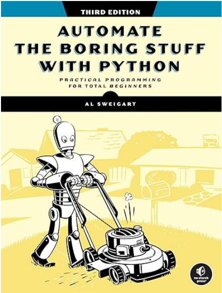

<p align="center"> 

</p>

# Automate the Boring Stuff with Python, 3rd Edition
## Written by Al Sweigart, published by No Starch, 2025
- [**Amazon URL**](https://www.amazon.com/Automate-Boring-Stuff-Python-3rd/dp/1718503407/)
- [**Original Books Notes**](No-Starch-Automate-the-Boring-Stuff-with-Python-3rd-Edition-2025.txt)
- [**Book Source**](https://nostarch.com/automate-boring-stuff-python-3rd-edition)

# Table of Content
- Part I: Programming Fundamentals
  - [Chapter 1: Python Basics](#chapter-1-python-basics)
  - [Chapter 2: if-else and Flow Control](#chapter-2-if-else-and-flow-control)
  - [Chapter 3: Loops](#chapter-3-loops)
  - [Chapter 4: Functions](#chapter-4-functions)
  - [Chapter 5: Debugging](#chapter-5-debugging)
  - [Chapter 6: Lists](#chapter-6-lists)
  - [Chapter 7: Dictionaries and Structuring Data](#chapter-7-dictionaries-and-structuring-data)
  - [Chapter 8: Strings and Text Editing](#chapter-8-strings-and-text-editing)
- Part II: Automating Tasks
  - [Chapter 9: Text Pattern Matching with Regular Expressions](#chapter-9-text-pattern-matching-with-regular-expressions)
  - [Chapter 10: Reading and Writing Files](#chapter-10-reading-and-writing-files)
  - [Chapter 11: Organizing Files](#chapter-11-organizing-files)
  - [Chapter 12: Designing and Deploying Command Line Programs](#chapter-12-designing-and-deploying-command-line-programs)
  - [Chapter 13: Web Scraping](#chapter-13-web-scraping)
  - [Chapter 14: Excel Spreadsheets](#chapter-14-excel-spreadsheets)
  - [Chapter 15: Google Sheets](#chapter-15-google-sheets)
  - [Chapter 16: SQLite Databases](#chapter-16-sqlite-databases)
  - [Chapter 17: PDF and Word Documents](#chapter-17-pdf-and-word-documents)
  - [Chapter 18: CSV, JSON, and XML Files](#chapter-18-csv-json-and-xml-files)
  - [Chapter 19: Keeping Time, Scheduling Tasks, and Launching Programs](#chapter-19-keeping-time-scheduling-tasks-and-launching-programs)
  - [Chapter 20: Sending Email, Texts, and Push Notifications](#chapter-20-sending-email-texts-and-push-notifications)
  - [Chapter 21: Making Graphs and Manipulating Images](#chapter-21-making-graphs-and-manipulating-images)
  - [Chapter 22: Recognizing Text in Images](#chapter-22-recognizing-text-in-images)
  - [Chapter 23: Controlling the Keyboard and Mouse](#chapter-23-controlling-the-keyboard-and-mouse)
  - [Chapter 24: Text-to-Speech and Speech Recognition Engines](#chapter-24-text-to-speech-and-speech-recognition-engines)

# Chapter 1: Python Basics
### [top](#table-of-contents)

### page 53
Table `1-1`: **Math Operators**

| Operator | Operation | Example | Evaluates to |
|----------|-----------|---------|--------------|
| ** | Exponentiation | 2 ** 3 | 8 |
| % | Modulus/remainder | 22 % 8 | 6 |
| // | Integer division | 22 // 8 | 2 |
| / | Division | 22 / 8 | 2.75 |
| * | Multiplication | 3 * 5 | 15 |
| - | Subtraction | 5 - 2 | 3 |
| + | Addition | 2 + 2 | 4 |

special value: `None`

typical **built-in** functions:
`str()`, `len()`, `int()`, `float()`, `input()`, `print()`, `type()`, `round()`, `abs()`


# Chapter 2: if-else and Flow Control
### [top](#table-of-contents)

### keywords
`and`, `or`, `not`, `if`, `else`, `elif`


# Chapter 3: Loops
### [top](#table-of-contents)

- Sample loop formats
  - `while <condition is true>:`
  - `for i in range(10):`
  - `for i in range(1, 10):`
  - `for i in range(1, 10, 2):`


# Chapter 4: Functions
### [top](#table-of-contents)
```
def <function name>(<function parameters>):
    ...
```
**Local scopes** vs. **Global Scopes**

scope rules:
- * Code that is in the global scope, outside all functions, can’t use local variables.
- * Code that is in one function’s local scope can’t use variables in any other local scope.
- * Code in a local scope can access global variables.
- * You can use the same name for different variables if they are in different scopes.

```
try:
    ...
except:
    ...
finally:
    ...
```

Exception example: **ZeroDivisionError**
```
Exercise: write code to print
    ********
   ********
  ********
 ********
********
 ********
  ********
   ********
    ********
```


# Chapter 5: Debugging
### [top](#table-of-contents)

### set breakpoints in `PyCharm`

### use assertions     
`assert x < 2, "no way"`

### logging
```
import logging
logging.basicConfig(level=logging.DEBUG, format=' %(asctime)s - %(levelname)s - %(message)s')
logging.debug('Start of program')
```

#### use a log file:
```
import logging
logging.basicConfig(filename='myProgramLog.txt', level=logging.DEBUG, format=' %(asctime)s - %(levelname)s - %(message)s')
```

#### page 189
Table 5-1: Logging Levels in Python

| Level | Logging function | Description |
|-------|------------------|-------------|
| DEBUG | logging.debug() | The lowest level, used for small details. Usually, you’ll care about these messages only when diagnosing problems. |
| INFO | logging.info() | Used to record information about general events in your program or to confirm that it’s working at various points. |
| WARNING | logging.warning() | Used to indicate a potential problem that doesn’t prevent the program from working but might do so in the future. |
| ERROR | logging.error() | Used to record an error that caused the program to fail to do something. |
| CRITICAL | logging.critical() | The highest level, used to indicate a fatal error that has caused, or is about to cause, the program to stop running entirely. |

`logging.disable(logging.CRITICAL)`


# Chapter 6: Lists
### [top](#table-of-contents)
```
>>> spam = ['cat', 'bat', 'rat', 'elephant']
>>> spam[1] = 'do'
>>> spam[-1] = 'again'
>>> del spam[2]
```
### Concatenation and Replication
```
>>> [1, 2, 3] + ['A', 'B', 'C']
[1, 2, 3, 'A', 'B', 'C']
>>> ['X', 'Y', 'Z'] * 3
['X', 'Y', 'Z', 'X', 'Y', 'Z', 'X', 'Y', 'Z']
>>> spam = [1, 2, 3]
>>> spam = spam + ['A', 'B', 'C']
>>> spam
[1, 2, 3, 'A', 'B', 'C']
```

### Random Selection and Ordering
```
>>> import random
>>> pets = ['Dog', 'Cat', 'Moose']
>>> random.choice(pets)
'Cat'
>>> random.choice(pets)
'Cat'
>>> random.choice(pets)
'Dog'
>>> random.shuffle(pets)
>>> pets
['Cat', 'Dog', 'Moose']
>>> pets.append('bat')
>>> pets
['Cat', 'Dog', 'Moose', 'bat']
>>> pets.append('bat')
>>> pets
['Cat', 'Dog', 'Moose', 'bat', 'bat']           # list allows duplicates
>>> pets.sort()
>>> pets.sort(reverse=True)
```
```
>>> s = [1, 2, 3]
>>> s.append(4)
>>> s
[1, 2, 3, 4]
>>> s.append(2)
>>> s
[1, 2, 3, 4, 2]
>>> s.remove(2)
>>> s
[1, 3, 4, 2]
```

### page 215
| Augmented assignment statement | Equivalent assignment statement |
|--------------------------------|---------------------------------|
| spam += 1 | spam = spam + 1 |
| spam -= 1 | spam = spam - 1 |
| spam *= 1 | spam = spam * 1 |
| spam /= 1 | spam = spam / 1 |
| spam %= 1 | spam = spam % 1 |

```
>>> tuple(['cat', 'dog', 5])
('cat', 'dog', 5)
>>> list(('cat', 'dog', 5))
['cat', 'dog', 5]
>>> list('hello')
['h', 'e', 'l', 'l', 'o']
```

### page 233
`copy()` vs. `deepcopy()`
```
>>> import copy
>>> spam = ['A', 'B', 'C']
>>> cheese = copy.copy(spam)    # Creates a duplicate copy of the list
>>> cheese[1] = 42              # Changes cheese
>>> spam                        # The spam variable is unchanged.
['A', 'B', 'C']
>>> cheese                      # The cheese variable is changed.
['A', 42, 'C']
```


# Chapter 7: Dictionaries and Structuring Data
### [top](#table-of-contents)

```
>>> my_cat = {'size': 'fat', 'color': 'gray', 'age': 17}
>>> my_cat['size']
'fat'
>>> 'My cat has ' + my_cat['color'] + ' fur.'
'My cat has gray fur.'
```


# Chapter 8: Strings and Text Editing
### [top](#table-of-contents)

### page 275

| Escape character | Prints as ... |
|------------------|---------------|
| \' | Single quote |
| \" | Double quote |
| \t | Tab |
| \n | Newline (line break) |
| \\ | Backslash |

### raw strings
```
>>> print(r'The file is in C:\Users\Alice\Desktop')
The file is in C:\Users\Alice\Desktop
```

### Multiline Strings
```
print('''Dear Alice,

Can you feed Eve's cat this weekend?

Sincerely,
Bob''')
```

### Multiline Comments
```
"""This is 
a
 test
 Python
    program.
"""
```

### in and not in operators
```
>>> 'Hello' in 'Hello, World'
True
>>> 'Hello' in 'Hello'
True
>>> 'HELLO' in 'Hello, World'
False
>>> '' in 'spam'
True
>>> 'cats' not in 'cats and dogs'
False
```
```
>>> name = 'Zophie'
>>> f'{name}'
'Zophie'
>>> f'{{name}}' # Double curly brackets are literal curly brackets.
'{name}'
```

### F-String Alternatives: %s and format()

**Useful String Methods:**

`upper()`, `lower()`, `isupper()`, `islower()`

`isalpha()`, `isalnum()`, `isdecimal()`, `isspace()`, `istitle()`

`startswith()`, `endswith()`
```
>>> ', '.join(['cats', 'rats', 'bats'])
'cats, rats, bats'
>>> 'My name is Simon'.split()
['My', 'name', 'is', 'Simon']
```
```
>>> 'Hello'.rjust(10)
'          Hello'
>>> 'Hello'.rjust(20)
'                    Hello'
>>> 'Hello'.ljust(10)
'Hello          '
>>> 'Hello'.center(20)
'          Hello          '
>>> 'Hello'.center(20, '=')
'=======Hello========'
```
```
>>> spam = ' Hello, World '
>>> spam.strip()
'Hello, World'
>>> spam.lstrip()
'Hello, World '
>>> spam.rstrip()
' Hello, World'
```
```
>>> ord('A')
65
>>> ord('4')
52
>>> ord('!')
33
>>> chr(65)
'A'

>>> ord('B')
66
>>> ord('A') < ord('B')
True
>>> chr(ord('A'))
'A'
>>> chr(ord('A') + 1)
'B'
```

### deal with copy and paste data over our computer's clipboard
```
>>> import pyperclip
>>> pyperclip.copy('Hello, world!')
>>> pyperclip.paste()
'Hello, world!'
```


# Chapter 9: Text Pattern Matching with Regular Expressions
### [top](#table-of-contents)
```
>>> import re
>>> phone_num_pattern_obj = re.compile(r'\d{3}-\d{3}-\d{4}')
>>> match_obj = phone_num_pattern_obj.search('My number is 415-555-4242.')
>>> match_obj.group()
'415-555-4242'
```
```
>>> import re
>>> phone_re = re.compile(r'(\d\d\d)-(\d\d\d-\d\d\d\d)')
>>> mo = phone_re.search('My number is 415-555-4242.')
>>> mo.group(1) # Returns the first group of the matched text
'415'
>>> mo.group(2) # Returns the second group of the matched text
'555-4242'
>>> mo.group(0) # Returns the full matched text
'415-555-4242'
>>> mo.group() # Also returns the full matched text
'415-555-4242'

>>> mo.groups()
('415', '555-4242')
>>> area_code, main_number = mo.groups()
>>> print(area_code)
415
>>> print(main_number)
555-4242
```

### Using Escape Characters
```
>>> pattern = re.compile(r'(\(\d\d\d\)) (\d\d\d-\d\d\d\d)')
>>> mo = pattern.search('My phone number is (415) 555-4242.')
>>> mo.group(1)
'(415)'
>>> mo.group(2)
'555-4242'
```
```
>>> import re
>>> pattern = re.compile(r'Cat(erpillar|astrophe|ch|egory)')
>>> match = pattern.search('Catch me if you can.')
>>> match.group()
'Catch'
>>> match.group(1)
'ch'
```

> The method call `match.group()` returns the full matched text 'Catch', while `match.group(1)` returns just the part of the matched text inside the first parentheses group, 'ch'.

### page 324

| Shorthand character class | Represents ... |
|---------------------------|----------------|
| \d | Any numeric digit from 0 to 9. |
| \D | Any character that is not a numeric digit from 0 to 9. |
| \w | Any letter, numeric digit, or the underscore character. (Think of this as matching “word” characters.) |
| \W | Any character that is not a letter, numeric digit, or the underscore character. |
| \s | Any space, tab, or newline character. (Think of this as matching “space” characters.) |
| \S | Any character that is not a space, tab, or newline character. |

### page 337
**A REVIEW OF REGEX SYMBOLS**

| Symbol(s) | Meaning                                                                                                                                                   |
|-----------|-----------------------------------------------------------------------------------------------------------------------------------------------------------|
| ? | matches zero or one instance of the preceding qualifier.                                                                                                  |
| * | matches zero or more instances of the preceding qualifier.                                                                                                |
| + | matches one or more instances of the preceding qualifier.                                                                                                 |
| {n} | matches exactly n instances of the preceding qualifier.                                                                                                   |
| {n,} | matches n or more instances of the preceding qualifier.                                                                                                   |
| {,m} | matches 0 to m instances of the preceding qualifier.                                                                                                      |
| {n,m} | matches at least n and at most m instances of the preceding qualifier.                                                                                    |
| {n,m}? or *? or +? | performs a non-greedy match of the preceding qualifier.                                                                                                   |
| ^spam | means the string must begin with spam.                                                                                                                    |
| spam$ | means the string must end with spam.                                                                                                                      |
| . | matches any character, except newline characters.                                                                                                         |
| \d, \w, and \s | match a digit, word, or space character, respectively.                                                                                                    |
| \D, \W, and \S | match anything except a digit, word, or space character, respectively.</br>[abc] matches any character between the square brackets (such as a, b, or c). |
| [^abc] | matches any character that isn’t between the square brackets. |
| (Hello) | groups 'Hello' together as a single qualifier. |


### Case-Insensitive Matching
```
>>> import re
>>> pattern = re.compile(r'robocop', re.I)
>>> pattern.search('RoboCop is part man, part machine, all cop.').group()
'RoboCop'
>>> pattern.search('ROBOCOP protects the innocent.').group()
'ROBOCOP'
>>> pattern.search('Have you seen robocop?').group()
'robocop'
```


# Chapter 10: Reading and Writing Files
### [top](#table-of-contents)
```
>>> from pathlib import Path
>>> Path('spam', 'bacon', 'eggs')
WindowsPath('spam/bacon/eggs')              # if we run it on a Windows machine
>>> str(Path('spam', 'bacon', 'eggs'))
'spam\\bacon\\eggs'

>>> from pathlib import Path
>>> my_files = ['accounts.txt', 'details.csv', 'invite.docx']
>>> for filename in my_files:
... print(Path(r'C:\Users\Al', filename))
...
C:\Users\Al\accounts.txt
C:\Users\Al\details.csv
C:\Users\Al\invite.docx
```

#### Note
There is **no** `pathlib` function for changing the working directory. You must use `os.chdir()`.
```
>>> from pathlib import Path
>>> Path.home()
>>> Path(r'C:\Users\Al\spam').mkdir()
>>> Path.cwd()
>>> Path.cwd().is_absolute()
>>> Path('spam/bacon/eggs').is_absolute()

>>> p = Path('C:/Users/Al/spam.txt')
>>> p.anchor
'C:\\'
>>> p.parent
WindowsPath('C:/Users/Al')
>>> p.name
'spam.txt'
>>> p.stem
'spam'
>>> p.suffix
'.txt'
>>> p.drive
'C:'
>>> p.parts
('C:\\', 'Users', 'Al', 'spam.txt')
>>> p.stat()                            # get file's dize nd timestamps etc.
>>> import time
>>> time.asctime(time.localtime(p.stat().st_mtime))
'Mon Apr 8 20:45:29 2024'
```
```
>>> for name in Path('C:/Users/Al/Desktop').glob('*'):
>>>     print(name)
C:\Users\Al\Desktop\1.png
C:\Users\Al\Desktop\22-ap.pdf
C:\Users\Al\Desktop\cat.jpg
C:\Users\Al\Desktop\zzz.txt
```

### page 381
File I/O:
```
>>> bacon_file = open('bacon.txt', 'w', encoding='UTF-8')
>>> bacon_file.write('Hello, world!\n')
14
>>> bacon_file.close()
>>> bacon_file = open('bacon.txt', 'a', encoding='UTF-8')
>>> bacon_file.write('Bacon is not a vegetable.')
25
>>> bacon_file.close()
>>> bacon_file = open('bacon.txt', encoding='UTF-8')
>>> content = bacon_file.read()
>>> bacon_file.close()
>>> print(content)
Hello, world!
Bacon is not a vegetable.
```
```
with open('data.txt', 'w', encoding='UTF-8') as file_obj:
    file_obj.write('Hello, world!')
with open('data.txt', encoding='UTF-8') as file_obj:
    content = file_obj.read()
```

> You can save variables in your Python programs to binary shelf files using the shelve module.
This lets your program restore that data to the variables the next time it is run.
```
>>> import shelve
>>> shelf_file = shelve.open('mydata')
>>> shelf_file['cats'] = ['Zophie', 'Pooka', 'Simon']
>>> shelf_file.close()

>>> shelf_file = shelve.open('mydata')
>>> type(shelf_file)
<class 'shelve.DbfilenameShelf'>
>>> list(shelf_file.keys())
['cats']
>>> list(shelf_file.values())
[['Zophie', 'Pooka', 'Simon']]
>>> shelf_file['cats']
['Zophie', 'Pooka', 'Simon']
>>> shelf_file.close()
```


# Chapter 11: Organizing Files
### [top](#table-of-contents)

The `shutil` module has functions to let you copy, move, rename, and delete files in your Python programs.

The module’s name is short for shell utilities, where shell is another term for a terminal command line.
```
>>> import shutil
>>> from pathlib import Path
>>> h = Path.home()
>>> (h / 'spam2').mkdir()
>>> shutil.move(h / 'spam/file1.txt', h / 'spam2')                  # move the file over
'C:\\Users\\Al\\spam2\\file1.txt'

>>> shutil.move(h / 'spam/file1.txt', h / 'spam2/new_name.txt')     # move and rename the file
'C:\\Users\\Al\\spam2\\new_name.txt'
```
```
import os
from pathlib import Path
for filename in Path.home().glob('*.rxt'):
    os.unlink(filename)                     # delete the file
```
```
>>> import send2trash
>>> send2trash.send2trash('file1.txt')      # delete the file and move it to the recycle bin
```
```
>>> import zipfile
>>> with open('file1.txt', 'w', encoding='utf-8') as file_obj:
        file_obj.write('Hello' * 10000)

>>> with zipfile.ZipFile('example.zip', 'w') as example_zip:
        example_zip.write('file1.txt', compress_type=zipfile.ZIP_DEFLATED, compresslevel=9)

>>> example_zip = zipfile.ZipFile('example.zip')
>>> example_zip.namelist()
['file1.txt']
>>> file1_info = example_zip.getinfo('file1.txt')
>>> file1_info.file_size
50000
>>> file1_info.compress_size
97
>>> f'Compressed file is {round(file1_info.file_size / file1_info.compress_size, 2)}x smaller!'
'Compressed file is 515.46x smaller!'
>>> example_zip.close()

>>> example_zip = zipfile.ZipFile('example.zip')
>>> example_zip.extractall()
>>> example_zip.close()
```


# Chapter 12: Designing and Deploying Command Line Programs
### [top](#table-of-contents)

The **which** (`MacOS`, `Linux`) and **where** (`Windows`) Commands
```
al@Als-MacBook-Pro ~ % which python3
/Library/Frameworks/Python.framework/Versions/3.13/bin/python3

C:\Users\al>where python
C:\Users\al\AppData\Local\Programs\Python\Python313\python.exe
C:\Users\al\AppData\Local\Programs\Python\Python312\python.exe
```

### virtual environments:
```
C:\Users\al>
C:\Users\al>cd Scripts
C:\Users\al\Scripts>python -m venv .venv
C:\Users\al\Scripts>cd .venv\Scripts
C:\Users\al\Scripts\.venv\Scripts>activate.bat
(.venv) C:\Users\al\Scripts\.venv\Scripts>where python.exe
C:\Users\Al\Scripts\.venv\Scripts\python.exe
C:\Users\Al\AppData\Local\Programs\Python\Python313\python.exe
C:\Users\Al\AppData\Local\Programs\Python\Python312\python.exe

C:\Users\al>python –m pip install package_name                  # install a package
C:\Users\al>python -m pip list
```

cross-platform Clipboard I/O: `pyperclip.copy()`      `pyperclip.paste()`

### Colorful Text with Bext:
```
>>> import bext
>>> bext.fg('red')
>>> print('This text is red.')
>>> bext.bg('blue')
>>> print('Red text on blue background is an ugly color scheme.')
Red text on blue background is an ugly color scheme.
>>> bext.bg('reset')
>>> print('The text is normal again. Ah, much better.')
The text is normal again. Ah, much better.
```

### Pop-up Message Boxes with PyMsgBox
`$ pip install pymsgbox`

### Compiling Python Programs with PyInstaller
- https://pyinstaller.org
- `$ pip install pyinstaller`


# Chapter 13: Web Scraping
### [top](#table-of-contents)

| python package | Note |
|----------------|-----|
| webbrowser | Comes with Python and opens a browser to a specific page |
| requests | Downloads files and web pages from the internet Beautiful Soup (bs4) Parses HTML, the format that web pages are written in, to extract the information you want |
| Selenium | Launches and controls a web browser, such as by filling in forms and simulating mouse clicks |
| Playwright | Launches and controls a web browser, newer than Selenium and has some additional features |
| bs4 | Parsing HTML with Beautiful Soup |

Find and exercise examples using the packages above.

### BeautifulSoup
| Selector passed to the select() method | Will match ... |
|----------------------------------------|----------------|
| soup.select('div') | All elements named `<div>` |
| soup.select('#author') | The element with an id attribute of author |
| soup.select('.notice') | All elements that use a CSS class attribute named notice |
| soup.select('div span') | All elements named `<span>` that are within an element named `<div>` |
| soup.select('div > span') | All elements named `<span>` that are directly within an element named `<div>`, with no other element in between |
| soup.select('input[name]') | All elements named `<input>` that have a name attribute with any value |
| soup.select('input[type="button"]') | All elements named `<input>` that have an attribute named type with the value button |

```
from playwright.sync_api import sync_playwright
with sync_playwright() as playwright:
    browser = playwright.firefox.launch()
    page = browser.new_page()
    page.goto('https://autbor.com/example3.xhtml')
    print(page.title())
    browser.close()
```

### page 521
Table 13-5: Playwright’s Locators for Finding Elements

| Locator | Locator object returned |
|---------|-------------------------|
| page.get_by_role(role, name=label) | Elements by their role and optionally their label |
| page.get_by_text(text) | Elements that contain text as part of their inner text |
| page.get_by_label(label) | Elements with matching `<label>` text as label |
| page.get_by_placeholder(text) | `<input>` and `<textarea>` elements with matching placeholder attribute values as the text provided |
| page.get_by_alt_text(text) | `` elements with matching alt attribute values as the text provided |
| page.locator(selector) | Elements with a matching CSS or XPath selector |


# Chapter 14: Excel Spreadsheets
### [top](#table-of-contents)

- openpyxl
  - operates on Excel files, and not the desktop Excel application or cloud-based Excel web app


# Chapter 15: Google Sheets
### [top](#table-of-contents)

- EZSheets
  - operate on Google Sheets on the cloud

`>>> import ezsheets`


# Chapter 16: SQLite Databases
### [top](#table-of-contents)

Main differences between SQLite and other database software:
- * `SQLite` databases are stored in a single file, which you can move, copy, or back up like any other file.
- * `SQLite` can run on computers with few resources, such as embedded devices or decades-old laptops.
- * `SQLite` is serverless; it doesn’t require a background server application to constantly run on your laptop, or any dedicated server hardware. There are no network connections involved.
- * From the perspective of users, `SQLite` doesn’t require any installation or configuration. It’s part of the Python program.
- * For faster performance, `SQLite` databases can exist entirely in memory and be saved to a file before the program exits.
- * While `SQLite` columns have data types, such as numbers and text, just as other SQL databases do, SQLite doesn’t strictly enforce a column’s data type.
- * There are no permission settings or user roles in `SQLite`. `SQLite` has no GRANT or REVOKE statements like in other SQL databases.
- * `SQLite` is public domain software; you can use it commercially or any way you want without restriction.
```
>>> import sqlite3
>>> conn = sqlite3.connect('example.db', isolation_level=None)
>>> conn.execute('CREATE TABLE IF NOT EXISTS cats (name TEXT NOT NULL, birthdate TEXT, fur TEXT, weight_kg REAL) STRICT')
<sqlite3.Cursor object at 0x00000201B2399540>

>>> conn.execute('SELECT name FROM sqlite_schema WHERE type="table"').fetchall()
[('cats',)]
```
```
>>> import sqlite3
>>> memory_db_conn = sqlite3.connect(':memory:', isolation_level=None)      # Create an in-memory database.
```

| sqlite3 | installation |
|---------|--------------|
| on MacOS | pre-installed |
| on Linux | sudo apt install sqlite3 |
| on Windows | https://sqlite.org/download.xhtml</br>download the files labeled “A bundle of command line tools for managing SQLite database files”.</br>Place the sqlite3.exe program in a folder on the system %PATH% |


# Chapter 17: PDF and Word Documents
### [top](#table-of-contents)

- pypdf
  - a Python package for creating and modifying PDF files
```
>>> import pypdf
>>> reader = pypdf.PdfReader('Recursion_Chapter1.pdf')
>>> len(reader.pages)
18
```


# Chapter 18: CSV, JSON, and XML Files
### [top](#table-of-contents)
```
>>> import csv
>>> output_file = open('output.tsv', 'w', newline='')
>>> output_writer = csv.writer(output_file, delimiter='\t', lineterminator='\n\n')  # use tab instead of comma as the field seperator
>>> output_writer.writerow(['spam', 'eggs', 'bacon', 'ham'])
21
>>> output_writer.writerow(['Hello, world!', 'eggs', 'bacon', 'ham'])
30
>>> output_writer.writerow([1, 2, 3.141592, 4])
16
>>> output_file.close()
```
```
>>> import json
>>> json_string = '{"name": "Alice Doe", "age": 30, "car": null, "programmer": true, "phone": [{"type": "mobile", "number": "415-555-7890"},
        {"type": "work", "number": "415-555-1234"}]}'
>>> python_data = json.loads(json_string)
```
```
>>> json_data = {"name": "Alice Doe", "age": 30, "car": null, "programmer": true, "phone": [{"type": "mobile", "number": "415-555-7890"},
        {"type": "work", "number": "415-555-1234"}]}
>>> python_string = json.dumps(json_data)
```
```
>>> import xml.etree.ElementTree as ET
>>> tree = ET.parse('my_data.xml')
>>> root = tree.getroot()
```


# Chapter 19: Keeping Time, Scheduling Tasks, and Launching Programs
### [top](#table-of-contents)
```
>>> import time
>>> time.time()
1773813875.3518236
>>> time.ctime()
'Tue Mar 17 11:05:38 2026'
```
```
>>> import datetime, time
>>> datetime.datetime.fromtimestamp(1000000)
datetime.datetime(1970, 1, 12, 5, 46, 40)
>>> datetime.datetime.fromtimestamp(time.time())
datetime.datetime(2026, 10, 21, 16, 30, 0, 604980)
```
```
>>> import datetime
>>> delta = datetime.timedelta(days=11, hours=10, minutes=9, seconds=8)
>>> delta.days, delta.seconds, delta.microseconds
(11, 36548, 0)
>>> delta.total_seconds()
986948.0
>>> str(delta)
'11 days, 10:09:08'
```

### page 737
Table 19-1: strftime() Directives

| strftime() directive | Meaning |
|----------------------|---------|
| %Y | Year with century, as in '2026' |
| %y | Year without century, '00' to '99' (1970 to 2069) |
| %m | Month as a decimal number, '01' to '12' |
| %B | Full month name, as in 'November' |
| %b | Abbreviated month name, as in 'Nov' |
| %d | Day of the month, '01' to '31' |
| %j | Day of the year, '001' to '366' |
| %w | Day of the week, '0' (Sunday) to '6' (Saturday) |
| %A | Full weekday name, as in 'Monday' |
| %a | Abbreviated weekday name, as in 'Mon' |
| %H | Hour (24-hour clock), '00' to '23' |
| %I | Hour (12-hour clock), '01' to '12' |
| %M | Minute, '00' to '59' |
| %S | Second, '00' to '59' |
| %p | 'AM' or 'PM' |
| %% | Literal '%' character |


- on Windows:
```
>>> import subprocess
>>> subprocess.run(['C:\\Windows\\System32\\calc.exe'])
```
- on Linux:
```
>>> import subprocess
>>> subprocess.run(['/usr/bin/gnome-calculator'])
```
- on MacOS:
```
>>> import subprocess
>>> subprocess.run(['open', '/System/Applications/Calculator.app'])
```
```
>>> calc_proc = subprocess.Popen(['C:\\Windows\\System32\\calc.exe'])   # immediately continue without waiting for the program to close
```


# Chapter 20: Sending Email, Texts, and Push Notifications
### [top](#table-of-contents)

**EZGmail**
- package to deal with Gmail

### page 761
Table 20-1: SMS Email Gateways for Cell Phone Providers

| Cell phone provider | SMS gateway | MMS gateway |
|---------------------|-------------|-------------|
| AT&T | number@txt.att.net | number@mms.att.net |
| Boost Mobile | number@sms.myboostmobile.com | Same as SMS |
| Cricket | number@sms.cricketwireless.net | number@mms.cricketwireless.net |
| Google Fi | number@msg.fi.google.com | Same as SMS |
| Metro PCS | number@mymetropcs.com | Same as SMS |
| Republic Wireless | number@text.republicwireless.com | Same as SMS |
| Sprint (now TMobile) | number@messaging.sprintpcs.com | number@pm.sprint.com |
| T-Mobile | number@tmomail.net | Same as SMS |
| U.S. Cellular | number@email.uscc.net | number@mms.uscc.net |
| Verizon | number@vtext.com | number@vzwpix.com |
| Virgin Mobile | number@vmobl.com | number@vmpix.com |
| Xfinity Mobile | number@vtext.com | number@mypixmessages.com |

An alternative to sending `SMS` texts is to use a free push notification service.
```
>>> import requests
>>> resp = requests.get('https://ntfy.sh/AlSweigartZPgxBQ42/
json?poll=1')
>>> resp.text
... (json blob)
```


# Chapter 21: Making Graphs and Manipulating Images
### [top](#table-of-contents)

### page 773
Table 21-1: Standard Color Names and Their RGBA Values

| Name | RGBA value           | Name | RGBA value         |
|------|----------------------|------|--------------------|
| White | (255, 255, 255, 255) | Red | (255, 0, 0, 255)   |
| Green | (0, 255, 0, 255)     | Blue | (0, 0, 255, 255)   |
| Gray | (128, 128, 128, 255) | Yellow | (255, 255, 0, 255) |
| Black |  (0, 0, 0, 255)      | Purple  (128, 0, 128, 255) |
```
>>> from PIL import ImageColor
>>> ImageColor.getcolor('red', 'RGBA')
(255, 0, 0, 255)
>>> ImageColor.getcolor('RED', 'RGBA')
(255, 0, 0, 255)
```
```
(0, 0)
----------------> X increases
|
|
|
|
Y increases
```
```
>>> from PIL import Image
>>> im = Image.new('RGBA', (100, 200), 'purple')
>>> im.save('purpleImage.png')
>>> im2 = Image.new('RGBA', (20, 20))
>>> im2.save('transparentImage.png')
```

### Creating Graphs with Matplotlib
- https://matplotlib.org
```
>>> import matplotlib.pyplot as plt
>>> x_values = [0, 1, 2, 3, 4, 5]
>>> y_values1 = [10, 13, 15, 18, 16, 20]
>>> y_values2 = [9, 11, 18, 16, 17, 19]
>>> plt.plot(x_values, y_values1)
[<matplotlib.lines.Line2D object at 0x000002501D9A7D10>]
>>> plt.plot(x_values, y_values2)
[<matplotlib.lines.Line2D object at 0x00000250212AC6D0>]
>>> plt.savefig('linegraph.png') # Saves the plot as an image file
>>> plt.show() # Opens a window with the plot
>>> plt.show() # Does nothing
```


# Chapter 22: Recognizing Text in Images
### [top](#table-of-contents)

- Windows:
  - https://github.com/UBMannheim/tesseract/wiki
  - follow the page’s instructions to download the latest installer program and run it
- MacOS:
```
$ brew install tesseract
$ brew install tesseract-lang
```
- Linux:
```
$ sudo apt install tesseract-ocr
```
```
>>> import pytesseract as tess
>>> from PIL import Image
>>> img = Image.open('ocr-example.png')
>>> text = tess.image_to_string(img)
>>> print(text)
```

Check out the blog post “Preprocessing Images for OCR with Python and OpenCV” at https://autbor.com/preprocessingocr for more examples.

```
>>> import pytesseract as tess
>>> from PIL import Image
>>> img = Image.open('frankenstein_jpn.png')
>>> text = tess.image_to_string(img, lang='jpn')
>>> print(text)
第 5 剖 私が自分の労苦の成果を目の当たり にし たのは、 11 月の芝鬱な夜でし た。 ほと んど苦
```


# Chapter 23: Controlling the Keyboard and Mouse
### [top](#table-of-contents)
```
>>> import pyautogui
>>> screen_size = pyautogui.size() # Obtain the screen resolution.
>>> screen_size
Size(width=1920, height=1080)
>>> screen_size[0], screen_size[1]
(1920, 1080)
>>> screen_size.width, screen_size.height
(1920, 1080)
>>> tuple(screen_size)
(1920, 1080)
```
```
>>> import pyautogui
>>> for i in range(10):         # Move the mouse in a square.
        pyautogui.moveTo(100, 100, duration=0.25)
        pyautogui.moveTo(200, 100, duration=0.25)
        pyautogui.moveTo(200, 200, duration=0.25)
        pyautogui.moveTo(100, 200, duration=0.25)

>>> pyautogui.position()        # Get the current mouse position.
Point(x=311, y=622)
>>> pyautogui.click(10, 5)      # Move the mouse to (10, 5) and click.
```

### A REVIEW OF THE PYAUTOGUI FUNCTIONS

| Function | Note |
|----------|------|
| moveTo(x, y) | Moves the mouse cursor to the given x- and ycoordinates |
| move(xOffset, yOffset) | Moves the mouse cursor relative to its current position |
| dragTo(x, y) | Moves the mouse cursor while the left button is held down |
| drag(xOffset, yOffset) | Moves the mouse cursor relative to its current position while the left button is held down |
| click(x, y, button) | Simulates a click (left button by default) |
| rightClick() | Simulates a right-button click |
| middleClick() | Simulates a middle-button click |
| doubleClick() | Simulates a double left-button click |
| mouseDown(x, y, button) | Simulates pressing the given button at the position x, y |
| mouseUp(x, y, button) | Simulates releasing the given button at the position x, y |
| scroll(units) | Simulates the scroll wheel; a positive argument scrolls up, and a negative argument scrolls down |
| write(message) | Types the characters in the given message string |
| write([key1, key2, key3]) | Types the given keyboard key strings |
| press(key) | Presses the given keyboard key string |
| keyDown(key) | Simulates pressing the given keyboard key |
| keyUp(key) | Simulates releasing the given keyboard key |
| hotkey(key1, key2, key3) | Simulates pressing the given keyboard key strings in order and then releasing them in reverse order |
| screenshot() | Returns a screenshot as an Image object |
| getActiveWindow(), getAllWindows(), getWindowsAt(), getWindowsWithTitle() | Returns Window objects that can resize and reposition application windows on the desktop |
| getAllTitles() | Returns a list of strings of the title bar text of every window on the desktop |


# Chapter 24: Text-to-Speech and Speech Recognition Engines
### [top](#table-of-contents)

### pyttsx3
- Text-to-Speech Engine
- It uses your operating system’s built-in text-to-speech engine
  - Microsoft Speech API (SAPI5) on Windows
  - NSSpeechSynthesizer on macOS
  - eSpeak on Linux
```
$ sudo apt install espeak
$ pip install pyttsx3
```
```
import pyttsx3
engine = pyttsx3.init()
engine.say('Hello. How are you doing?')
engine.runAndWait() # The computer speaks.
feeling = input('>')
engine.say('Yes. I am feeling ' + feeling + ' as well.')
engine.runAndWait() # The computer speaks again.
```
