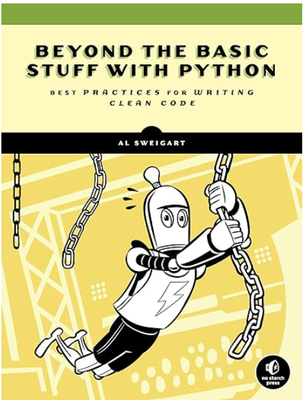

<p align="center"> 

</p>

# Beyond the Basic Stuff with Python - Best Practices for Writing Clean Code
## Written by Al Sweigart, published by No Starch, 2021
- [**Amazon URL**](https://www.amazon.com/Python-Beyond-Basics-Al-Sweigart/dp/1593279663/)
- [**Original Books Notes**](No-Starch-Beyond-the-Basic-Stuff-with-Python-Best-Practices-for-Writing-Clean-Code-2021.txt)

# Table of Content
- Part I: GETTING STARTED
  - [Chapter 1: Dealing with Errors and Asking for Help](#chapter-1-dealing-with-errors-and-asking-for-help)
  - [Chapter 2: Environment Setup and the Command Line](#chapter-2-environment-setup-and-the-command-line)
  - [Chapter 3: Code Formatting with Black](#chapter-3-code-formatting-with-black)
  - [Chapter 4: Choosing Understandable Names](#chapter-4-choosing-understandable-names)
  - [Chapter 5: Finding Code Smells](#chapter-5-finding-code-smells)
  - [Chapter 6: Writing Pythonic Code](#chapter-6-writing-pythonic-code)
  - [Chapter 7: Programming Jargon](#chapter-7-programming-jargon)
  - [Chapter 8: Common Python Gotchas](#chapter-8-common-python-gotchas)
  - [Chapter 9: Esoteric Python Oddities](#chapter-9-esoteric-python-oddities)
  - [Chapter 10: Writing Effective Functions](#chapter-10-writing-effective-functions)
  - [Chapter 11: Comments, Docstrings, and Type Hints](#chapter-11-comments-docstrings-and-type-hints)
  - [Chapter 12: Organizing Your Code Projects with Git](#chapter-12-organizing-your-code-projects-with-git)
  - [Chapter 13: Measuring Performance and Big O Algorithm Analysis](#chapter-13-measuring-performance-and-big-o-algorithm-analysis)
  - [Chapter 14: Practice Projects](#chapter-14-practice-projects)
  - [Chapter 15: Object-Oriented Programming and Classes](#chapter-15-object-oriented-programming-and-classes)
  - [Chapter 16: Object-Oriented Programming and Inheritance](#chapter-16-object-oriented-programming-and-inheritance)
  - [Chapter 17: Pythonic OOP: Properties and Dunder Methods](#chapter-17-pythonic-oop-properties-and-dunder-methods)
 
# PART I: GETTING STARTED


# Chapter 1: Dealing with Errors and Asking for Help
### [top](#table-of-contents)

**typical python linters:**
- Flake8 or Ruff for style and syntax.
```
$ pip install ruff
$ ruff check .
$ ruff check --fix .
$ ruff format .

$ pip install flake8
$ flake8 my_project/
$ pip install flake8-docstrings flake8-bugbear
$ flake8 --doctests myproject/
```
- Pylint for deeper analysis.
```
$ pip install pylint
$ pylint myfile.py
$ pylint --output-format=json myfile.py > report.json
```
- Bandit for security checks.
```
$ pip install bandit
$ bandit -r path/to/your/code
$ bandit examples/*.py -n 3 --severity-level=high           # showing three lines of context and only reporting on the high-severity issues
```

**typical python formatters:**
- black: eliminates style debates
```
$ pip install black
$ black myproject/
```
- isort: Import Statement Organizer
```
$ pip install isort
$ isort myproject/
```

### page 47
```
>>> from pathlib import Path
>>> import os
>>> Path.cwd()
WindowsPath('C:/Users/Al/AppData/Local/Programs/Python/Python38')
>>> os.chdir('C:\\Windows\\System32')
>>> Path.cwd()
WindowsPath('C:/Windows/System32')
```

### page 54
Running Commands from a Python Program:
```
>>> import subprocess, locale
>>> procObj = subprocess.run(['ls', '-al'], stdout=subprocess.PIPE)
>>> outputStr = procObj.stdout.decode(locale.getdefaultlocale()[1])
>>> print(outputStr)
```


# Chapter 2: Environment Setup and the Command Line
N/A


# PART II: BEST PRACTICES, TOOLS, AND TECHNIQUES


# Chapter 3: Code Formatting with Black
### [top](#table-of-contents)

Use `Space Characters` for Indentation, way better than using `tabs`.

https://github.com/psf/black/
```
$ python3 -m pip install --user black
$ python3 -m black yourScript.py
$ python3 -m black -l 120 yourScript.py         # set line limit to 120 characters
$ python3 -m black --diff yourScript.py         # see the proposed changes before making real ones
```


# Chapter 4: Choosing Understandable Names
### [top](#table-of-contents)

**Casing Styles**

Because Python identifiers are `case sensitive` and **cannot** contain `white space`, programmers use several styles for identifiers that include multiple words.
- snake_case
- camelCase
- PascalCase

**Don’t Overwrite `Built-in` Names!!**


# Chapter 5: Finding Code Smells
### [top](#table-of-contents)

> The most common code smell is duplicate code.
The solution to duplicate code is to deduplicate it; that is, make it appear once in your program by placing the code in a function or loop.

- Commented-Out Code and Dead Code
- Print Debugging
- import logging
```
logging.basicConfig(filename='log_filename.txt', level=logging.DEBUG, format='%(asctime)s - %(levelname)s - %(message)s')
logging.debug('This is a log message.')
```

Code Smell Myths:
- Functions Should Have Only One return Statement at the End
- Functions Should Have at Most One try Statement
- Flag Arguments Are Bad
- Global Variables Are Bad
- Comments Are Unnecessary


# Chapter 6: Writing Pythonic Code
### [top](#table-of-contents)
```
>>> import this
The Zen of Python, by Tim Peters

Beautiful is better than ugly.
Explicit is better than implicit.
Simple is better than complex.
Complex is better than complicated.
Flat is better than nested.
Sparse is better than dense.
Readability counts.
Special cases aren't special enough to break the rules.
Although practicality beats purity.
Errors should never pass silently.
Unless explicitly silenced.
In the face of ambiguity, refuse the temptation to guess.
There should be one-- and preferably only one --obvious way to do it.
Although that way may not be obvious at first unless you're Dutch.
Now is better than never.
Although never is often better than *right* now.
If the implementation is hard to explain, it's a bad idea.
If the implementation is easy to explain, it may be a good idea.
Namespaces are one honking great idea -- let's do more of those!
```

Commonly Misused Syntax:
- Use `enumerate()` Instead of `range()`
- Use the with Statement Instead of `open()` and `close()`
```
>>> # Pythonic Example
>>> with open('spam.txt', 'w') as fileObj:
...     fileObj.write('Hello, world!')
```
- Use `is` to Compare with None Instead of `==`
The `==` equality operator compares two object’s values, whereas the is identity operator compares two object’s identities.

Making Shallow Copies of Lists
```
>>> spam = ['cat', 'dog', 'rat', 'eel']
>>> eggs = spam[:]

>>> # Pythonic Example
>>> import copy
>>> spam = ['cat', 'dog', 'rat', 'eel']
>>> eggs = copy.copy(spam)
>>> id(spam) == id(eggs)
False
```

Pythonic Ways to Use Dictionaries:
- Use `get()` and `setdefault()` with Dictionaries
- Use `collections.defaultdict` for Default Values
- Use Dictionaries Instead of a switch Statement


# Chapter 7: Programming Jargon
### [top](#table-of-contents)

**Python keywords:**

| | | | | |
|-----|----------|---------|----|-|
| and | continue | finally | is | raise |
|as | def | for | lambda | return |
| assert | del | from | None | True |
| async | elif | global | nonlocal | try |
| await | else | if | not | while |
| break | except | import | or | with |
| class | False | in | pass | yield |


The `PyCon 2016` talk, “Playing with Python Bytecode” by Scott Sanderson and Joe Jevnik, is an excellent resource to learn more about bytecode vs machine code

https://youtu.be/mxjv9KqzwjI

Nina Zakharenko’s `PyCon 2016` talk, “Memory Management in Python—The Basics,” explains many details about how Python’s garbage collector works

https://youtu.be/F6u5rhUQ6dU


# Chapter 8: Common Python Gotchas
### [top](#table-of-contents)

- Every language has warts (some more than others), and Python is no exception.
- Adding or deleting items from a list while looping (that is, iterating) over it with a for or while loop will most likely cause bugs.
- Don’t Copy Mutable Values Without `copy.copy()` and `copy.deepcopy()`
- Don’t Use Mutable Values, such as a list or dictionary, for Default Arguments.
- Don’t Build Strings with String Concatenation
  - In Python, strings are immutable objects. This means that string values can’t change, and any code that seems to modify the string is actually creating a new string object.
- Don’t Expect `sort()` to Sort Alphabetically
- Don’t Assume Floating-Point Numbers Are Perfectly Accurate
- Don’t Chain Inequality `!=` Operators
```
>>> a = 'cat'
>>> b = 'dog'
>>> c = 'moose'
>>> a != b != c
True
```
- Don’t Forget the Comma in Single-Item Tuples
```
>>> spam = ('cat', 'dog', 'moose')
>>> spam[0]
'cat'
>>> spam = ('cat')
>>> spam[0]
'c'
>>> spam = ('cat', )
>>> spam[0]
'cat'
```


# Chapter 9: Esoteric Python Oddities
### [top](#table-of-contents)

Why 256 Is 256 but 257 Is Not 257
```
>>> a = 42
>>> b = 42.0
>>> a == b 
True
>>> a is b 
False
>>> id(a), id(b)
(140718571382896, 2526629638888)
```

String Interning
>Python reuses objects to represent identical string literals in your code rather than making separate copies of the same string.
```
>>> spam = 'cat'
>>> eggs = 'cat'
>>> spam is eggs
True
>>> id(spam), id(eggs) 
(1285806577904, 1285806577904)
```

Python’s Fake Increment and Decrement Operators
```
>>> spam = 42
>>> spam = --spam
>>> spam
42
```

Boolean Values Are Integer Values
```
>>> int(False) 
0
>>> int(True) 
1
>>> True == 1 
True
>>> False == 0
True
```

Chaining Multiple Kinds of Operators
> Chaining different kinds of operators in the same expression can produce unexpected bugs.
```
>>> False == False in [False]
True
```
This True result is surprising, because you would expect it to evaluate as either:
- • (False == False) in [False], which is False.
- • False == (False in [False]), which is also False.


Python’s Antigravity Feature
```
>>> import antigravity
```
This line is a fun Easter egg that opens the web browser to a classic XKCD comic strip about Python at ht tps://xkcd.com/353/.


# Chapter 10: Writing Effective Functions
### [top](#table-of-contents)

Return Values Should Always Have the Same Data Type

Raising Exceptions vs. Returning Error Codes


# Chapter 11: Comments, Docstrings, and Type Hints
### [top](#table-of-contents)

| Codetags | TODO Comments |
|----------|---------------|
| TODO | Introduces a general reminder about work that needs to be done |
|FIXME | Introduces a reminder that this part of the code doesn’t entirely work |
| HACK | Introduces a reminder that this part of the code works, perhaps barely, but that the code should be improved |
| XXX | Introduces a general warning, often of high severity |


We might see one of these lines at the top of a .py file:
```
#!/usr/bin/env python3              <-- Magic Comments
# -*- coding: utf-8 -*-             <-- Source File Encoding
```

Python’s type hints offer optional static typing. For example
```
def describeNumber(number: int) -> str:
    pass
```

Using Static Analyzers - `Mypy`
```
$ python –m pip install –user mypy
$ python –m mypy example.py
Incompatible types in assignment (expression has type "float", variable has type "int")
Found 1 error in 1 file (checked 1 source file)
```
```
# Telling Mypy to Ignore Code
def removeThreesAndFives(number: int) -> int:
    number = str(number)                                # type: ignore
    number = number.replace('3', '').replace('5', '')   # type: ignore
    return int(number)
```

Setting Type Hints for Multiple Types:
```
from typing import Union
spam: Union[int, str, float] = 42
spam = 'hello'
spam = 3.14
```
```
from typing import Optional
lastName: Optional[str] = None
lastName = 'Sweigart'
```
```
from typing import Any
import datetime
spam: Any = 42
spam = datetime.date.today()
spam = True
```

Setting Type Hints for Lists, Dictionaries, and More:
```
from typing import List, Union

catNames: List[str] = ['Zophie', 'Simon', 'Pooka', 'Theodore']
numbers: List[Union[int, float]] = [42, 3.14, 99.9, 86]
```

Here’s a list of the type aliases for common container types in Python:

| Type | Note |
|------|------|
| List | is for the list data type. |
| Tuple | is for the tuple data type. |
| Dict | is for the dictionary (dict) data type. |
| Set | is for the set data type. |
| FrozenSet | is for the frozenset data type. |
| Sequence | is for the list, tuple, and any other sequence data type. |
| Mapping | is for the dictionary (dict), set, frozenset, and any other mapping data type. |
| ByteString | is for the bytes, bytearray, and memoryview types |

the full list of these types are at https://docs.python.org/3/library/typing.html#classes-functions-and-decorators


# Chapter 12: Organizing Your Code Projects with Git
### [top](#table-of-contents)

> Git allows you to save the state of your project files, called snapshots or commits, as you make changes to them.
That way, you can roll back to any previous snapshot if you ever need to.
Commit is a noun and a verb; programmers commit (or save) their commits (or snapshots). Check-in is also a less popular term for commits.


Installing Git:
- On Ubuntu or Debian Linux
    `$ sudo apt install git-all`
- On Red Hat Linux
    `$ sudo dnf install git-all`


Configuring Your Git Username and Email:
```
$ git config --global user.name "Al Sweigart"
$ git config --global user.email al@inventwithpython.com
```
This configuration information is stored in a .gitconfig file in your home folder.

Installing GUI Git Tools -  https://git-scm.com/downloads/guis


How Git Keeps Track of File Status
> All files in a working directory are either tracked or untracked by Git.
Tracked files are the files that have been added and committed to the repo, whereas every other file is untracked.

To the Git repo, untracked files in the working copy might as well not exist.

On the other hand, the tracked files exist in one of three other states:
- • The committed state is when a file in the working copy is identical to the repo’s most recent commit. (This is also sometimes called the unmodified state or clean state.)
- • The modified state is when a file in the working copy is different than the repo’s most recent commit.
- • The staged state is when a file has been modified and marked to be included in the next commit.
  - We say that the file is staged or in the staging area. (The staging area is also known as the index or cache.)


The .gitignore file that the cookiecutter-basicpythonproject template creates looks like this:
```
# Byte-compiled / optimized / DLL files
__pycache__/
*.py[cod]
*$py.class
--snip--
```


# Chapter 13: Measuring Performance and Big O Algorithm Analysis
### [top](#table-of-contents)

### The timeit Module
```
>>> import timeit
>>> timeit.timeit('a, b = 42, 101; a = a ^ b; b = a ^ b; a = a ^ b')
0.1307766629999998
>>> timeit.timeit("""a, b = 42, 101
... a = a ^ b
... b = a ^ b
... a = a ^ b""")
0.13515726800000039
```

```
>>> timeit.timeit('random.randint(1, 100)', 'import random', number=10000000)
10.020913950999784
```

### The cProfile Profiler
Compare to `timeit`, the `cProfile` module is more effective for analyzing entire functions or program.
```
import time, cProfile

def addUpNumbers():
    total = 0
    for i in range(1, 1000001):
        total += i

cProfile.run('addUpNumbers()')
```
The columns in `cProfile.run()`’s output are:
- ncalls
  - The number of calls made to the function
- tottime
  - The total time spent in the function, excluding time in subfunctions
- percall
  - The total time divided by the number of calls
- cumtime
  - The cumulative time spent in the function and all subfunctions
- percall
  - The cumulative time divided by the number of calls
- filename:lineno(function)
  - The file the function is in and at which line number

### Big O Algorithm Analysis

### Big O Orders

-  1.  O(1), Constant Time (the lowest order)
-  2.  O(log n), Logarithmic Time
-  3.  O(n), Linear Time
-  4.  O(n log n), N-Log-N Time
-  5.  O(n2), Polynomial Time
-  6.  O(2n), Exponential Time
-  7.  O(n!), Factorial Time (the highest order)

- •	 O(1) and O(log n) algorithms are fast.
- •	 O(n) and O(n log n) algorithms aren’t bad.
- •	 O(n2), O(2n), and O(n!) algorithms are slow.

Big O specifically measures the worst-case scenario for any task.

Lower Orders and Coefficients Don’t Matter.


# Chapter 14: Practice Projects
### [top](#table-of-contents)

### The Tower of Hanoi
- 1.  The player can move only one disk at a time.
- 2.  The player can only move disks to and from the top of a tower.
- 3.  The player can never place a larger disk on top of a smaller disk.

### Page 275
Figure 14-1: A physical Tower of Hanoi puzzle set


# PART III: OBJECT-ORIENTED PYTHON


# Chapter 15: Object-Oriented Programming and Classes
### [top](#table-of-contents)

Python’s OOP features in many scenarios are optional.

Python core developer Jack Diederich’s `PyCon 2012` talk, “Stop Writing Classes”  https://youtu.be/o9pEzgHorH0/

### sample class
```
class WizCoin:
    def __init__(self, galleons, sickles, knuts):
        """Create a new WizCoin object with galleons, sickles, and knuts."""
        self.galleons = galleons
        self.sickles  = sickles
        self.knuts    = knuts
        # NOTE: __init__() methods NEVER have a return statement.

    def value(self):
        """The value (in knuts) of all the coins in this WizCoin object."""
        return (self.galleons * 17 * 29) + (self.sickles * 29) + (self.knuts)

    def weightInGrams(self):
        """Returns the weight of the coins in grams."""
        return (self.galleons * 31.103) + (self.sickles * 11.34) + (self.knuts * 5.0)
```

### The type() Function and __qualname__ Attribute

Passing an object to the built-in type() function tells us the object’s data type through its return value. 

Examples:
```
>>> type(42)  # The object 42 has a type of int.
<class 'int'>
>>> int # int is a type object for the integer data type.
<class 'int'>
>>> type(42) == int  # Type check 42 to see if it is an integer.
True
```

> Say you need to log some information about the variables in your program to help you debug them later.
You can only write strings to a logfile, but passing the type object to str() will return a rather messy-looking string. 
Instead, use the __qualname__ attribute, which all type objects have, to write a simpler, human-readable string:

```
>>> str(type(42))  # Passing the type object to str() returns a messy string.
"<class 'int'>"
>>> type(42).__qualname__ # The __qualname__ attribute is nicer looking.
'int'
```


# Chapter 16: Object-Oriented Programming and Inheritance
### [top](#table-of-contents)

### Simple example on inheritance and method overwritting
```
class parent:
    def __init__(self):
        self.data = 1
        self.print_me()

    def print_me(self):
        print(f"data = {self.data}")

    def print_inherited(self):
        self.data = 2
        print(f"original data = {self.data}")


class child(parent):
    def __init__(self):
        self.data = 10      # data members are **NOT** inherited by default
        self.print_me()     # overeidded method

    def print_me(self):
        print(f"overridded data = {self.data}")


try_it = child()
try_it.print_inherited()
```
output:
```
overridded data = 10
original data = 2
```

`super()` could be used to call methods defined in the parent **class**, **NOT** the instantiated object of the parent class.


### The isinstance() and issubclass() Functions
```
>>> class ParentClass:
...     pass
...
>>> class ChildClass(ParentClass):
...     pass
...
>>> parent = ParentClass() # Create a ParentClass object.
>>> child = ChildClass() # Create a ChildClass object.
>>> isinstance(parent, ParentClass)
True
>>> isinstance(parent, ChildClass)
False
>>> isinstance(child, ChildClass)
True
>>> isinstance(child, ParentClass)
True
```

### Class Methods
```
class ExampleClass:
    def exampleRegularMethod(self):
        print('This is a regular method.')

    @classmethod
    def exampleClassMethod(cls):
        print('This is a class method.')

# Call the class method without instantiating an object:
ExampleClass.exampleClassMethod()
obj = ExampleClass()

# Given the above line, these two lines are equivalent:
obj.exampleClassMethod()
obj.__class__.exampleClassMethod()
```

### When to Use Class and Static Object-Oriented Features
Phillip J. Eby’s post “Python Is Not Java” at https://dirtsimple.org/2004/12/python-is-not-java.html
Ryan Tomayko’s “The Static Method Thing” at https://tomayko.com/blog/2004/the-static-method-thing

### Multiple Inheritance
```
class Airplane:
    def flyInTheAir(self):
        print('Flying...')

class Ship:
    def floatOnWater(self):
        print('Floating...')

class FlyingBoat(Airplane, Ship):
    pass


>>> from flyingboat import *
>>> seaDuck = FlyingBoat()
>>> seaDuck.flyInTheAir()
Flying...
>>> seaDuck.floatOnWater()
Floating...
```


# Chapter 17: Pythonic OOP: Properties and Dunder Methods
### [top](#table-of-contents)

```
class ClassWithProperties:
    def __init__(self):
        self.someAttribute = 'some initial value'

    @property
    def someAttribute(self): # This is the "getter" method.
        return self._someAttribute

    @someAttribute.setter
    def someAttribute(self, value): # This is the "setter" method.
        self._someAttribute = value

    @someAttribute.deleter
    def someAttribute(self): # This is the "deleter" method.
        del self._someAttribute

obj = ClassWithProperties()
print(obj.someAttribute)    # Prints 'some initial value'
obj.someAttribute = 'changed value'
print(obj.someAttribute)    # Prints 'changed value'
del obj.someAttribute       # Deletes the _someAttribute attribute.
```

- • When Python runs code that accesses a property, such as print(obj.someAttribute), behind the scenes, it calls the getter method and uses the returned value. 
- • When Python runs an assignment statement with a property, such as obj.someAttribute = 'changed value', behind the scenes, it calls the setter method, passing the 'changed value' string for the value parameter.
- • When Python runs a del statement with a property, such as del obj .someAttribute, behind the scenes, it calls the deleter method.


