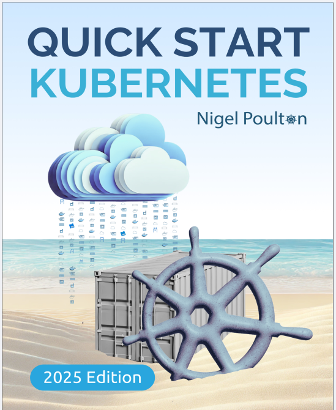

<p align="center"> 

</p>

# Quick Start Kubernetes 2025 Edition
## Written by Nigel Poulton, published in 2025
- [**Amazon URL**](https://www.amazon.com/Quick-Start-Kubernetes-Nigel-Poulton/dp/1916585027/)
- [**Original Books Notes**](Quick-Start-Kubernetes-2025-Edition.txt)

# Table of Content
- [Chapter 1: What is Kubernetes](#chapter-1-what-is-kubernetes)
- [Chapter 2: Why Kubernetes is so important](#chapter-2-why-kubernetes-is-so-important)
- [Chapter 3: Kubernetes architecture](#chapter-3-kubernetes-architecture)
- [Chapter 4: Getting Kubernetes](#chapter-4-getting-kubernetes)
- [Chapter 5: Containerizing an app](#chapter-5-containerizing-an-app)
- [Chapter 6: Running an app on Kubernetes](#chapter-6-running-an-app-on-kubernetes)
- [Chapter 8: Scaling the app](#chapter-8-scaling-the-app)
- [Chapter 9: Performing a rolling update](#chapter-9-performing-a-rolling-update)
- [Chapter 10: What's next](#chapter-10-whats-next)

# Chapter 1: What is Kubernetes
### [top](#table-of-contents)

**Page 19**

A cloud-native app must:
- • Self-heal
- • Scale on demand
- • Support rolling updates

**In summary, Kubernetes is an application orchestrator that brings different microservices together and organizes them into a useful application.** 


# Chapter 2: Why Kubernetes is so important
### [top](#table-of-contents)

Kubernetes is an open-source project hosted and maintained by the `Cloud Native Computing Foundation` (`CNCF`). 

Upstream: k8s development

Downstream: `RedHat OpenShift`, `Amazon EKS`, `Civio Cloud`, `k3s`


# Chapter 3: Kubernetes architecture
### [top](#table-of-contents)

**Page 29**

A Kubernetes cluster is one or more machines with Kubernetes installed. These machines can be physical servers, virtual machines (VM), cloud instances, your laptop, Raspberry Pis, and more. 

We refer to machines in a Kubernetes cluster as nodes, and there are two types:
- • Control plane nodes
- • Worker nodes

the control plane runs all of the following services:
- • API Server
- • Scheduler
- • Store
- • Cloud controller
- • More…

Worker nodes run two essential services:
- • Kubelet
- • Container runtime

The `kubelet` is the main Kubernetes agent. It joins workers to the cluster and communicates with the control plane. For example, it watches the API server for new work tasks and sends status reports back to the API server.

The container runtime manages container lifecycle events such as creating, starting, stopping, and deleting containers.

Most of the cloud providers have hosted Kubernetes services. Some of the more popular ones include:
- • AWS: Elastic Kubernetes Service (EKS)
- • Azure: Azure Kubernetes Service (AKS)
- • Civo: Civo Cloud Kubernetes
- • GCP: Google Kubernetes Engine (GKE)
- • Linode: Linode Kubernetes Engine (LKE)


# Chapter 4: Getting Kubernetes
### [top](#table-of-contents)

- • Install Docker and kubectl with Docker Desktop

- • Create a multi-node Kubernetes cluster with Docker Desktop
  - 1. Click your Docker whale icon
  - 2. Choose Settings
  - 3. Open the Kubernetes tab
  - 4. Click the Enable Kubernetes slider
  - 5. Choose the kind option
  - 6. Choose an up-to-date version of Kubernetes
  - 7. Move the slider to 3 nodes
  - 8. Click Apply & restart

If you don’t see the kind cluster option, you can try using the Konami Code to enable it.
>  Go to the Docker Desktop Settings page and type the following key sequence on your keyboard "up, up, down, down, left, right, left, right, b, a" to reveal the hidden Experimental features page.
  Enable the MultiNodeKubernetes option.
  Go back to Settings > Kubernetes, and you should now have the kind multi-node cluster option.

- • Create a multi-node Kubernetes cluster in the Civo Cloud
> You only have to complete this section if you’re not using the Docker Desktop Kubernetes cluster.

> Civo Cloud Kubernetes is easy to use and you may get $500 of free credit using the civo.com/nigel sign-up link.
The free credit is more than enough to complete all the examples in the book, it lasts for three months following sign-up, and the link will work until at least 2025. 

> Once you’ve created your account, log in to the Civo Dashboard, click Kubernetes in the left navigation bar, and choose Create new Cluster.

Give your cluster the following settings:
- • Name: qsk
- • How many nodes: 3
- • Select a size: Choose the small option from the Standard tab
- • Network: default
- • Firewall: default
- • Expand the Show advanced options section and choose a K3S cluster with either of the CNI options and then select one of the newest Kubernetes versions
  - Leave all other options as default and click Create Cluster.
  - It’ll take a couple of minutes for the cluster to build.
  - When it’s ready, you’ll be able to see basic cluster info on the Civo dashboard.
- • Get the sample app

default kubectl config file's location:
- • Windows: `C:\Users\<username>\.kube\config`
- • macOS: `/Users/<username>/.kube/config`
- • Linux: `/Users/<username>/.kube/config`
```
$ git clone https://github.com/nigelpoulton/qsk-book.git
$ cd qsk-book
$ ls -l
```


# Chapter 5: Containerizing an app
### [top](#table-of-contents)
```
- the sample app
$ git clone https://github.com/nigelpoulton/qsk-book.git
$ cd qsk-book
$ ls -l
$ cd App
$ ls -l

- Containerize the app
$ docker build -t nigelpoulton/qsk-book:1.0 .
$ docker images

- Share the image on a registry
$ docker push nigelpoulton/qsk-book:1.0
# Go to hub.docker.com and make sure the image is present. Remember to browse your own repos.
```


# Chapter 6: Running an app on Kubernetes
### [top](#table-of-contents)
```
$ kubectl get nodes
$ kubectl config get-contexts
$ kubectl config use-context <name of the context>
$ kubectl config view > demo.config
$ kubectl get pods
```

pod.yml:
```
apiVersion: v1
kind: Pod
metadata:
    name: first-pod
    labels:
        project: qsk-book
spec:
    containers:
        - name: web-ctr
        image: nigelpoulton/qsk-book:1.0
        ports:
            - containerPort: 8080
```
```
$ kubectl apply -f pod.yml
$ kubectl get pods

$ kubectl describe pod first-pod
```

To connect to the app from outside, we need to deploy a service.

> BE AWARE that
- the project's name matches to the one we defined for the pod
- the targetPort of the service equals to the containerPort of the pod
 
**svc.yml:**
```
kind: Service
apiVersion: v1
metadata:
    name: svc-lb
spec:
    type: LoadBalancer
    ports:
        - port: 5555
          targetPort: 8080
    selector:
        project: qsk-book
```

```
$ kubectl apply -f svc.yml
$ kubectl get svc
NAME    TYPE            CLUSTER-IP      EXTERNAL-IP     PORT(S)
svc-lb  LoadBalancer    10.96.118.148   localhost       5555:30476/TCP
```

The Service is called `svc-lb`, and the type is correctly set as LoadBalancer.

The `CLUSTER-IP` is the Service’s internal IP address and is what Pods on the same cluster will use to access it.

The `EXTERNAL-IP` is the address we’ll use to connect to the app. If you’re following along on a cloud, this will be a public IP or DNS name you can access from the internet.

If you’re using Docker Desktop, it may be localhost or another IP address you can access from your local machine.

The `PORT(S)` column lists the ports the Service is accessible on, i.e. 5555 here.

```
# clean up
$ kubectl delete pod first-pod
```


# Chapter 7: Self-healing
### [top](#table-of-contents)

- • Intro to Kubernetes Deployments
```
apiVersion: apps/v1
kind: Deployment
metadata:
  name: qsk-deploy
spec:
  replicas: 5
  selector:
    matchLabels:
      project: qsk-book
  template:
    metadata:
      labels:
        project: qsk-book
    spec:
      containers:
        - name: web-ctr
          imagePullPolicy: Always
          ports:
            - containerPort: 8080
            image: nigelpoulton/qsk-book:1.0
```

```
$ kubectl deploy -f deploy.yml
```

- • Self-heal from an app failure
```
$ kubectl get deployments
$ kubectl get pods
NAME                        READY   STATUS  RESTARTS    AGE
qsk-deploy-85dffd5d64-4rbdr 1/1     Running 0           26s
qsk-deploy-85dffd5d64-df88c 1/1     Running 0           26s
qsk-deploy-85dffd5d64-f256l 1/1     Running 0           26s
qsk-deploy-85dffd5d64-mhpfc 1/1     Running 0           26s
qsk-deploy-85dffd5d64-qsjn2 1/1     Running 0           26s

$ kubectl delete pod qsk-deploy-85dffd5d64-4rbdr

$ kubectl get pods
NAME                        READY   STATUS  RESTARTS    AGE
qsk-deploy-85dffd5d64-9kvn9 1/1     Running 0           40s
qsk-deploy-85dffd5d64-df88c 1/1     Running 0           3m5s
qsk-deploy-85dffd5d64-f256l 1/1     Running 0           3m5s
qsk-deploy-85dffd5d64-mhpfc 1/1     Running 0           3m5s
qsk-deploy-85dffd5d64-qsjn2 1/1     Running 0           3m5s
```

- • Self-heal from an infrastructure failure
  - We’ll simulate an infrastructure failure by deleting a worker node.
  - When a worker node fails, all Pods on the node are lost. However, if the Pods are managed by a Deployment controller, Kubernetes will start replacements on surviving nodes.


# Chapter 8: Scaling the app
### [top](#table-of-contents)

- • Pre-requisites
```
$ kubectl apply -f deploy.yml -f svc.yml
$ kubectl get deployments
$ kubectl get svc
```

- • Scale an application up
```
$ kubectl get deployment qsk-deploy
# edit deplyment and cnahge the replicas value
$ kubectl scale --replicas 5 deployment/qsk-deploy
$ kubectl get pods
```

- • Scale an application down
```
$ kubectl scale --replicas 2 deployment/qsk-deploy
$ kubectl get pods
```

- • The role of labels
  - Deployments use labels to ensure they only manage the Pods they created.
  - If you scale the Deployment down from four Pods to two, it will only delete Pods with the app=qsk label.
  - If you scale it up, Kubernetes will add more Pods with the same label.

- • Declarative vs imperative
  - There are two ways to perform updates:
    - • Declaratively
    - • Imperatively
  - The declarative method is preferred and requires you to perform all updates by updating the YAML configuration files and re-sending them to Kubernetes.
  - The imperative method uses CLI commands to perform updates and isn’t recommended for live production environments.


# Chapter 9: Performing a rolling update
### [top](#table-of-contents)

- • Pre-requisites
```
$ git clone https://github.com/nigelpoulton/qsk-book.git
$ cd qsk-book
$ kubectl apply -f deploy.yml -f svc.yml
$ kubectl get deployments
$ kubectl get svc
```

  - Edit the Deployment YAML file:
```
 apiVersion: apps/v1
 kind: Deployment
 metadata:
   name: qsk-deploy
 spec:
   replicas: 5
   selector:
     matchLabels:
       project: qsk-book
  minReadySeconds: 20        <<---- Add this line
  strategy:                  <<---- Add this line
    type: RollingUpdate      <<---- Add this line
    rollingUpdate:           <<---- Add this line
      maxSurge: 1            <<---- Add this line
      maxUnavailable: 0      <<---- Add this line
  template:
    metadata:
      labels:
        project: qsk-book
    spec:
      containers:
        - name: web-ctr
          imagePullPolicy: Always
          ports:
            - containerPort: 8080
            image: nigelpoulton/qsk-book:1.1 <<---- Set to 1.1
```
  - Save the changes.

- • Performing a rollout
```
$ kubectl apply -f deploy.yml
$ kubectl rollout status deployment qsk-deploy

# clean up
$ kubectl delete deployment qsk-deploy
$ kubectl delete svc cloud-lb
```


# Chapter 10: What's next
### [top](#table-of-contents)

- books
  - The Kubernetes Book
  - Getting Started with Docker

- Video courses
  - on pluralsight.com

- Events
  - local community meetups, search on
    - "Kubernetes meetup near me"
    - "Cloud native meetup near me"

- Contact
  - LinkedIn / X: nigelpoulton.com/books
  - qskbook@nigelpoulton.com

