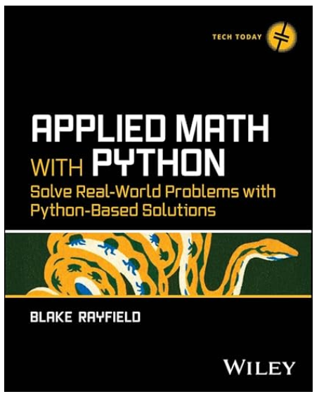
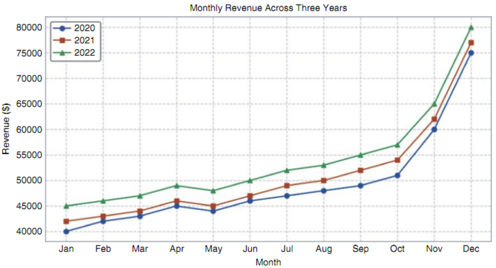
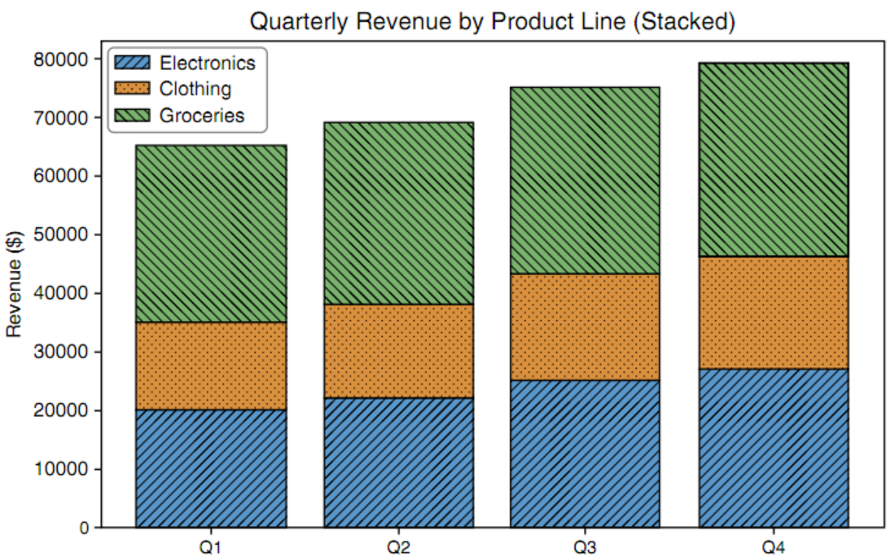
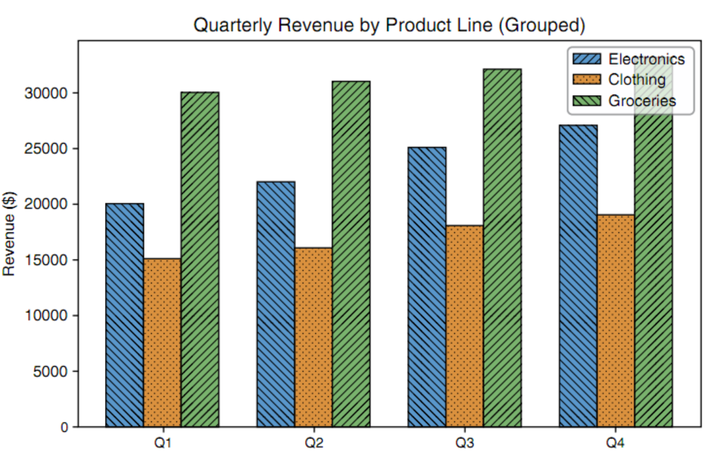
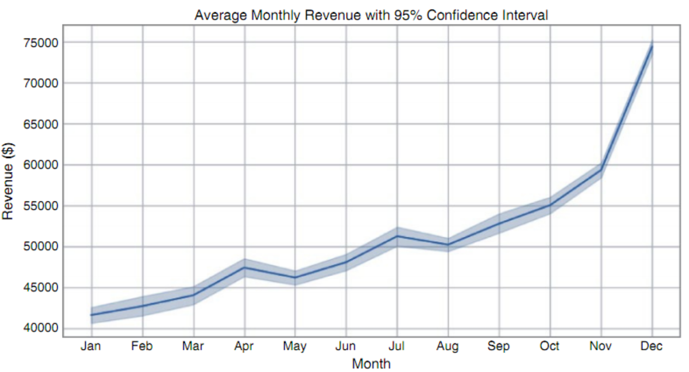
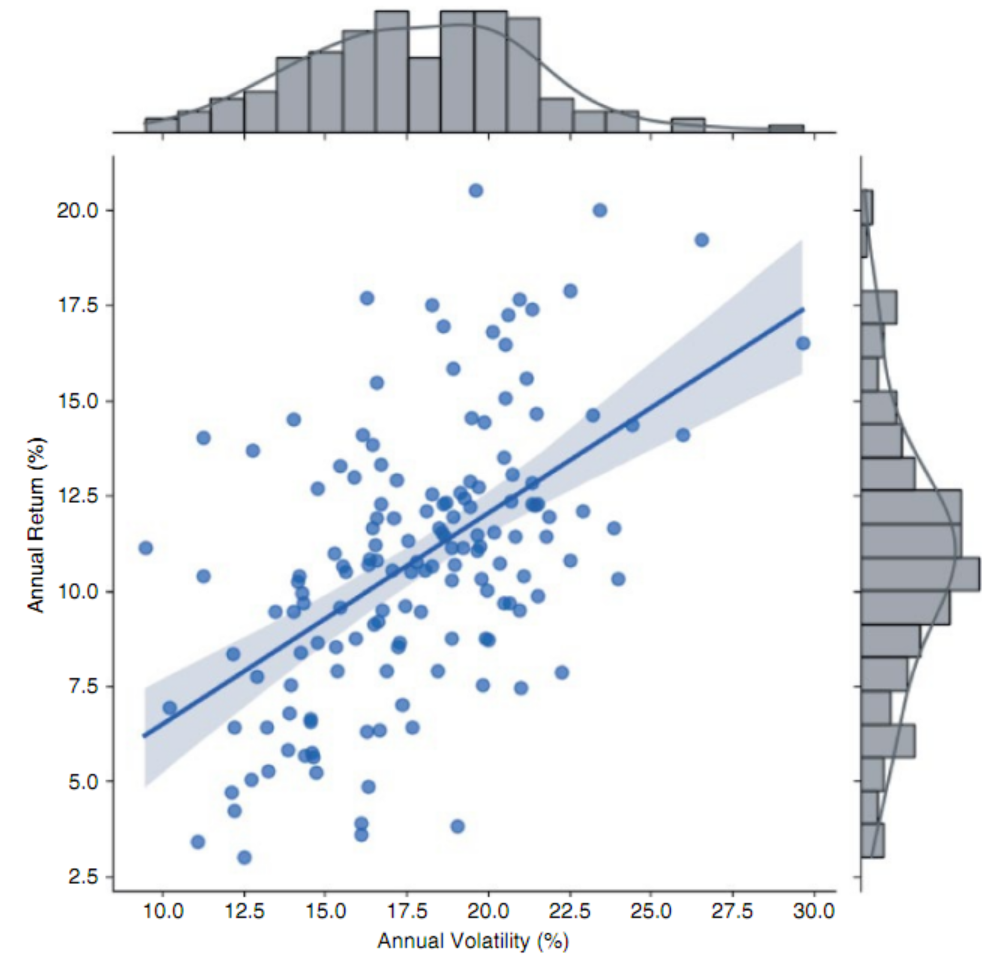

<p align="center"> 

</p>

# Applied Math with Python - Solve Real-World Problems with Python-Based Solutions
## Written by Blake Rayfield, published by Wiley, 2026
- [**Amazon URL**](https://www.amazon.com/Applied-Math-Python-Real-World-Python-Based-ebook/dp/B0GX2VPQCQ/)


## Table of Contents
- [Part 1 - Getting Started](#part-1---getting-started)
- [Chapter 1: Introduction to Python for Business Applications](#-chapter-1-introduction-to-python-for-business-applications)
- [Chapter 2: Basic Mathematical Operations in Python](#-chapter-2-basic-mathematical-operations-in-python)
- [Chapter 3: Visualization for Business Decision-making](#-chapter-3-visualization-for-business-decision-making)
- [Part 2 - Applying the Math](#part-2---applying-the-math)
- [Chapter 4: Linear Algebra for Business and Finance](#chapter-4-linear-algebra-for-business-and-finance)
- [Chapter 5: Calculus for Business Problem Solving](#chapter-5-calculus-for-business-problem-solving)
- [Chapter 6: Optimization Techniques for Business Strategy](#chapter-6-optimization-techniques-for-business-strategy)
- [Chapter 7: Probability and Statistics for Business Analytics](#chapter-7-probability-and-statistics-for-business-analytics)
- [Chapter 8: Applied Business Problems with Math and Python](#chapter-8-applied-business-problems-with-math-and-python)
- [Chapter 9: ]()
- [Chapter 10: ]()
- [Chapter 11: ]()
- [Chapter 12: ]()

### [top](#table-of-contents)


source code:  https://github.com/bkrayfield/Applied-Math-With-Python

# PART 1 - Getting Started

# ➤ Chapter 1: Introduction to Python for Business Applications
### [top](#table-of-contents)

### The Python Ecosystem
- ➤  `Pandas`: This is the go-to tool for manipulating tabular data (think Excel spreadsheets). It provides data structures like DataFrames that allow you to filter, group, join, and summarize 
datasets with ease.
- ➤  `NumPy`: Short for Numerical Python, NumPy enables efficient numerical computations. It is the foundational package for scientific computing in Python and underlies many other 
libraries like Pandas and scikit-learn.
- ➤  `Matplotlib`: One of the oldest and most widely used Python visualization libraries. It prodides functions to create line plots, bar charts, histograms, and more. Great for producing 
publication-quality static graphics.
- ➤  `Seaborn`: Built on top of Matplotlib, Seaborn makes it easier to create complex statistical graphics with simpler syntax and more attractive defaults.
- ➤  `scikit-learn`: A powerful library for machine learning. With just a few lines of code, you can run clustering algorithms, build classification models, or perform regression analysis.
- ➤  `Plotly`: A library for creating interactive visualizations and dashboards. Often used for business presentations, it enables dynamic charts that users can explore in real time.


# ➤ Chapter 2: Basic Mathematical Operations in Python
### [top](#table-of-contents)

### One-dimensional Arrays
```
import numpy as np
sales = np.array([10_000, 12_000, 9_500, 11_000])
# apply 5 % increase
uplift = sales * 1.05
print(uplift)

#Result: [10500, 12600, 9975, 11550]
```

### Example: Random Vectors and Monte Carlo
```
import numpy as np

rng = np.random.default_rng(2025)
demand = rng.normal(loc=500, scale=35, size=10_000)

revenue = demand * 12.75
# print summary
print("Mean: ",revenue.mean())
print("5th percentile: ", np.quantile(revenue, 0.05))
print("95th percentile: ", np.quantile(revenue, 0.95))

import matplotlib.pyplot as plt

plt.hist(revenue, bins='auto')
plt.title("Monte-Carlo Histogram")
plt.show()
```

# Pandas examples
```
# Constructing a DataFrame

import pandas as pd
    
# From a dictionary -------------------------------------------------
sales = pd.DataFrame({
    "Region": ["North", "South", "East", "West"],
    "Month" : ["2025-01", "2025-01", "2025-01", "2025-01"],
    "Revenue": [15_200, 18_100, 12_900, 17_600]
})
    
# From a CSV file ---------------------------------------------------
orders = pd.read_csv("https://raw.githubusercontent.com/bkrayfield/
Applied-Math-With-Python/refs/heads/main/Data/orders_2025_Q1.csv")
```

- ➤ `head()` (similar to the UNIX head command) gives a sample of the first few rows of the DataFrame.
- ➤ `info()` lists dtypes and non-null counts: a structural sanity check.
- ➤ `describe()` computes column-wise reductions (mean, std, quartiles) in one call, using the same reduction kernels that NumPy applies to an ndarray.

#### Grouping and Aggregation
```
region_summary = (
    sales
    .groupby("Region", as_index=False)
    .agg(
        Revenue_sum   = ("Revenue", "sum"),
        Profit_mean   = ("Profit",  "mean"),
        Margin_median = ("Margin",  "median")
        print(region_summary.head())
    )
)
```

#### Joins and Merges
```
targets = pd.read_csv("https://raw.githubusercontent.com/bkrayfield/
Applied-Math-With-Python/refs/heads/main/Data/sales_targets.csv")
sales_with_target = sales.merge(targets, on="Region", how="left")
    
sales_with_target["Gap"] = (
    sales_with_target["Revenue"] - sales_with_target["Target"]
)
```

#### Pandas Merging Methods
| MERGE TYPE | DESCRIPTION | ROWS KEPT | EXAMPLE USE |
|-----------|-------------|-----------|-------------|
| inner | Keeps only rows where the key appears in both tables. | Matches only | Comparing data where both sources must overlap (e.g., customers with both orders and payments). |
| left | Keeps all rows from the left table; fills gaps from the right with NaN. | All from left | Preserving all sales data even if some regions don’t have targets. |
| right | Keeps all rows from the right table; fills gaps from the left with NaN. | All from right | Preserving all target values even if some regions have no sales. |
| outer | Keeps all rows from both tables; unmatched rows are filled with NaN. | All from both | Auditing to see every region in either dataset, whether or not a match exists. |

#### Reshaping: Pivot, Melt, Stack
> Sometimes your data needs to change shape before you can analyze it effectively. Columns may need to become rows or rows may need to become columns. This could happen when preparing a heat-
map, building a crosstab, or feeding data into another tool.

`pivot = sales.pivot(index="Month", columns="Region", values="Revenue")`

> Here, the DataFrame is pivoted so that months run down the rows, regions spread across the columns, and revenue values fill the grid. This wide format makes side-by-side comparisons 
straightforward.
```
long  = pivot.reset_index().melt(id_vars="Month",
                                 var_name="Region",
                                 value_name="Revenue")
```


# ➤ Chapter 3: Visualization for Business Decision-making
### [top](#table-of-contents)

### Libraries for Visualization in Python
| LIBRARY | MOST SUITABLE FOR | OUTPUT STYLE |
|---------|-------------------|--------------|
| Matplotlib | Static plots, fine-grained customization | Publication-quality images |
| Plotly | Interactive charts, web dashboards | Web-based (HTML/JS) |
| HoloViz | App-like data tools, dashboards | Web apps, notebooks |

### Choosing the Right Visualization Tool for Your Work
-  ➤  If your goal is to produce a static, print-ready report with full control over the final look, `Matplotlib` is usually the best choice.
-  ➤  If you love the simplicity of the `.plot()` API but want instantly interactive charts for exploration, `hvPlot` is an excellent choice.
-  ➤  If you need to deliver an engaging and exploratory experience for non-technical users, the `Plotly` (for charts) and Dash (for the application) stack offers the richest experience.
-  ➤  If you want to prototype interactive business apps quickly, especially by combining charts from different libraries, `Panel` is a powerful and flexible option.

### Additional Plotting Libraries in Python
| LIBRARY | DESCRIPTION | DOCUMENTATION                  |
|---------|-------------|--------------------------------|
| Seaborn | Built on top of Matplotlib; specializes in statistical visualization with attractive defaults and simple syntax for common analyses. | https://seaborn.pydata.org     |
| Altair | Declarative statistical visualization library based on Vega-Lite grammar of graphics; concise syntax; best for clean statistical charts. | https://altair-viz.github.io   |
| Pygal | SVG-based charting library; creates interactive, lightweight visuals for embedding in web apps. | http://www.pygal.orgen/stable/ |
| VisPy | High-performance interactive visualization powered by OpenGL; best for large or complex datasets. | https://vispy.org |
| plotnine | Grammar-of-graphics–inspired plotting library for Python, modeled after R’s ggplot2. | https://plotnine.org |
| Cartopy | Geospatial plotting library for creating maps and visualizations of spatial data (often with Matplotlib). | https://cartopy.readthedocs.io |

### LISTING 3-1: PLOTTING LINES
```
import matplotlib.pyplot as plt
    
months = ["Jan", "Feb", "Mar", "Apr", "May"]
revenue = [40000, 45000, 47000, 52000, 55000]
expenses = [30000, 32000, 35000, 37000, 39000]
    
fig, (ax1, ax2) = plt.subplots(1, 2, figsize=(10, 4))
    
ax1.plot(months, revenue, marker="o", color="green")
ax1.set_title("Monthly Revenue")
ax1.set_xlabel("Month")
ax1.set_ylabel("Revenue ($)")
    
ax2.plot(months, expenses, marker="o", color="red")
ax2.set_title("Monthly Expenses")
ax2.set_xlabel("Month")
ax2.set_ylabel("Expenses ($)")
    
plt.tight_layout()
plt.show()
```

### Basic Chart Plotting Customization Options
| OPTION | PARAMETERS | DESCRIPTION |
|--------|------------|-------------|
| Plot title | `ax.set_title()` | Adds a main title to the top of the individual subplot (axes). |
| X-axis label | `ax.set_xlabel()` | Sets the descriptive label for the horizontal (X) axis. |
| Y-axis label | `ax.set_ylabel()` | Sets the descriptive label for the vertical (Y) axis. |
| Legend | `ax.legend()` | Adds a key (legend) to the plot, which is essential if you have multiple datasets (e.g., several lines) on the same chart. |

### Basic Chart Customization Elements
| OPTION/CHART | ELEMENT | PARAMETERS | DESCRIPTION |
|--------------|---------|------------|-------------|
| Color | `color=` | A common parameter in most plot functions (like `ax.plot(..., color=‘red’)`) that changes the color of the plot’s elements. |
| Linestyle | `linestyle=` | A parameter used in line plots to change the line’s style (e.g., solid, dashed, or dotted). |
| Marker | `marker=` | A parameter used in line and scatterplots to change the style of the data points themselves (e.g., circles, squares, or x). |
| Figure size | `plt.subplots(figsize=(...))` | Sets the overall width and height of the entire figure (the “canvas” holding your plots) when you first create it. |


### CREATING EFFECTIVE VISUALS TO COMMUNICATE BUSINESS DATA
#### ➤  Time-series data
#### ➤  Cross-sectional data
```
LISTING 3-3: A BAR CHART EXAMPLE
import matplotlib.pyplot as plt
    
regions = ["North", "South", "East", "West"]
q2_sales = [180000, 150000, 210000, 160000]
    
fig, ax = plt.subplots()
ax.bar(regions, q2_sales)
ax.set_title("Q2 Sales by Region")
ax.set_xlabel("Region")
ax.set_ylabel("Sales ($)")
plt.show()
```
#### ➤  Relational data
```
LISTING 3-4: A SCATTERPLOT CHART
import matplotlib.pyplot as plt
   
ad_spend =  [20, 25, 30, 35, 38, 42, 45, 50]   # in $K
monthly_sales = [210, 230, 260, 280, 295, 320, 330, 360]  # in $K
    
fig, ax = plt.subplots()
ax.scatter(ad_spend, monthly_sales)
ax.set_title("Advertising Spend vs. Monthly Sales")
ax.set_xlabel("Advertising Spend ($K)")
ax.set_ylabel("Sales ($K)")
ax.grid(True, linestyle="--", alpha=0.6)
plt.show()
```

### Other Charts You Can Create
TABLE 3-5: Matplotlib Chart Types
| PLOT TYPE | MATPLOTLIB FUNCTION | DESCRIPTION |
| Line plot | `plt.plot()` | Shows trends over time or another continuous sequence (e.g., a stock’s price over one year). |
| Scatterplot | `plt.scatter()` | Shows the relationship between two different numerical variables (e.g., plotting a person’s height vs. their weight). |
| Bar chart | `plt.bar()` | Compares a numerical value across different distinct categories (e.g., total sales for different store locations). |
| Horizontal bar chart | `plt.barh()` | Same as a bar chart, but better when category names are long (e.g., movie ticket sales by movie title). |
| Histogram | `plt.hist()` | Shows the distribution (frequency) of a single numerical variable (e.g., showing how many students scored in the 70s, 80s, 90s, etc., on a test). |
| Boxplot | `plt.boxplot()` | Visualizes the summary (median, quartiles, outliers) of one or more datasets (e.g., comparing salary ranges across different job departments). |
| Pie chart | `plt.pie()` | Shows the proportions (percentages) of categories that make up a whole (e.g., what percentage of a budget goes to rent, food, and transport). |
| Heat map | `plt.imshow()` | Visualizes 2D data (a matrix) using color to show value (e.g., a correlation matrix showing how strongly different variables are related). |

### Highlighting Seasonality and Long-term Growth
```
# LISTING 3-5: PLOTTING MONTHLY REVENUE

import matplotlib.pyplot as plt
    
# Sample monthly revenue data for 3 years
months = ["Jan", "Feb", "Mar", "Apr", "May", "Jun", 
          "Jul", "Aug", "Sep", "Oct", "Nov", "Dec"]
     
revenue_2020 = [40000, 42000, 43000, 45000, 44000, 46000, 
                47000, 48000, 49000, 51000, 60000, 75000]
     
revenue_2021 = [42000, 43000, 44000, 46000, 45000, 47000, 
                49000, 50000, 52000, 54000, 62000, 77000]
     
revenue_2022 = [45000, 46000, 47000, 49000, 48000, 50000, 
                52000, 53000, 55000, 57000, 65000, 80000]
     
# Create the figure and axis
fig, ax = plt.subplots(figsize=(9, 5))
     
# Plot each year’s data
ax.plot(months, revenue_2020, marker="o", label="2020")
ax.plot(months, revenue_2021, marker="s", label="2021")
ax.plot(months, revenue_2022, marker="^", label="2022")
     
# Add titles and labels
ax.set_title("Monthly Revenue Across Three Years")
ax.set_xlabel("Month")
ax.set_ylabel("Revenue ($)")
ax.grid(True, linestyle="--", alpha=0.6)
ax.legend()
     
plt.tight_layout()
plt.show()
```

<p align="center"> 

</p>

### Comparing Categories and Segments
```
# LISTING 3-6: USING STACKED AND GROUPED BAR CHARTS

import matplotlib.pyplot as plt
import numpy as np
     
quarters = ["Q1", "Q2", "Q3", "Q4"]
electronics = [20000, 22000, 25000, 27000]
clothing = [15000, 16000, 18000, 19000]
groceries = [30000, 31000, 32000, 33000]
     
# Stacked Bar Chart
fig, ax = plt.subplots(figsize=(8, 5))
     
ax.bar(quarters, electronics, label="Electronics")
ax.bar(quarters, clothing, bottom=electronics, label="Clothing")
# stacking groceries on top of electronics+clothing
bottom_stack = np.array(electronics) + np.array(clothing)
ax.bar(quarters, groceries, bottom=bottom_stack, label="Groceries")
     
ax.set_title("Quarterly Revenue by Product Line (Stacked)")
ax.set_ylabel("Revenue ($)")
ax.legend()
plt.show()
     
# Grouped Bar Chart
x = np.arange(len(quarters))  # numeric positions for quarters
width = 0.25  # width of each bar

     
fig, ax = plt.subplots(figsize=(8, 5))
     
ax.bar(x - width, electronics, width, label="Electronics")
ax.bar(x, clothing, width, label="Clothing")
ax.bar(x + width, groceries, width, label="Groceries")
     
ax.set_xticks(x)
ax.set_xticklabels(quarters)
ax.set_title("Quarterly Revenue by Product Line (Grouped)")
ax.set_ylabel("Revenue ($)")
ax.legend()
plt.show()
```

<p align="center"> 

</p>

<p align="center"> 

</p>

### Visualizing Cumulative Effects
```
# LISTING 3-7: VISUALIZING A SERIES WITH PYTHON

import matplotlib.pyplot as plt
import numpy as np
     
months = ["Jan", "Feb", "Mar", "Apr", "May", "Jun", 
          "Jul", "Aug", "Sep", "Oct", "Nov", "Dec"]
revenue = [42000, 43000, 45000, 48000, 47000, 49000, 
            52000, 51000, 53000, 55000, 60000, 75000]
     
# Calculate cumulative revenue
cumulative_revenue = np.cumsum(revenue)
     
fig, ax = plt.subplots()
     
# Plot cumulative revenue instead of monthly
ax.plot(months, cumulative_revenue, marker="o", color="blue")
ax.set_title("Cumulative Revenue (2022)")
ax.set_xlabel("Month")
ax.set_ylabel("Cumulative Revenue ($)")
ax.grid(True, linestyle="--", alpha=0.6)
plt.show()
```

### Line Charts with Confidence Intervals Using Seaborn
```
# LISTING 3-9: USING CONFIDENCE INTERVALS

import numpy as np
import pandas as pd
import matplotlib.pyplot as plt
import seaborn as sns
     
# 1) Simulate tidy business data: multiple stores reporting monthly revenue
rng = np.random.default_rng(7)
months = pd.Index(
    ["Jan","Feb","Mar","Apr","May","Jun","Jul","Aug","Sep","Oct","Nov","Dec"],
    name="month"
)
n_stores = 40
      
# Base seasonal pattern: gentle climb + December spike
seasonal = np.array([42, 43, 45, 48, 47, 49, 52, 51, 53, 55, 60, 75]) * 1000
      
# Store-level deviations + random noise
records = []
for store in range(n_stores):
    store_effect = rng.normal(0, 2500)               
    noise = rng.normal(0, 2000, size=len(months))    
    rev = seasonal + store_effect + noise
    for m, r in zip(months, rev):
        records.append({"store_id": store, "month": m, "revenue": r})
     
df = pd.DataFrame(records)
     
# 2) Plot with seaborn: mean revenue per month + 95% confidence interval
sns.set_theme(style="whitegrid") 
     
fig, ax = plt.subplots(figsize=(9, 5))
sns.lineplot(
    data=df,
    x="month",
    y="revenue",
    errorbar=("ci", 95),     
    estimator="mean",        
    n_boot=1000,             
    ax=ax
)
      
ax.set_title("Average Monthly Revenue with 95% Confidence Interval")
ax.set_xlabel("Month")
ax.set_ylabel("Revenue ($)")
plt.tight_layout()
plt.show()
```

<p align="center"> 

</p>

- ➤  When you use **Matplotlib**, you say: “Draw a red line using these X points and these Y points.”
- ➤  When you use **Seaborn**, you say: “Here is my entire dataset. I want to see the relationship between the Price column and the Time column, and please group everything by the Asset Class column.”

### Analyzing Relationships and Distributions with jointplot
```
# LISTING 3-10: USING JOINTPLOT TO SHOW RELATIONSHIPS AND DISTRIBUTIONS

import numpy as np
import pandas as pd
import matplotlib.pyplot as plt
import seaborn as sns
     
# 1) Simulate tidy financial data: volatility vs. return for 150 funds
rng = np.random.default_rng(42)
n_funds = 150
     
# Create correlated data: higher volatility tends to mean higher returns,
# but with a lot of variance.
volatility = rng.normal(loc=18, scale=4, size=n_funds)
# Make returns dependent on volatility + random noise
returns = (volatility * 0.5) + rng.normal(loc=2, scale=3, size=n_funds)
     
# Put into a DataFrame
funds_df = pd.DataFrame({
    "annual_volatility_pct": volatility,
    "annual_return_pct": returns
})
     
# 2) Plot with seaborn: show relationship AND individual distributions
# This is a "figure-level" plot, so we don't create a plt.subplots() first.
# Seaborn handles the figure creation.
g = sns.jointplot(
    data=funds_df,
    x="annual_volatility_pct",
    y="annual_return_pct",
    kind="reg",                 
    height=7,                   
    color="royalblue",          
    
    # --- Customization Dictionaries ---
    joint_kws={                 
        "scatter_kws": { 's': 40, 'alpha': 0.6 } 
    },
    marginal_kws={              
        'bins': 20, 'kde': True, 'color': 'gray'
    }
)
     
# 3) Add titles and labels (syntax is slightly different)
g.set_axis_labels("Annual Volatility (%)", "Annual Return (%)")
g.fig.suptitle("Relationship Between Fund Volatility and Return", y=1.02)
     
plt.show()
```

- ➤  `kind=“reg”`
  - This is the most important parameter. By default, jointplot just shows a scatterplot. By setting `kind=“reg,”` it instructs Seaborn to automatically run a linear regression on the data and — just like in the lineplot example — draw the resulting trend line along with its 95% confidence interval band.
- ➤  `height=7`
  - Since Seaborn is creating the figure, you can control the size (in inches) with this parameter.
- ➤  `joint_kws={...}`
  - This is a powerful customization feature. It’s a dictionary of “keyword arguments” that are passed directly to the underlying plot function in the central panel. Since the kind=“reg” plot has scatter points, you can pass a scatter_kws dictionary inside it to make the points semi-transparent (alpha=0.6) and smaller (s=40).
- ➤  `marginal_kws={...}`
  - Similarly, this dictionary passes arguments to the two marginal histograms. This code tells Seaborn to use 20 bins for the histograms, to set their color to gray, and to overlay a smooth Kernel Density Estimate (KDE) line (kde=True) on both.

<p align="center"> 

</p>


# PART 2 - Applying the Math

# ➤Chapter 4: Linear Algebra for Business and Finance
### [top](#table-of-contents)


# ➤Chapter 5: Calculus for Business Problem Solving
### [top](#table-of-contents)


# ➤Chapter 6: Optimization Techniques for Business Strategy
### [top](#table-of-contents)


# ➤Chapter 7: Probability and Statistics for Business Analytics
### [top](#table-of-contents)


# ➤Chapter 8: Applied Business Problems with Math and Python


